# Arquitetura — E-commerce de Suprimentos para Comunicação Visual

> Documento do **Agent 2 (Software Architect)**. Complementa e obedece a
> [`DECISIONS.md`](./DECISIONS.md) (fonte da verdade). Onde este documento
> **refina** uma ADR, isso está marcado com **🔧 Proposta ADR** e listado na seção 12.2
> — até ser aceito pelo coordenador, vale o texto de `DECISIONS.md`.
>
> Idioma: texto em pt-BR; identificadores (classes, tabelas, rotas, eventos) em inglês.
> Documentos relacionados: `SECURITY.md` (segurança), `DATABASE.md` (esquema detalhado),
> `SHIPPING.md` (motor de frete), `API.md` (contratos HTTP).

## Sumário

1. [Visão geral (C4)](#1-visão-geral-c4)
2. [Módulos (bounded contexts)](#2-módulos-bounded-contexts)
3. [Organização do código Laravel](#3-organização-do-código-laravel)
4. [Fluxos principais](#4-fluxos-principais)
5. [Catálogo de eventos](#5-catálogo-de-eventos)
6. [Cache, filas e agendador](#6-cache-filas-e-agendador)
7. [Integrações externas](#7-integrações-externas)
8. [Arquitetura dos frontends](#8-arquitetura-dos-frontends)
9. [Infraestrutura, CI/CD e deploy](#9-infraestrutura-cicd-e-deploy)
10. [Observabilidade](#10-observabilidade)
11. [Escalabilidade e evolução](#11-escalabilidade-e-evolução)
12. [Resumo de ADRs e propostas](#12-resumo-de-adrs-e-propostas)

---

## 1. Visão geral (C4)

### 1.1 Contexto (C4 nível 1)

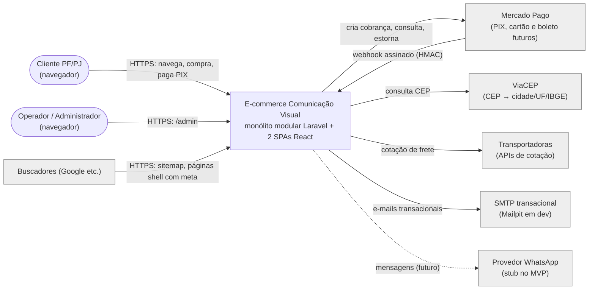

### 1.2 Containers (C4 nível 2)

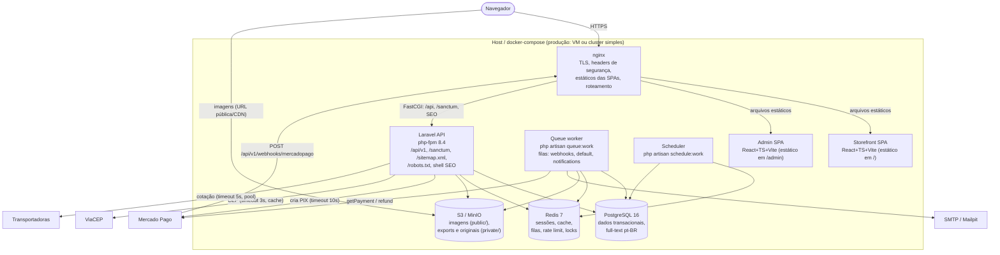

**Pontos-chave**

- **Mesma origem em produção** (ADR-006): `https://loja.exemplo.com.br/` (storefront),
  `/admin` (painel), `/api` e `/sanctum` (Laravel). Sem CORS no caminho feliz.
- `app`, `worker` e `scheduler` usam **a mesma imagem Docker** do backend com comandos
  diferentes. Todos são *stateless* (sessão, cache e filas no Redis; arquivos no S3).
- HTTP para gateway de pagamento **nunca** é feito dentro de transação de banco (ver 4.3).
- Webhooks são **persistidos e respondidos rápido** (200) e processados na fila
  `webhooks` (ver 4.4).

---

## 2. Módulos (bounded contexts)

### 2.1 Avaliação da divisão sugerida

| Sugerido | Decisão | Justificativa |
|---|---|---|
| Catalog | **Mantido** | Produtos, variantes, categorias, marcas, imagens, regras de unidade de venda (ADR-004), busca (ADR-014). |
| Customers | **Mantido** | Clientes PF/PJ, empresas, endereços, autenticação do guard `customer`. |
| Cart | **Mantido** | Carrinho visitante/cliente, merge no login (ADR-007). |
| Orders | **Mantido** | Pedido, itens (snapshot), máquina de estados, expiração (ADR-008). |
| Payments | **Mantido** | Gateway, pagamentos, transações, webhooks, estornos (ADR-009/010). |
| Shipping | **Mantido** | Motor de frete, zonas, regras, transportadoras, CEP (ADR-011). |
| Inventory | **Mantido** | Saldo e movimentos, locks (ADR-008). |
| Pricing | **Mantido, absorve Promotions** | `PriceResolver` (ADR-005) precisa avaliar preço base, faixas, tabelas, preço promocional, **promoções** e preço de cliente juntos ("menor vence"). Separar Promotions obrigaria Pricing ↔ Promotions a conversarem a cada cálculo e cupons (nível pedido) compartilham regras de vigência/escopo com promoções. Um módulo coeso é mais simples. |
| Promotions | **Fundido em Pricing** | Ver acima. Subpasta `Pricing/…/Promotion*` mantém a organização. |
| Users | **Renomeado para Identity** | "Users" é ambíguo (cliente × admin). `Identity` = `admin_users` + RBAC spatie guard `admin` + login do painel. |
| Reports | **Mantido (somente leitura)** | Consultas agregadas; sem tabelas próprias no MVP. Único módulo autorizado a ler tabelas de outros módulos diretamente (read model). |
| Notifications | **Mantido (camada de topo)** | Só consome eventos; ninguém depende dele. E-mail + canal WhatsApp stub. |
| **Checkout** (novo) | **Criado — orquestrador sem tabelas** | O checkout toca Cart, Pricing, Shipping, Inventory, Orders e Payments. Colocá-lo em Orders faria Orders depender de tudo e criaria ciclos (Cart → Orders → Cart). Checkout fica no topo do grafo e é o único a coordenar a transação de compra. |
| **Audit** (novo) | **Criado** | `audit_logs` imutável (ADR-016). O **contrato** `AuditLogger` fica em `Shared` para que qualquer módulo registre auditoria sem criar ciclo; a implementação e as telas de consulta ficam em `Audit`. |
| **Seo** (novo) | **Criado** | Sitemap, robots, shell com meta/JSON-LD (ADR-015) e redirects 301 de slugs alterados (`url_redirects`). Depende só de Catalog/Settings. |
| **Settings** (novo) | **Criado** | Configurações editáveis no painel (expiração PIX, limiar de estoque baixo, dados da loja, endereço de retirada, WhatsApp on/off). Pequeno, na base do grafo. |
| **Shared** (kernel) | **Criado — não é bounded context** | Value objects (`Money`, `Quantity`, `Dimensions`, `Weight`, `PackageDimensions`, `PostalCode`, `TaxDocument`), contrato de auditoria, middleware `RequestId`, exceções base, helpers de mascaramento. Sem tabelas, sem rotas. |

### 2.2 Lista final

`Shared` (kernel) · `Settings` · `Identity` · `Audit` · `Customers` · `Inventory` ·
`Pricing` · `Catalog` · `Shipping` · `Payments` · `Cart` · `Orders` · `Checkout` ·
`Notifications` · `Reports` · `Seo`  → **15 módulos + kernel**.

### 2.3 Regras de dependência entre módulos

1. Um módulo só pode usar, de outro módulo, o que estiver em `Contracts/`, `DTOs/`,
   `Events/`, `Enums/` e `Exceptions/` — **e somente se a aresta existir no grafo 2.5**.
2. Relacionamentos Eloquent *de leitura* para Models de módulos de camada inferior são
   permitidos (ex.: `Order::customer()`), mas **escrita** em tabela de outro módulo é
   proibida: sempre via Service/Action do dono.
3. Consumir um evento de outro módulo conta como dependência (importa a classe).
4. `Reports` pode ler (somente SELECT) tabelas de qualquer módulo que ele referencia.
5. Todos dependem de `Shared` (arestas omitidas no grafo).
6. Verificação automática: **deptrac** (`backend/deptrac.yaml`) no CI — camadas = módulos,
   regras = grafo 2.5. 🔧 Proposta ADR (ferramenta nova no CI).

### 2.4 Detalhamento por módulo

Convenções: `ActorRef` (Shared) = `{type: admin|customer|system, id: ?int}`.
Assinaturas abreviadas; DTOs são `final readonly class`. Tabelas detalhadas em `DATABASE.md`.

#### Shared (kernel)

- **Responsabilidade:** primitivas de domínio e infraestrutura transversal.
- **Tabelas:** nenhuma.
- **Contratos públicos:**

```php
namespace App\Shared\Domain;

final readonly class Money {            // centavos BRL, imutável (ADR-003)
    public static function ofCents(int $cents): self;
    public static function zero(): self;
    public function cents(): int;
    public function add(Money $other): self;
    public function subtract(Money $other): self;          // pode ficar negativo; chamador valida
    public function multiplyByQuantity(Quantity $q): self; // round_half_up(cents × milli / 1000)
    public function applyBasisPoints(int $bps): self;      // % em pontos-base (1000 = 10%), half-up
    public function isZero(): bool;
    public function isNegative(): bool;
    public function lessThan(Money $other): bool;
    public static function min(Money $first, Money ...$rest): self;
}

final readonly class Quantity {         // milésimos inteiros (ADR-003)
    public static function fromDecimal(string|int $value): self; // "5.5" → 5500; rejeita > 3 casas
    public static function fromMilli(int $milli): self;
    public function milli(): int;
    public function toDecimalString(): string;              // 5500 → "5.500"
    public function isMultipleOf(Quantity $step): bool;
    public function add(Quantity $o): self;
    public function subtract(Quantity $o): self;
    public function compareTo(Quantity $o): int;
    public function isPositive(): bool;
}

final readonly class Dimensions {       // material vendável, mm inteiros
    public function __construct(public int $widthMm, public int $heightMm);
    public static function fromMeters(string $width, string $height): self; // "1.220" → 1220
    public function areaFor(int $pieces): Quantity;        // m² em milésimos (ver nota ADR-003)
}

final readonly class Weight { public static function fromGrams(int $g): self; public function grams(): int;
    public function add(Weight $o): self; public function multiplyByQuantity(Quantity $q): self; } // ceil em gramas

final readonly class PackageDimensions { // logística; cm (1 casa) na API, mm inteiros no domínio
    public static function fromCentimeters(string $l, string $w, string $h): self;
    public function volumeCm3(): int; }

final readonly class PostalCode { public static function fromString(string $raw): self; // 8 dígitos
    public function value(): string; public function formatted(): string; }               // 01310-100

final readonly class TaxDocument { public static function cpf(string $raw): self; // valida DV
    public static function cnpj(string $raw): self; public function value(): string; public function masked(): string; }

final class Rounding { public static function halfUpDiv(int $numerator, int $denominator): int; }
```

```php
namespace App\Shared\Audit;
interface AuditLogger { public function record(AuditEntry $entry): void; }
final readonly class AuditEntry { /* ActorRef $actor, string $action, string $entityType,
    ?string $entityId, array $changes (já sem dados sensíveis), ?array $context */ }

namespace App\Shared\Support;
final class Mask { public static function cpf(string $v): string; public static function cnpj(string $v): string;
    public static function email(string $v): string; public static function phone(string $v): string; }

namespace App\Shared\Exceptions;
abstract class DomainException extends \RuntimeException {   // renderizada como {message, code}
    abstract public function errorCode(): string;              // ex.: insufficient_stock
    public function status(): int { return 409; } }
```

- **Http:** `RequestId`, `ForceJsonResponse`, `EnsureAdminSessionIsFresh` (ver SECURITY.md).
- **Logging:** `RedactSensitiveDataProcessor` (Monolog), `JsonFormatter` configurado.
- **Nota ADR-003 🔧:** `width_mm × height_mm × pieces / 1000` só é inteiro quando o
  produto é múltiplo de 1000 (ex.: 1225 mm × 1001 mm não é). Proposta:
  `area_milli = round_half_up(width_mm × height_mm × pieces, 1000)` via `Rounding::halfUpDiv`,
  aplicado **antes** de comparar com `min_billable_area`.

#### Settings

- **Responsabilidade:** configurações de negócio editáveis no painel, tipadas e cacheadas.
- **Tabelas:** `settings` (`key` único, `value` jsonb, `updated_by`).
- **Contratos:**

```php
enum SettingKey: string { case StoreName = 'store.name'; case StoreContactEmail = 'store.contact_email';
    case PixExpirationMinutes = 'orders.pix_expiration_minutes'; case LowStockDefaultThreshold = 'inventory.low_stock_default_threshold';
    case PickupAddress = 'shipping.pickup_address'; case WhatsAppEnabled = 'notifications.whatsapp_enabled';
    case AdminAlertEmails = 'notifications.admin_alert_emails'; /* ... */ }
interface SettingsRepository {
    public function get(SettingKey $key): mixed;              // default vindo do enum
    public function set(SettingKey $key, mixed $value, ActorRef $actor): void;
    public function all(): array;
}
```

- **Emite:** `SettingsUpdated`. **Consome:** —. **Depende de:** Shared.

#### Identity

- **Responsabilidade:** usuários do painel, login/logout do guard `admin`, recuperação de
  senha, papéis e permissões (spatie, guard `admin`), timeout de sessão administrativa.
- **Tabelas:** `admin_users`, `admin_password_reset_tokens`, `roles`, `permissions`,
  `model_has_roles`, `model_has_permissions`, `role_has_permissions`.
- **Contratos:**

```php
enum Permission: string { case ProductsView = 'products.view'; /* lista completa em SECURITY.md §4.2 */ }
enum Role: string { case SuperAdmin = 'super_admin'; case Manager = 'manager'; case Sales = 'sales';
    case Catalog = 'catalog'; case Stock = 'stock'; case Finance = 'finance'; case Viewer = 'viewer'; }
interface AdminUserDirectory {
    public function find(int $adminUserId): ?AdminUserData;
    /** @return list<string> e-mails de admins ativos com a permissão */
    public function emailsWithPermission(Permission $permission): array;
}
// Actions: LoginAdmin, LogoutAdmin, CreateAdminUser, UpdateAdminUser, SyncAdminRoles, DeactivateAdminUser
```

- **Emite:** `AdminLoggedIn`, `AdminLoginFailed`, `AdminRolesChanged`. **Consome:** —.
- **Depende de:** Shared.

#### Audit

- **Responsabilidade:** implementação de `AuditLogger` e consulta de logs no painel.
  Módulos registram auditoria **explicitamente** nas Actions (sem observers mágicos),
  o que torna o diff controlado e livre de dados sensíveis.
- **Tabelas:** `audit_logs` (imutável; trigger no Postgres bloqueia UPDATE/DELETE).
- **Contratos:** `DatabaseAuditLogger implements App\Shared\Audit\AuditLogger`
  (preenche `ip`, `user_agent`, `request_id` a partir do `Context`).
- **Emite/Consome:** —. **Depende de:** Shared.

#### Customers

- **Responsabilidade:** cadastro PF/PJ (`customers.type`, `companies`), validação CPF/CNPJ,
  endereços, login/logout guard `customer`, recuperação de senha, perfil de preço
  (tabela de preço atribuída ao cliente ou à empresa), consentimentos LGPD.
- **Tabelas:** `customers`, `companies`, `customer_addresses`,
  `customer_password_reset_tokens`.
- **Contratos:**

```php
interface CustomerDirectory {
    public function find(int $customerId): ?CustomerData;                 // nome, e-mail, tipo, documento
    public function pricingProfile(int $customerId): CustomerPricingProfile; // {customerId, ?companyId, ?priceListId}
    public function addressForCustomer(int $customerId, string $addressUuid): ?AddressData; // escopado (IDOR)
}
// Actions: RegisterCustomer, AuthenticateCustomer, LogoutCustomer, UpdateProfile,
//          CreateAddress, UpdateAddress, DeleteAddress, SendPasswordResetLink, ResetPassword
```

- **Emite:** `CustomerRegistered`, `CustomerAuthenticated` (com `?guestCartToken`),
  `CustomerPasswordReset`. **Consome:** —. **Depende de:** Shared.

#### Inventory

- **Responsabilidade:** saldo (`on_hand`, `reserved`), movimentos, locks ordenados por
  `variant_id`, limiar de estoque baixo. Conhece apenas `variant_id` (não depende de Catalog).
- **Tabelas:** `inventory`, `inventory_movements`.
- **Contratos:**

```php
interface InventoryService {
    /** @param list<int> $variantIds @return array<int, Quantity> disponível = on_hand − reserved */
    public function availability(array $variantIds): array;
    /** Deve rodar dentro de DB::transaction(); SELECT ... FOR UPDATE ORDER BY variant_id */
    public function lockForUpdate(array $variantIds): void;
    public function reserve(StockReservation $r): void;   // lança InsufficientStock (409)
    public function commit(StockReservation $r): void;    // pagamento aprovado: on_hand−=q, reserved−=q
    public function release(StockReservation $r): void;   // não pago cancelado/expirado
    public function restock(StockReservation $r): void;   // pago cancelado antes do envio ("return")
    public function receive(int $variantId, Quantity $q, string $reason, ActorRef $actor): void; // "in"
    public function adjust(int $variantId, Quantity $newOnHand, string $reason, ActorRef $actor): void;
}
final readonly class StockReservation { /* string $referenceType ('order'), int $referenceId, list<StockLine{int variantId, Quantity quantity}> $lines */ }
```

- **Emite:** `StockLow`, `StockAdjusted`. **Consome:** —. **Depende de:** Settings.

#### Pricing (inclui promoções e cupons)

- **Responsabilidade:** `PriceResolver` (ADR-005), faixas por quantidade, tabelas de preço,
  preço de cliente, preço promocional com vigência, promoções (produto/categoria/marca),
  cupons (nível pedido) e controle de uso de cupom com lock.
- **Tabelas:** `price_lists`, `price_tiers` (`price_list_id NULL` = faixas do preço base),
  `customer_prices`, `promotions`, `promotion_products`, `promotion_categories`,
  `promotion_brands`, `coupons`, `coupon_redemptions` (conforme `DATABASE.md`).
  (O preço base e o preço promocional com vigência são colunas de `product_variants`,
  donas do Catalog, e chegam ao Pricing dentro do `PricingSubject`.)
- **Não depende de Catalog**: o chamador envia tudo que é necessário no `PricingSubject`.
  Isso permite que Catalog mostre preço nas listagens sem ciclo.

```php
final readonly class PricingSubject { /* int $variantId, int $productId, ?int $brandId,
    list<int> $categoryIdsWithAncestors, Money $basePrice, ?Money $promotionalPrice,
    ?CarbonImmutable $promoStartsAt, ?CarbonImmutable $promoEndsAt */ }
final readonly class PriceContext { /* PricingSubject $subject, Quantity $billableQuantity,
    ?int $customerId, CarbonImmutable $at */ }
final readonly class PriceQuote { /* int $variantId, Money $unitPrice, Money $baseUnitPrice,
    Money $lineTotal, Quantity $billableQuantity, PriceSource $source, ?int $promotionId */ }
enum PriceSource: string { case Base='base'; case Tier='tier'; case PriceList='price_list';
    case Promotional='promotional'; case Promotion='promotion'; case Customer='customer'; }

interface PriceResolver {
    public function resolve(PriceContext $ctx): PriceQuote;
    /** @param list<PriceContext> $contexts @return list<PriceQuote> — consultas em lote (sem N+1) */
    public function resolveMany(array $contexts): array;
}
interface CouponService {
    public function evaluate(string $code, CouponContext $ctx): CouponEvaluation;  // sem efeitos
    /** Dentro de transação: SELECT coupon FOR UPDATE, confere limites, grava coupon_redemptions */
    public function redeem(string $code, CouponContext $ctx, int $orderId): CouponEvaluation;
    public function releaseForOrder(int $orderId): void;   // pedido não pago cancelado/expirado
}
final readonly class CouponContext { /* ?int $customerId, Money $subtotal, list<CouponLine> $lines, ?Money $shipping */ }
final readonly class CouponEvaluation { /* bool $valid, ?string $reasonCode, Money $discount, bool $freeShipping, ?int $couponId */ }
```

- **Emite:** `CouponRedeemed`. **Consome:** —. **Depende de:** Customers (perfil de preço).

#### Catalog

- **Responsabilidade:** categorias (árvore), marcas, produtos, variantes, imagens,
  atributos, unidade de venda e regras (ADR-004), validação/conversão de quantidade
  faturável, busca (ADR-014), endpoints públicos de listagem/detalhe (com preço e
  disponibilidade), CRUD no painel e upload de imagens.
- **Tabelas:** `categories`, `brands`, `products`, `product_categories` (N:N), `product_variants`
  (atributos de exibição em `attributes` jsonb), `product_images` (conforme `DATABASE.md`).
- **Contratos:**

```php
interface CatalogQuery {
    public function variant(int $variantId): ?VariantData;          // inclui sale_unit, regras, peso, embalagem
    /** @param list<int> $variantIds @return array<int, VariantData> */
    public function variants(array $variantIds): array;
    public function variantByUuid(string $uuid): ?VariantData;
    public function pricingSubject(int $variantId): PricingSubject;  // monta DTO do Pricing
    /** @return array<int, PricingSubject> */
    public function pricingSubjects(array $variantIds): array;
}
interface SaleQuantityResolver {
    /** Valida min/max/step/larguras/alturas e calcula quantidade faturável (área mínima incluída).
     *  Lança InvalidSaleQuantity (422, com campo). */
    public function resolve(VariantData $variant, SaleInput $input): BillableQuantity;
}
final readonly class SaleInput { /* ?Quantity $quantity, ?Dimensions $dimensions, ?int $pieces */ }
final readonly class BillableQuantity { /* Quantity $quantity, bool $minimumAreaApplied, ?Quantity $calculatedArea */ }

interface ProductSearch {                                          // ADR-014
    public function search(ProductSearchQuery $q): ProductSearchResult; // ids ordenados + total + facets
    public function index(int $productId): void;                   // Postgres: atualiza products.search_vector
    public function remove(int $productId): void;
}
```

- **Emite:** `ProductSaved`, `ProductDeleted`, `ProductSlugChanged`, `CategoryTreeChanged`.
- **Consome (próprios):** `ProductSaved` → `ReindexProduct` (fila `default`).
- **Depende de:** Pricing (preço exibido), Inventory (disponibilidade), Settings.

#### Shipping

- **Responsabilidade:** motor de frete (ADR-011, detalhado em `SHIPPING.md`): métodos,
  zonas, regras, transportadoras, cotações persistidas, lookup de CEP e endpoint público
  de CEP (`GET /api/v1/postal-codes/{cep}`) usado também pelo formulário de endereço.
- **Tabelas:** `shipping_carriers`, `shipping_methods`, `shipping_zones`,
  `shipping_zone_postal_ranges`, `shipping_zone_cities`, `shipping_zone_states`,
  `shipping_rules`, `shipping_quotes` (opções em jsonb), `ibge_cities` (referência) —
  conforme `DATABASE.md`/`SHIPPING.md`.
- **Não depende de Catalog/Cart:** recebe `ShippingRequest` já montado.

```php
final readonly class ShippingRequest { /* PostalCode $destination, list<ShippingItem> $items,
    Money $subtotal, ?int $customerId, string $cartHash */ }
final readonly class ShippingItem { /* int $variantId, Quantity $quantity, Weight $totalWeight,
    PackageDimensions $package, int $packages */ }
final readonly class ShippingOption { /* string $id (id da opção dentro da cotação), int $methodId, string $methodType,
    string $name, Money $price, int $minDays, int $maxDays, ?string $carrierCode, CarbonImmutable $expiresAt */ }

interface ShippingEngine {                                 // assinatura fixada pela ADR-011
    /** @return list<ShippingOption> */
    public function quote(ShippingRequest $request): array;
}
interface ShippingQuoteService {
    /** Cota + persiste em shipping_quotes (TTL 30 min, hash carrinho+CEP) */
    public function quoteAndStore(ShippingRequest $request): ShippingQuoteData;
    /** Checkout: recalcula e confere a opção escolhida; lança ShippingQuoteExpired /
     *  ShippingOptionUnavailable (409). Retorna o valor RECALCULADO. */
    public function revalidate(string $shippingQuoteId, string $shippingOptionId, ShippingRequest $request): ShippingOption;
}
interface ShippingCarrierInterface { /* §7.2 */ }
interface PostalCodeLookup { /* §7.3 */ }
```

- **Emite:** —. **Consome:** —. **Depende de:** Settings.

#### Payments

- **Responsabilidade:** gateway (ADR-010), criação de cobrança PIX, status de pagamento,
  transações, webhooks (verificação, dedupe, processamento), estornos, reconciliação.
  Conhece o pedido apenas por `order_id` (FK) e recebe valores via DTO — **não depende de Orders**.
- **Tabelas:** `payments`, `payment_transactions`, `webhook_events`.

```php
interface PaymentService {
    /** Dentro da transação do checkout: cria registro local status=pending, sem HTTP */
    public function createPending(PaymentRequest $request): PaymentData;
    /** FORA de transação: chama gateway (idempotency key = payments.uuid), grava QR/copia-e-cola */
    public function initiate(int $paymentId): PaymentData;               // lança PaymentGatewayUnavailable (503)
    public function latestForOrder(int $orderId): ?PaymentData;
    public function markExpired(int $orderId): void;                     // idempotente
    /** Cria transação de estorno "pending" e agenda ProcessRefund (afterCommit) */
    public function requestRefund(int $orderId, ?Money $amount, string $reason, ActorRef $actor): RefundData;
    /** Chamado pelo job de webhook e pela reconciliação: consulta o gateway e aplica transição idempotente */
    public function syncFromGateway(string $gateway, string $externalId): PaymentData;
}
final readonly class PaymentRequest { /* int $orderId, string $orderNumber, PaymentMethod $method,
    Money $amount, PayerData $payer, CarbonImmutable $expiresAt */ }
enum PaymentMethod: string { case Pix='pix'; case CreditCard='credit_card'; case Boleto='boleto'; case Invoice='invoice'; }
enum PaymentStatus: string { case Pending='pending'; case Approved='approved'; case Failed='failed';
    case Refunded='refunded'; case Expired='expired'; }
interface PaymentGatewayInterface { /* §7.1 */ }
interface PaymentWebhookVerifier { /* §7.1 */ }
```

- **Emite:** `PaymentCreated`, `PaymentApproved`, `PaymentFailed`, `PaymentExpired`,
  `PaymentRefunded`, `PaymentRefundFailed`, `PaymentAmountMismatch`.
- **Consome:** —. **Depende de:** Settings.

#### Cart

- **Responsabilidade:** carrinho visitante (`X-Cart-Token`) e do cliente, itens (só a
  escolha do cliente — ADR-007), recálculo a cada leitura, cupom aplicado (código), merge
  no login, cotação de frete do carrinho, prévia de preço de item (`PriceQuote`).
- **Tabelas:** `carts`, `cart_items`.

```php
interface CartService {
    public function snapshot(int $cartId, ?int $customerId): CartSnapshot;  // recalcula tudo
    public function toShippingRequest(CartSnapshot $cart, PostalCode $destination): ShippingRequest;
    public function toCouponContext(CartSnapshot $cart, ?Money $shipping): CouponContext;
    public function markConverted(int $cartId, int $orderId): void;
    public function mergeGuestInto(string $guestToken, int $customerId): void;
}
final readonly class CartSnapshot { /* int $cartId, ?int $customerId, list<CartLine> $lines,
    Money $subtotal, ?string $couponCode, Weight $totalWeight, string $hash (sha256 de itens+qtd+dims) */ }
final readonly class CartLine { /* int $cartItemId, VariantData $variant, SaleInput $input,
    BillableQuantity $billable, PriceQuote $price, Quantity $available, bool $isAvailable */ }
```

- **Emite:** —. **Consome:** `CustomerAuthenticated` → `MergeGuestCart` (**síncrono**).
- **Depende de:** Catalog, Pricing, Inventory, Shipping, Customers.

#### Orders

- **Responsabilidade:** criação do pedido com snapshot (ADR-016), numeração `CV-000123`
  (sequence Postgres), máquina de estados (ADR-008), histórico de status, expiração,
  cancelamento (com liberação/retorno de estoque, liberação de cupom e pedido de estorno),
  consulta do cliente (por `uuid`, escopada) e gestão no painel.
- **Tabelas:** `orders` (inclui snapshot de cliente, endereço, frete; `idempotency_key`,
  `checkout_fingerprint` 🔧), `order_items`, `order_status_history`. Sequence `order_number_seq`.

```php
final class OrderStateMachine {
    public function canTransition(OrderStatus $from, OrderStatus $to): bool;
    public function assertTransition(OrderStatus $from, OrderStatus $to): void; // InvalidOrderTransition (409)
}
interface OrderPlacement {
    /** Chamado pelo Checkout DENTRO da transação: grava pedido + itens, reserva estoque,
     *  registra histórico. Não chama HTTP. */
    public function place(PlaceOrderData $data): OrderData;
    public function findByIdempotencyKey(int $customerId, string $key): ?OrderData;
}
// Actions internas / admin:
// MarkOrderAsPaid (listener de PaymentApproved), ChangeOrderStatus::execute(Order, OrderStatus, ActorRef, ?StatusChangeData),
// CancelOrder::execute(Order, CancellationReason, ActorRef), ExpirePendingOrders::execute(CarbonImmutable $now)
final readonly class PlaceOrderData { /* int $customerId, string $idempotencyKey, string $fingerprint,
    CustomerSnapshot $customer, AddressSnapshot $shippingAddress, list<OrderLineData> $lines,
    ShippingSnapshot $shipping, ?CouponEvaluation $coupon, Money $subtotal, Money $discount,
    Money $shippingTotal, Money $total, PaymentMethod $paymentMethod, CarbonImmutable $expiresAt, ?string $notes */ }
```

- **Emite:** `OrderPlaced`, `OrderPaid`, `OrderStatusChanged`, `OrderCancelled`.
- **Consome:** `PaymentApproved` (síncrono, na transação), `PaymentFailed`,
  `PaymentRefunded`, `PaymentRefundFailed`, `PaymentAmountMismatch`.
- **Depende de:** Inventory, Payments, Pricing (cupom), Customers, Settings.

#### Checkout (orquestrador)

- **Responsabilidade:** único caso de uso "fechar pedido": idempotência, revalidação
  completa (preço, cupom, frete, estoque), transação, criação do pagamento e resposta PIX.
  Também oferece prévia (`POST /api/v1/me/checkout/preview`) sem efeitos colaterais.
- **Tabelas:** nenhuma (usa `orders.idempotency_key` via Orders).

```php
final class PlaceCheckout { public function execute(CheckoutData $data): CheckoutResult; }
final class PreviewCheckout { public function execute(CheckoutData $data): CheckoutTotals; }
final readonly class CheckoutData { /* int $customerId, string $idempotencyKey, string $shippingAddressUuid,
    string $shippingQuoteId, string $shippingOptionId, PaymentMethod $paymentMethod, ?string $couponCode, ?string $notes */ }
final readonly class CheckoutResult { /* OrderData $order, PaymentData $payment, bool $replayed */ }
```

- **Emite:** —. **Consome:** —.
- **Depende de:** Cart, Orders, Payments, Pricing, Shipping, Inventory, Customers, Settings.

#### Notifications

- **Responsabilidade:** e-mails transacionais (Laravel Notifications/Mailables em pt-BR),
  alertas ao admin, digest de estoque baixo, canal `WhatsAppChannel` (stub).
- **Tabelas:** `notifications` (database channel — avisos no painel, conforme `DATABASE.md` §3.10.2).
- **Contratos:** `WhatsAppClient` (§7.5); Notifications: `OrderReceivedNotification` (com
  PIX), `OrderPaidNotification`, `OrderShippedNotification`, `OrderReadyForPickupNotification`,
  `OrderCancelledNotification`, `RefundProcessedNotification`, `WelcomeNotification`,
  `NewOrderAdminAlert`, `LowStockDigestNotification`, `PaymentAnomalyAdminAlert`.
- **Consome:** eventos de Orders, Payments, Customers, Inventory (§5). **Emite:** —.
- **Depende de:** Orders, Payments, Customers, Inventory, Catalog, Identity, Settings.

#### Reports

- **Responsabilidade:** dashboards e relatórios do painel (vendas por período, pedidos por
  status, produtos mais vendidos, estoque baixo/valorizado, clientes). Exportação CSV
  assíncrona para `s3 private/exports/` com URL temporária (15 min).
- **Tabelas:** nenhuma (read models via SQL). Futuro: views materializadas / réplica.
- **Contratos:** `SalesSummaryReport::run(ReportPeriod $p): SalesSummary`, `TopProductsReport`,
  `OrdersByStatusReport`, `InventoryValuationReport`, `ExportReportJob`.
- **Emite/Consome:** —. **Depende de:** Orders, Payments, Catalog, Customers, Inventory.

#### Seo

- **Responsabilidade:** `/sitemap.xml` (cache 6 h), `/robots.txt`, rota *shell* que injeta
  `<title>`, meta description, canonical, OG e JSON-LD (Product, BreadcrumbList) no
  `index.html` da loja, redirects 301 para slugs antigos, resolução de slugs reservados.
- **Tabelas:** `url_redirects` (`from_path` único, `to_path`, `status_code`).
- **Contratos:** `SeoMetaBuilder::forProduct(ProductSeoData): SeoMeta`, `forCategory(...)`,
  `ShellRenderer::render(SeoMeta $meta, int $status): Response`.
- **Consome:** `ProductSlugChanged` → `CreateRedirect` (síncrono); `ProductSaved`,
  `ProductDeleted`, `CategoryTreeChanged` → `ForgetSitemapCache` (queued).
- **Depende de:** Catalog, Settings.

### 2.5 Grafo de dependências (acíclico)

Aresta `A --> B` = "A depende de B". Todos dependem de `Shared` (omitido).

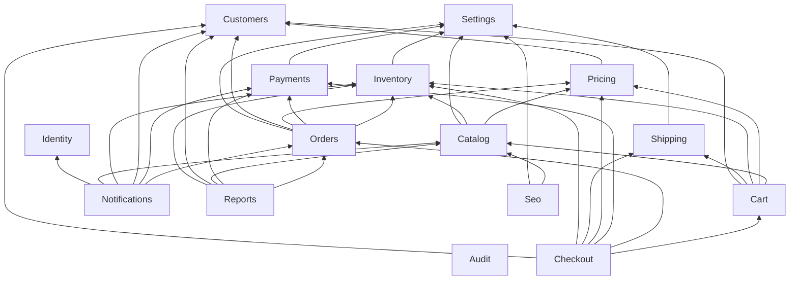

Camadas (de baixo para cima): **0** Shared → **1** Settings, Identity, Audit, Customers →
**2** Inventory, Pricing, Shipping, Payments → **3** Catalog → **4** Cart, Orders →
**5** Checkout → **6** Notifications, Reports, Seo.

Decisões que quebram ciclos potenciais:

| Ciclo evitado | Como |
|---|---|
| Catalog ↔ Pricing (listagem com preço × promoção por categoria) | Pricing recebe `PricingSubject` pronto; não lê Catalog. |
| Catalog ↔ Inventory (disponibilidade × nome no digest) | Inventory só conhece `variant_id`; nomes são resolvidos por Notifications/Catalog. |
| Orders ↔ Payments (aprovação × estorno) | Payments não conhece Orders; comunica por eventos que Orders consome. |
| Customers ↔ Cart (merge no login) | Customers emite `CustomerAuthenticated`; Cart escuta. |
| Todos ↔ Audit | Contrato `AuditLogger` em Shared; implementação em Audit. |
| Orders ↔ Checkout/Cart | Checkout é orquestrador de topo; Orders não conhece Cart. |

---

## 3. Organização do código Laravel

### 3.1 Árvore de diretórios

```text
backend/
├── app/
│   ├── Modules/
│   │   └── <Module>/                       # ex.: Orders
│   │       ├── Actions/                    # casos de uso; abrem transação
│   │       ├── Contracts/                  # interfaces públicas do módulo
│   │       ├── DTOs/                       # readonly; usados entre módulos
│   │       ├── Enums/
│   │       ├── Events/
│   │       ├── Exceptions/                 # estendem Shared\Exceptions\DomainException
│   │       ├── Http/
│   │       │   ├── Controllers/
│   │       │   │   ├── Store/              # público (/api/v1)
│   │       │   │   ├── Customer/           # cliente autenticado (/api/v1/me)
│   │       │   │   ├── Admin/              # painel (/api/v1/admin)
│   │       │   │   └── Webhook/            # só Payments
│   │       │   ├── Requests/{Store,Customer,Admin}/
│   │       │   └── Resources/{Store,Customer,Admin}/
│   │       ├── Jobs/
│   │       ├── Listeners/
│   │       ├── Models/
│   │       ├── Notifications/              # só Notifications (e resets de senha em Customers/Identity)
│   │       ├── Policies/
│   │       ├── Services/                   # implementações dos Contracts, regras sem I/O de request
│   │       ├── Console/                    # comandos artisan do módulo (agendados)
│   │       ├── Providers/<Module>ServiceProvider.php
│   │       └── routes/
│   │           ├── store.php               # opcional
│   │           ├── customer.php            # opcional
│   │           ├── admin.php               # opcional
│   │           ├── admin_guest.php         # só Identity (login/esqueci senha do painel)
│   │           ├── webhooks.php            # só Payments
│   │           └── web.php                 # só Seo (sitemap, robots, shell)
│   ├── Shared/
│   │   ├── Domain/                         # Money, Quantity, Dimensions, Weight, PackageDimensions,
│   │   │                                   # PostalCode, TaxDocument, Rounding, ActorRef
│   │   ├── Audit/                          # AuditLogger (interface), AuditEntry
│   │   ├── Exceptions/                     # DomainException + Handler de renderização
│   │   ├── Http/Middleware/                # RequestId, ForceJsonResponse, EnsureAdminSessionIsFresh
│   │   ├── Http/Casts/                     # MoneyCast, QuantityCast (numeric(12,3) ↔ Quantity)
│   │   ├── Logging/                        # RedactSensitiveDataProcessor, JsonLogFormatterTap
│   │   ├── Resilience/                     # CircuitBreaker (lite), HttpClientFactory
│   │   ├── Support/                        # Mask, HtmlSanitizer
│   │   └── Providers/ModuleServiceProvider.php   # classe base
│   └── Providers/AppServiceProvider.php    # Model::shouldBeStrict, Password defaults, rate limiters
├── bootstrap/app.php                       # middleware global, exceções, statefulApi
├── bootstrap/providers.php                 # lista os ServiceProviders dos módulos
├── config/                                 # modules.php (lista), payments.php, shipping.php
├── database/migrations/                    # timeline ÚNICA (prefixo de data)
├── database/seeders/                       # PermissionSeeder, DemoCatalogSeeder...
├── database/factories/                     # por model (namespace Database\Factories\<Module>)
├── deptrac.yaml
└── tests/
    ├── Unit/<Module>/                      # VOs, resolvers, state machine (sem HTTP)
    ├── Feature/<Module>/                   # HTTP + banco Postgres real
    ├── Feature/Security/                   # checklist de SECURITY.md §22
    └── Fakes/                              # FakePaymentGateway, FakeCarrier, FakePostalCodeLookup
```

- **Migrations** ficam em `database/migrations` (linha do tempo única, evita dependência de
  ordem entre módulos). Nome sugerido: `2026_10_01_000100_create_orders_table.php`.
- **Factories** de Models de módulo: `newFactory()` no Model apontando para
  `Database\Factories\<Module>\<Model>Factory`.

### 3.2 Classe base e ServiceProvider de módulo

```php
namespace App\Shared\Providers;

abstract class ModuleServiceProvider extends ServiceProvider
{
    /** @var array<class-string, class-string> interface => implementação */
    protected array $bindings = [];
    /** @var array<class-string, list<class-string>> evento => listeners */
    protected array $listen = [];
    /** @var array<class-string, class-string> model => policy */
    protected array $policies = [];

    abstract protected function moduleName(): string;   // 'Orders'

    public function register(): void
    {
        foreach ($this->bindings as $abstract => $concrete) {
            $this->app->singleton($abstract, $concrete);   // Services são stateless
        }
    }

    public function boot(): void
    {
        foreach ($this->listen as $event => $listeners) {
            foreach ($listeners as $listener) { Event::listen($event, $listener); }
        }
        foreach ($this->policies as $model => $policy) { Gate::policy($model, $policy); }
        $this->loadModuleRoutes();
    }

    protected function loadModuleRoutes(): void
    {
        if ($this->app->routesAreCached()) { return; }
        $dir = app_path("Modules/{$this->moduleName()}/routes");
        $groups = [
            'store.php'       => ['prefix' => 'api/v1',          'middleware' => ['api'],                                   'as' => 'store.'],
            'customer.php'    => ['prefix' => 'api/v1/me',       'middleware' => ['api', 'auth:customer', 'throttle:customer'], 'as' => 'customer.'],
            'admin_guest.php' => ['prefix' => 'api/v1/admin',    'middleware' => ['api'],                                   'as' => 'admin.'],
            'admin.php'       => ['prefix' => 'api/v1/admin',    'middleware' => ['api', 'auth:admin', 'admin.fresh', 'throttle:admin'], 'as' => 'admin.'],
            'webhooks.php'    => ['prefix' => 'api/v1/webhooks', 'middleware' => ['webhook'],                               'as' => 'webhooks.'],
            'web.php'         => ['prefix' => '',                'middleware' => ['seo'],                                   'as' => 'seo.'],
        ];
        foreach ($groups as $file => $attrs) {
            if (is_file("$dir/$file")) { Route::group($attrs, "$dir/$file"); }
        }
    }
}
```

```php
namespace App\Modules\Orders\Providers;

final class OrdersServiceProvider extends ModuleServiceProvider
{
    protected array $bindings = [
        OrderPlacement::class => OrderPlacementService::class,
    ];
    protected array $listen = [
        PaymentApproved::class       => [MarkOrderAsPaid::class],        // síncrono (na transação)
        PaymentRefunded::class       => [MarkOrderAsRefunded::class],    // síncrono
        PaymentAmountMismatch::class => [FlagOrderForReview::class],     // síncrono
    ];
    protected array $policies = [Order::class => OrderPolicy::class];
    protected function moduleName(): string { return 'Orders'; }
}
```

Configuração em `bootstrap/app.php`:

- `->withRouting(health: null, …)` sem `routes/api.php` genérico (rotas vêm dos módulos);
  `/api/health` é registrado em `routes/api.php` mínimo **ou** no provider do Shared.
- `->withMiddleware(fn ($m) => $m->statefulApi()` (Sanctum SPA: sessão + CSRF para
  origens em `SANCTUM_STATEFUL_DOMAINS`), `$m->prepend(RequestId::class)`,
  `$m->appendToGroup('api', ForceJsonResponse::class)`,
  `$m->group('webhook', [RequestId::class, ForceJsonResponse::class, 'throttle:webhooks'])`
  (sem sessão, sem CSRF), `$m->group('seo', [RequestId::class, 'throttle:seo'])` (sem sessão),
  `$m->alias(['admin.fresh' => EnsureAdminSessionIsFresh::class])`,
  `$m->validateCsrfTokens(except: ['api/v1/webhooks/*'])`, `$m->trustProxies(...)`.
- `->withEvents(discover: false)` — listeners **somente** via `$listen` dos providers
  (explícito, auditável); `php artisan event:cache` no deploy.
- `->withExceptions(...)`: `DomainException` → `{message, code}` com `status()`;
  `ValidationException` → 422 padrão; `AuthenticationException` → 401 JSON;
  `ThrottleRequestsException` → 429 com `Retry-After`.
- Rotas nomeadas com prefixo (`store.products.show`, `admin.orders.update-status`).
  Permissão nas rotas admin via `->can('update', 'order')` ou middleware
  `permission:orders.update_status,admin` além da Policy.

### 3.3 Regras de implementação

| Camada | Regra |
|---|---|
| Controller | Fino: recebe Form Request, chama **uma** Action/Service, devolve Resource. Sem query complexa, sem transação. |
| Form Request | `authorize()` delega à Policy quando há recurso; `rules()` espelhadas pelos schemas Zod. Controllers usam **só** `$request->validated()` / `->safe()->only([...])`. |
| Action | Um caso de uso (`PlaceCheckout`, `ChangeOrderStatus`). Abre `DB::transaction()`, aplica locks, registra auditoria, dispara eventos. Pode ser chamada por controller, job ou comando. |
| Service | Implementação de `Contracts/` (regra reutilizável). Não lê `request()`. |
| Model | `$fillable` explícito (nunca `$guarded = []`), casts para `Money`/`Quantity`/enums, `getRouteKeyName()` = `uuid` para recursos do cliente. `Model::shouldBeStrict()` fora de produção. |
| Resource | Única forma de saída JSON. Dinheiro como inteiro `*_cents`, quantidade como número decimal (string formatada `"5.500"` convertida para número), datas ISO-8601 UTC. Nunca expõe `id` interno em recursos do cliente (usa `uuid`/`number`). |
| Policy | Toda leitura/escrita de recurso de cliente (`OrderPolicy::view` confere `customer_id`) e toda ação admin (`$admin->can('orders.cancel')`). |
| DTO | Toda chamada entre módulos usa DTO/escalares, nunca `Request` e, preferencialmente, não Models de outro módulo. Principais: `CartSnapshot`, `CartLine`, `PriceContext`, `PriceQuote`, `PricingSubject`, `ShippingRequest`, `ShippingOption`, `CouponContext`, `CouponEvaluation`, `StockReservation`, `PlaceOrderData`, `PaymentRequest`, `PaymentData`. |
| Evento | `final class` com propriedades `readonly` escalares/IDs (serializáveis); nunca dados sensíveis. |
| Exceção de domínio | Estende `DomainException` com `errorCode()`; o handler traduz para HTTP. |
| Tempo | `now()`/`CarbonImmutable` (testável com `travelTo`). Timezone da aplicação **UTC**; exibição `America/Sao_Paulo` no frontend. |

**Ordem global de locks** (idêntica a `DATABASE.md` §4.2; evita deadlock entre checkout,
webhook, expiração e cancelamento): advisory lock de checkout do cliente → `carts` →
`orders` → `payments` → `coupons` → `inventory` (por `variant_id` crescente). O checkout não
trava `orders` (o pedido ainda não existe).

---

## 4. Fluxos principais

Convenções dos diagramas: `TX` = `DB::transaction()`; "afterCommit" = listener/job
enfileirado que só é despachado se a transação confirmar.

### 4.1 Adicionar ao carrinho (com cálculo de preço)

Antes de adicionar, a página de produto chama `POST /api/v1/price-quotes`
(`{variant_uuid, quantity | width_m, height_m, pieces}`, debounce 300 ms) que executa os
passos 4–7 abaixo sem persistir e retorna `PriceQuote` (unitário, total da linha, área
faturável, `min_area_applied`, `price_source`).

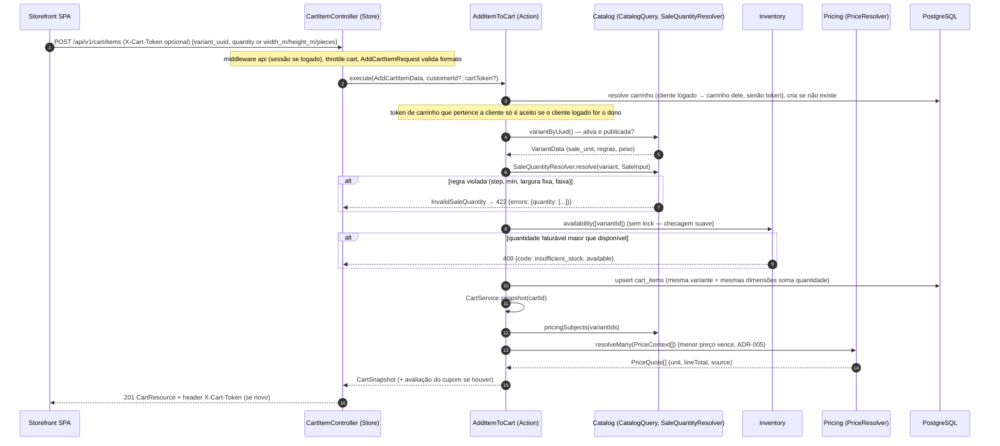

### 4.2 Cotação de frete

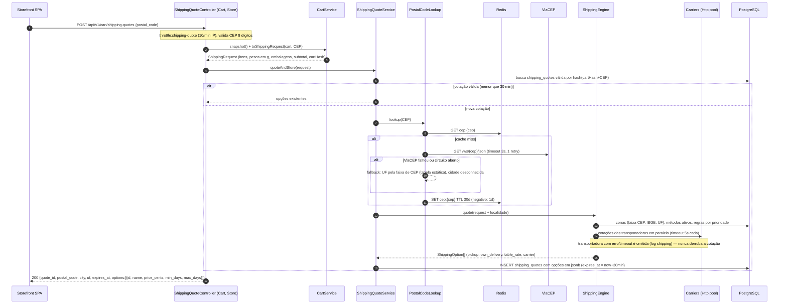

### 4.3 Checkout (PIX)

Pré-requisitos: cliente logado; carrinho com itens; endereço (`uuid`) do próprio cliente;
`shipping_quote_id` + `shipping_option_id` obtidos na cotação (contrato de `SHIPPING.md`). O corpo **não** contém preço, desconto, frete,
total, `customer_id` nem status (ADR-012). Opcional 🔧: `expected_total_cents` — usado
**apenas para comparação**; se diferente do total recalculado, 409 `price_changed` com os
novos totais (evita cobrar valor que o cliente não viu).

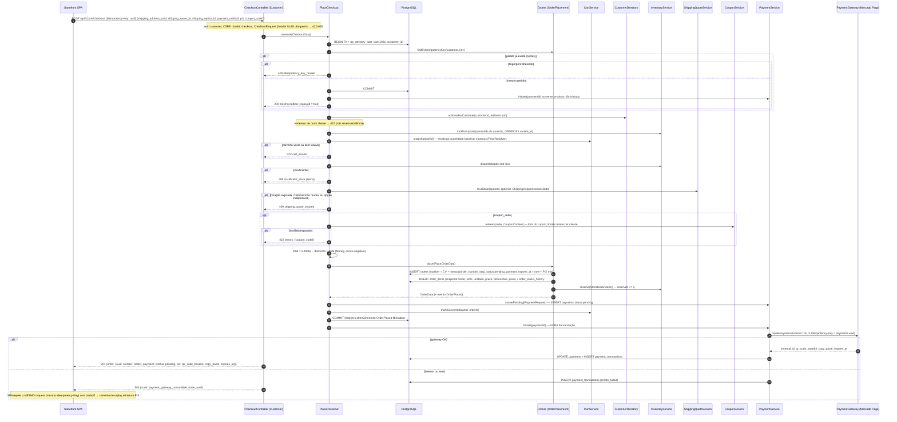

Observações:

- A trava consultiva `pg_advisory_xact_lock(1001, customer_id)` (namespace 1001 = checkout,
  `DATABASE.md` §4.2) serializa os checkouts do mesmo cliente; `unique(customer_id, idempotency_key)` é a garantia final (ADR-009).
- `checkout_fingerprint` = `sha256(cart_hash|address_uuid|shipping_option_id|payment_method|coupon)`
  🔧 (ver 12.2): mesma chave com corpo diferente → 409.
- Se o pedido ficar sem PIX (gateway fora), ele expira normalmente (4.5) e libera o estoque.

### 4.4 Webhook de pagamento

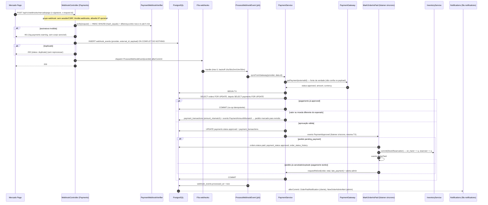

Rede de segurança: `payments:reconcile` (a cada 5 min) chama `syncFromGateway` para
pagamentos `pending` com mais de 5 min e não expirados — cobre webhooks perdidos.

### 4.5 Job de expiração de pedidos

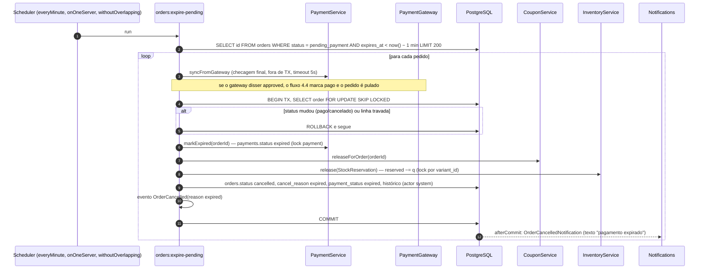

### 4.6 Mudança de status pelo admin

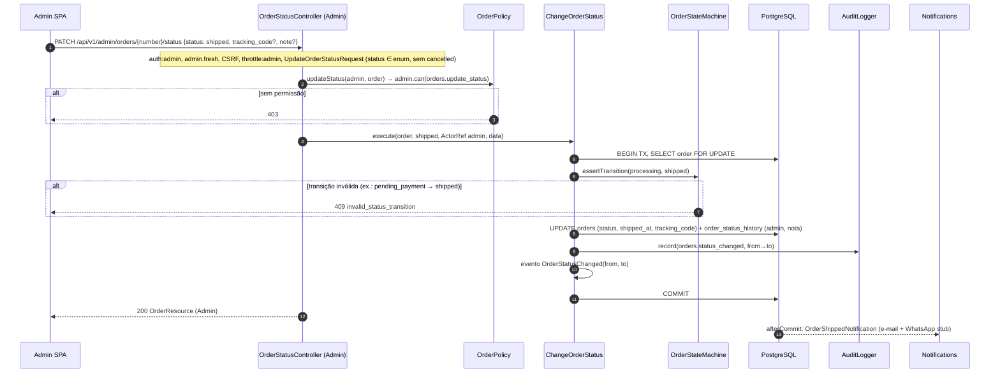

Transições permitidas (ADR-008): `paid → processing`, `processing → shipped |
ready_for_pickup`, `shipped → delivered`, `ready_for_pickup → picked_up`. `pending_payment
→ paid` **somente** pelo fluxo de pagamento (nunca manual no MVP). Cancelamento tem
endpoint próprio (4.7).

### 4.7 Cancelamento com estorno

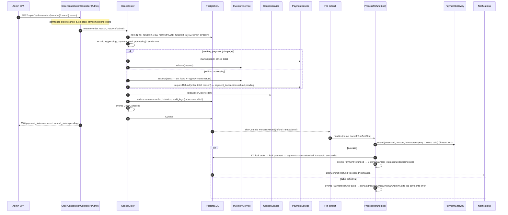

Cliente pode cancelar **apenas** pedidos `pending_payment` próprios
(`POST /api/v1/me/orders/{uuid}/cancel`, `OrderPolicy::cancel`), mesmo fluxo sem estorno.

---

## 5. Catálogo de eventos

### 5.1 Regras

- Eventos são disparados **dentro** da transação da Action que os causa.
- **Listeners síncronos** (sem `ShouldQueue`) fazem parte da consistência transacional do
  backend (ex.: `PaymentApproved → MarkOrderAsPaid`). Só são permitidos para escrita
  local no banco — **nunca** HTTP externo, e-mail ou operação lenta.
- **Listeners enfileirados** implementam `ShouldQueue` com `public bool $afterCommit = true`
  (e a conexão `redis` tem `after_commit => true` como rede de segurança): efeitos
  colaterais (e-mail, WhatsApp, reindexação, cache, alertas) só acontecem se a transação
  confirmar. Devem ser **idempotentes** (podem rodar 2×). `$tries`, `backoff()` e
  `failed()` definidos; falha final vai para `failed_jobs` e log `error`.
- Payload: IDs e escalares imutáveis (`readonly`). Nenhum dado sensível (senha, token,
  CPF/CNPJ completo). O listener recarrega o que precisar.
- Nomes no passado (`OrderPaid`), namespace `App\Modules\<Module>\Events`.

### 5.2 Tabela

| Evento (módulo) | Payload | Listeners | Tipo / fila |
|---|---|---|---|
| `CustomerRegistered` (Customers) | `customerId`, `type` (person/company), `occurredAt` | `SendWelcomeEmail` (Notifications) | queued / `notifications` |
| `CustomerAuthenticated` (Customers) | `customerId`, `?guestCartToken` | `MergeGuestCart` (Cart) | **síncrono** |
| `CustomerPasswordReset` (Customers) | `customerId` | `SendPasswordChangedEmail` (Notifications) | queued / `notifications` |
| `AdminLoggedIn` / `AdminLoginFailed` (Identity) | `?adminUserId`, `emailHash`, `ip` | (auditoria gravada pela própria Action) | — |
| `AdminRolesChanged` (Identity) | `adminUserId`, `roles[]`, `byAdminId` | `ForgetPermissionCache` (Identity) | síncrono |
| `ProductSaved` (Catalog) | `productId`, `changedFields[]` | `ReindexProduct` (Catalog), `ForgetSitemapCache` (Seo) | queued / `default` |
| `ProductDeleted` (Catalog) | `productId` | `RemoveFromSearchIndex` (Catalog), `ForgetSitemapCache` (Seo) | queued / `default` |
| `ProductSlugChanged` (Catalog) | `productId`, `oldPath`, `newPath` | `CreateRedirect` (Seo) | **síncrono** |
| `CategoryTreeChanged` (Catalog) | `categoryId` | `ForgetCategoryTreeCache` (Catalog), `ForgetSitemapCache` (Seo) | queued / `default` |
| `StockLow` (Inventory) | `variantId`, `availableMilli`, `thresholdMilli` | `RecordLowStockForDigest` (Notifications — acumula em Redis set p/ digest diário) | queued / `notifications` |
| `StockAdjusted` (Inventory) | `variantId`, `movementId`, `type`, `deltaMilli`, `actor` | — (auditoria gravada pela Action; reservado p/ ERP) | — |
| `CouponRedeemed` (Pricing) | `couponId`, `orderId`, `customerId`, `discountCents` | — (futuro: métricas) | — |
| `OrderPlaced` (Orders) | `orderId`, `orderUuid`, `number`, `customerId`, `totalCents`, `paymentMethod` | `SendOrderReceived` (e-mail com instruções PIX, após `initiate`; se o PIX ainda não existir o e-mail sai sem QR e com link para o pedido), `NotifyAdminNewOrder` | queued / `notifications` |
| `OrderPaid` (Orders) | `orderId`, `number`, `customerId`, `totalCents`, `paidAt` | `SendOrderPaid` (cliente), `NotifyAdminOrderPaid`, `CheckLowStockAfterSale` (Inventory → pode emitir `StockLow`) | queued / `notifications` (e `default` p/ estoque) |
| `OrderStatusChanged` (Orders) | `orderId`, `from`, `to`, `actor`, `?trackingCode` | `SendOrderStatusUpdate` (e-mail/WhatsApp para `shipped`, `ready_for_pickup`, `delivered`) | queued / `notifications` |
| `OrderCancelled` (Orders) | `orderId`, `number`, `reason` (expired, customer, admin, fraud), `wasPaid`, `actor` | `SendOrderCancelled` | queued / `notifications` |
| `PaymentCreated` (Payments) | `paymentId`, `orderId`, `method`, `expiresAt` | — | — |
| `PaymentApproved` (Payments) | `paymentId`, `orderId`, `amountCents`, `approvedAt`, `gateway` | `MarkOrderAsPaid` (Orders) | **síncrono** (mesma TX) |
| `PaymentFailed` (Payments) | `paymentId`, `orderId`, `reasonCode` | `RecordPaymentFailure` (Orders, histórico — pedido continua `pending_payment` até expirar) | síncrono |
| `PaymentExpired` (Payments) | `paymentId`, `orderId` | — (Orders é quem inicia a expiração) | — |
| `PaymentRefunded` (Payments) | `paymentId`, `orderId`, `amountCents`, `refundedAt` | `MarkOrderAsRefunded` (Orders, síncrono); `SendRefundProcessed` (Notifications) | síncrono + queued / `notifications` |
| `PaymentRefundFailed` (Payments) | `paymentId`, `orderId`, `reasonCode`, `attempts` | `AlertAdminPaymentAnomaly` (Notifications) | queued / `notifications` |
| `PaymentAmountMismatch` (Payments) | `paymentId`, `orderId`, `expectedCents`, `receivedCents` | `FlagOrderForReview` (Orders, síncrono); `AlertAdminPaymentAnomaly` | síncrono + queued |
| `SettingsUpdated` (Settings) | `keys[]`, `actor` | `ForgetSettingsCache` (Settings) | síncrono |

---

## 6. Cache, filas e agendador

### 6.1 Cache (Redis, store `redis`, prefixo `cv:{env}:`)

Estratégia: *cache-aside* com chaves versionadas; invalidação explícita por evento.
**Não** usar cache tags (fragilidade no Redis Cluster/limpeza). **Não** cachear preço por
cliente, carrinho, estoque ou totais no MVP (sempre calculados).

| Chave | Conteúdo | TTL | Invalidação |
|---|---|---|---|
| `catalog:category_tree:v{n}` | árvore de categorias ativas (menu) | 6 h | `CategoryTreeChanged` incrementa `catalog:category_tree:version` |
| `catalog:brands:active` | marcas ativas | 6 h | `ProductSaved`/CRUD de marca → `forget` |
| `catalog:facets:{categoryId}:v{n}` | facets de filtros por categoria (atributos/marcas) | 1 h | versão da categoria |
| `settings:all` | todas as settings | sem TTL (`forever`) | `SettingsUpdated` |
| `cep:{cep}` | resultado de `PostalCodeLookup` | 30 dias (negativo: 24 h) | — |
| `shipping:methods:active` | métodos/zonas/regras ativas | 10 min | CRUD de frete → `forget` |
| `shipping:carrier:{code}:{hash}` | resposta de transportadora | 10 min | — |
| `seo:sitemap` | XML do sitemap | 6 h | `ProductSaved/Deleted`, `CategoryTreeChanged` |
| `seo:shell:{path}` | meta tags da página shell (sem preço dinâmico por cliente; preço base "a partir de" do JSON-LD) | 15 min | `ProductSaved` do produto |
| `cb:{service}:*` | estado do circuit breaker (§7.6) | 60 s | automático |
| `spatie.permission.cache` | permissões | 24 h | automático do pacote |
| `scheduler:heartbeat` | timestamp do último tick do scheduler | 5 min | escrito a cada minuto |

Sessões (`SESSION_DRIVER=redis`, conexão Redis `session` separada da `cache` para que
`cache:clear` não derrube sessões), rate limiting e locks (`Cache::lock`, `onOneServer`)
também usam Redis.

### 6.2 Filas

| Fila | Uso | Prioridade | Worker |
|---|---|---|---|
| `webhooks` | `ProcessWebhookEvent` (pagamento) | 1 (maior) | `queue:work redis --queue=webhooks,default,notifications` |
| `default` | reindexação, `ProcessRefund`, invalidações de cache, exports, processamento de imagens | 2 | mesmo worker |
| `notifications` | e-mails, WhatsApp, alertas admin, digest | 3 | mesmo worker |

- MVP: **1 container `queue`** consumindo as três filas em ordem de prioridade
  (`--tries=3 --backoff=10 --max-time=3600 --memory=256`); escalar criando containers
  dedicados por fila (ex.: um só para `webhooks`).
- `QUEUE_CONNECTION=sync` nos testes (ADR-002); testes de "afterCommit" usam `Queue::fake()`.
- `failed_jobs` no Postgres (`database-uuids`), `queue:prune-failed --hours=720` semanal.
- `retry_after` (90 s) > maior timeout de job (60 s). Jobs com HTTP definem `$timeout`.
- **Horizon: não no MVP.** Justificativa: um worker só, filas pequenas; `queue:monitor`
  + logs + `failed_jobs` bastam. Adotar Horizon quando houver ≥ 2 workers ou necessidade
  de métricas de throughput (é drop-in, só Redis). 🔧 registrado em 12.2.

### 6.3 Agendador (`routes/console.php` + comandos dos módulos)

Todos com `->onOneServer()->withoutOverlapping()` e timezone `America/Sao_Paulo` para os
diários. Container `scheduler` roda `php artisan schedule:work`.

| Comando | Frequência | Módulo | O que faz |
|---|---|---|---|
| `orders:expire-pending` | a cada minuto | Orders | Fluxo 4.5 (lotes de 200). |
| `payments:reconcile` | a cada 5 min | Payments | `syncFromGateway` de pagamentos `pending` com 5 min a 24 h. |
| `webhooks:retry-unprocessed` | a cada 10 min | Payments | Re-enfileira `webhook_events` sem `processed_at` com mais de 10 min. |
| `scheduler:heartbeat` | a cada minuto | Shared | Grava `scheduler:heartbeat` (usado por `/api/health`). |
| `queue:monitor redis:webhooks,redis:default,redis:notifications --max=100` | a cada 5 min | Shared | Loga/alerta fila acumulada. |
| `carts:prune` | diário 03:10 | Cart | Remove carrinhos visitantes inativos há 30 dias e de clientes há 90 dias (não convertidos). |
| `shipping:prune-quotes` | diário 03:20 | Shipping | Remove `shipping_quotes` expiradas há mais de 24 h (não referenciadas por pedido — o pedido guarda snapshot). |
| `inventory:low-stock-digest` | diário 07:50 | Notifications | E-mail aos admins com `inventory.adjust`/`reports.view` listando variantes abaixo do limiar. |
| `webhooks:prune` | semanal (dom 04:00) | Payments | Remove `webhook_events` processados há mais de 180 dias. |
| `auth:clear-resets` | diário 04:10 | Customers/Identity | Tokens de reset expirados (ambos os brokers). |
| `queue:prune-failed --hours=720` | semanal | Shared | Limpeza de `failed_jobs`. |

---

## 7. Integrações externas

Princípios: toda integração atrás de **interface no módulo dono**, driver escolhido por
`config/*.php` + env, **fake** registrado nos testes, **timeouts explícitos**, retry só em
operações idempotentes, *circuit breaker lite* (§7.6), log no canal dedicado com
`request_id` e sem segredos, respostas mapeadas para DTOs (nada de arrays crus do
fornecedor fora do adapter).

### 7.1 Pagamentos (`App\Modules\Payments`)

```php
interface PaymentGatewayInterface {                       // ADR-010
    public function createPayment(PaymentRequest $request, string $idempotencyKey): GatewayPayment;
    public function getPayment(string $externalId): GatewayPayment;
    public function refund(string $externalId, ?Money $amount, string $idempotencyKey): GatewayRefund;
    public function supports(PaymentMethod $method): bool;
}
interface PaymentWebhookVerifier {                        // 🔧 separado da interface do gateway
    /** Lança InvalidWebhookSignature. Retorna o essencial para dedupe e processamento. */
    public function verify(Request $request): WebhookNotification; // {provider, externalEventId, resourceId, type, occurredAt}
}
final class PaymentGatewayManager extends \Illuminate\Support\Manager {
    public function getDefaultDriver(): string { return config('payments.driver'); } // sandbox|mercadopago
    protected function createSandboxDriver(): PaymentGatewayInterface;
    protected function createMercadopagoDriver(): PaymentGatewayInterface;
}
```

| Driver | Detalhes |
|---|---|
| `sandbox` | PIX fake (QR PNG gerado localmente + copia-e-cola `00020126...SANDBOX`). Comando `php artisan payments:sandbox-approve {order_number}` e botão no admin **apenas em `local`/`staging`** enviam webhook assinado com `SANDBOX_WEBHOOK_SECRET`, exercitando o mesmo caminho de produção. |
| `mercadopago` | `POST /v1/payments` (`payment_method_id=pix`, `date_of_expiration`, `X-Idempotency-Key`), `GET /v1/payments/{id}`, `POST /v1/payments/{id}/refunds`. Webhook: header `x-signature` (`ts=…,v1=…`) com HMAC-SHA256 do manifesto `id:{data.id};request-id:{x-request-id};ts:{ts};` usando `MERCADOPAGO_WEBHOOK_SECRET`. |
| `FakePaymentGateway` (tests) | Em memória, controlável (`approveNext()`, `failNextWith()`, `throwTimeout()`), registra chamadas para asserts. Testes do driver real usam `Http::fake` + `Http::preventStrayRequests()`. |

Timeouts: connect 3 s; `createPayment` 10 s; `getPayment` 5 s; `refund` 15 s.
Retries: `getPayment` 2× (100 ms, 500 ms); `createPayment`/`refund` **0 retries síncronos**
(a idempotência é garantida pela `X-Idempotency-Key`; o retry acontece por replay do
checkout ou pelo backoff do job).

### 7.2 Transportadoras (`App\Modules\Shipping`)

```php
interface ShippingCarrierInterface {
    public function code(): string;                                     // 'correios', 'jadlog', 'fake'
    /** @return list<CarrierQuote> {serviceCode, name, Money price, int minDays, int maxDays} */
    public function quote(ShippingRequest $request, CarrierServiceConfig $config): array;
    // Evolução: createShipment(), track(), label() — em interfaces separadas (ISP).
}
```

- Registro: `config/shipping.php` → `carriers` (código → classe + credenciais env);
  `CarrierRegistry` resolve os ativos para o método `carrier`.
- Chamadas em paralelo via `Http::pool()`, timeout 5 s cada, **sem retry** (cotação é
  descartável). Falha → opção omitida + log `shipping.warning`. Se **todas** falharem,
  os métodos internos (`pickup`, `own_delivery`, `table_rate`) ainda respondem.
- Fakes: `FakeCarrier` (preço/prazo determinísticos por CEP), `FailingCarrier`.

### 7.3 CEP (`PostalCodeLookup`)

```php
interface PostalCodeLookup {
    public function lookup(PostalCode $cep): ?PostalCodeInfo; // {cep, street, district, city, uf, ibgeCode, source: viacep|cache|fallback}
}
```

`CachedPostalCodeLookup` (decorator Redis, §6.1) → `ViaCepPostalCodeLookup` (timeout 3 s,
1 retry em erro de conexão) → fallback `UfRangePostalCodeLookup` (tabela estática de faixas
de CEP por UF; cidade/IBGE nulos — zonas por faixa de CEP e por UF continuam funcionando,
zonas por cidade não casam). Resposta `{"erro": true}` do ViaCEP = CEP inexistente → 422 no
endpoint. Teste: `FakePostalCodeLookup` com mapa fixo.

### 7.4 Busca (`ProductSearch`, ADR-014)

`PostgresProductSearch`: coluna `products.search_vector tsvector` (peso A nome/SKU, B marca/
categoria, C descrição) mantida pelo job `ReindexProduct` (não generated column, pois junta
tabelas); consulta com `websearch_to_tsquery('portuguese', unaccent(:q))` + `sku ILIKE :prefix || '%'`
(com escape de `%`/`_`), `ts_rank` + filtros (categoria, marca, faixa de preço base, atributos,
em estoque) e paginação. Troca futura: `MeilisearchProductSearch` implementando a mesma
interface; `ReindexProduct` passa a enviar documento ao Meilisearch. Teste: Postgres real.

### 7.5 WhatsApp (stub)

```php
interface WhatsAppClient { public function sendTemplate(string $toE164, string $template, array $params): WhatsAppResult; }
final class WhatsAppChannel { public function send(object $notifiable, Notification $n): void; } // chama $n->toWhatsApp()
```

Drivers: `log` (MVP: grava no log `notifications` com telefone mascarado), `null` (testes),
futuro `cloud_api` (Meta) ou provedor BR. Ativado por `Setting notifications.whatsapp_enabled`
**e** opt-in do cliente (`customers.whatsapp_opt_in_at`) — LGPD.

### 7.6 Resiliência (circuit breaker lite)

`App\Shared\Resilience\CircuitBreaker::call(string $service, callable $fn, callable $fallback)`:

- Conta falhas (timeout/5xx) em `cb:{service}:failures` (janela 60 s). Com **5 falhas** abre
  o circuito por **60 s** (`cb:{service}:open`); aberto → executa `fallback` sem chamar o
  serviço. Após 60 s, a próxima chamada é o "teste" (half-open).
- Aplicado a: ViaCEP (fallback UF), transportadoras (omitir opção), `getPayment` na
  reconciliação (pular ciclo). **Não** aplicado a `createPayment` no checkout (o usuário
  recebe 503 e pode repetir) nem a webhooks.
- `HttpClientFactory::for(string $service)` centraliza `timeout`, `connectTimeout`,
  `retry`, user-agent, log de latência e propagação de `X-Request-Id`.

---

## 8. Arquitetura dos frontends

As duas SPAs (`storefront/`, `admin/`) têm a mesma estrutura e convenções, sem pacote
compartilhado no MVP (código comum pequeno é duplicado de propósito em `src/shared`;
um workspace `packages/shared` fica para quando a duplicação doer).

### 8.1 Estrutura de pastas

```text
<spa>/
├── index.html                      # lang="pt-BR"; storefront contém marcadores <!--seo:head--> p/ shell
├── vite.config.ts                  # proxy /api e /sanctum; admin: base '/admin/'
├── src/
│   ├── main.tsx
│   ├── app/
│   │   ├── App.tsx                 # providers: QueryClient, Theme (MUI pt-BR), Helmet, Router, ErrorBoundary
│   │   ├── router.tsx              # createBrowserRouter, rotas lazy
│   │   ├── queryClient.ts
│   │   ├── theme.ts
│   │   └── layouts/                # StoreLayout / AdminLayout (menu por permissão)
│   ├── features/
│   │   └── <feature>/              # storefront: catalog, search, cart, checkout, auth, account, orders
│   │       │                       # admin: auth, dashboard, products, categories, brands, inventory, pricing,
│   │       │                       #        coupons, orders, customers, shipping, users, settings, reports, audit
│   │       ├── api/                # funções HTTP tipadas + query keys + hooks useQuery/useMutation
│   │       ├── components/
│   │       ├── hooks/
│   │       ├── schemas/            # Zod (espelho dos Form Requests) + tipos inferidos
│   │       └── pages/              # componentes de rota (lazy)
│   └── shared/
│       ├── api/                    # client.ts (axios), errors.ts (ApiError), csrf.ts, types.ts (Paginated<T>)
│       ├── ui/                     # componentes MUI base: MoneyText, QuantityInput, DimensionsInput, FormTextField...
│       ├── formatters/             # money.ts, quantity.ts, date.ts, document.ts (CPF/CNPJ), postalCode.ts
│       ├── hooks/                  # useAuth, useDebounce, useCartToken, usePermission (admin)
│       └── lib/                    # safeHtml.ts (DOMPurify), env.ts
└── tests/                          # e2e Playwright (ou /e2e na raiz)
```

Regra: `features/A` não importa de `features/B` exceto via `index.ts` público da feature
(ESLint `import/no-restricted-paths`). `shared` não importa de `features`.

### 8.2 Roteamento

**Storefront** (paths pt-BR, ADR-015; slugs reservados não podem ser slug de categoria —
validação no backend):

| Rota | Página | Acesso |
|---|---|---|
| `/` | Home | público |
| `/busca?q=` | Resultados | público |
| `/carrinho` | Carrinho + cotação de frete | público |
| `/checkout` | Endereço → frete → revisão → pagamento | `RequireCustomer` (redireciona a `/entrar?redirect=/checkout`) |
| `/checkout/pedido/:uuid` | PIX (QR, copia-e-cola, contador, polling de status 5 s) | cliente |
| `/entrar`, `/cadastro`, `/recuperar-senha`, `/redefinir-senha` | Auth | só visitante |
| `/conta`, `/conta/pedidos`, `/conta/pedidos/:uuid`, `/conta/enderecos`, `/conta/dados` | Área do cliente | cliente |
| `/:categorySlug` | Categoria | público |
| `/:categorySlug/:productSlug` | Produto | público |
| `*` | 404 (com `noindex`) | — |

**Admin** (`basename: '/admin'`): `/entrar`, `/` (dashboard), `/produtos`, `/produtos/:id`,
`/categorias`, `/marcas`, `/estoque`, `/precos` (tabelas, preços de cliente),
`/promocoes`, `/cupons`, `/pedidos`, `/pedidos/:number`, `/clientes`, `/clientes/:id`,
`/frete`, `/usuarios`, `/configuracoes`, `/relatorios`, `/auditoria`. Cada rota declara
`permission` (ex.: `orders.view`); `RequirePermission` esconde menu e bloqueia rota
(o backend continua sendo a autoridade — 403).

### 8.3 Autenticação (Sanctum stateful)

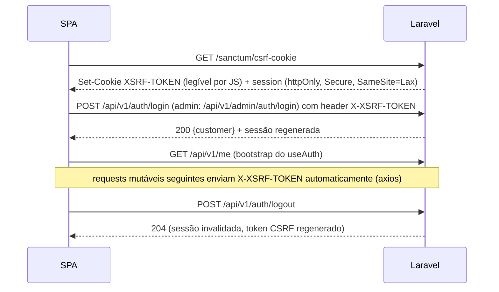

- `axios.create({ baseURL: '/api/v1', withCredentials: true, withXSRFToken: true, headers: { Accept: 'application/json' } })`.
- `useAuth()` = `useQuery(['auth','me'])` com `retry: false`; 401 → `null` (visitante).
  Após login/logout: `queryClient.clear()` (evita vazar dados entre usuários) e, no
  storefront, refetch do carrinho (merge ocorre no backend via `X-Cart-Token`).
- `X-Cart-Token` (storefront) é guardado em `localStorage` (`cv_cart_token`) e enviado por
  interceptor; após login o backend faz merge e o token do cliente passa a valer.
- 419 (CSRF expirado) → interceptor chama `/sanctum/csrf-cookie` e repete **uma** vez.
- Admin: 401 em qualquer rota → redireciona para `/admin/entrar?redirect=…`; aviso de
  sessão expirando conforme `admin.fresh` (idle 30 min).

### 8.4 TanStack Query — convenções de chave

Fábricas por feature em `features/<f>/api/keys.ts`; chave = `[domínio, escopo, params]`:

```ts
export const productKeys = {
  all: ['products'] as const,
  lists: () => [...productKeys.all, 'list'] as const,
  list: (filters: ProductFilters) => [...productKeys.lists(), filters] as const,
  detail: (slug: string) => [...productKeys.all, 'detail', slug] as const,
};
// ['cart'], ['cart','shipping-quote', cep], ['orders','list',{page}], ['orders','detail',uuid], ['auth','me']
// admin: ['admin','orders','list',filters], ['admin','orders','detail',number], ['admin','settings']
```

| Dado | `staleTime` | Observação |
|---|---|---|
| Catálogo/categorias | 5 min | `placeholderData: keepPreviousData` em listas |
| Carrinho | 0 | mutações fazem `setQueryData` com a resposta do servidor (fonte da verdade) |
| Cotação de frete | 0 (expira em 30 min no servidor) | invalidada quando o carrinho muda |
| Pedido PIX pendente | polling 5 s até `paid`/`cancelled` | para quando a aba está oculta |
| Admin listas | 30 s | invalidação por prefixo após mutação (`['admin','orders']`) |

Defaults: `retry` só para erros de rede/5xx (máx. 2), nunca para 4xx;
`refetchOnWindowFocus` ligado apenas no admin.

### 8.5 Tratamento de erros

`shared/api/errors.ts` normaliza tudo em `ApiError { status, message, code?, fieldErrors?, requestId? }`:

| Status | Comportamento |
|---|---|
| 422 | `applyServerErrors(form.setError, error.fieldErrors)` mapeia chaves do Laravel (`items.0.quantity` → campo do RHF); mensagens do backend já em pt-BR são exibidas como vieram. Erros sem campo → `Alert` no topo do form. |
| 401 | storefront: limpa `['auth','me']`; rotas protegidas redirecionam para `/entrar`. |
| 403 | página/aviso "sem permissão". |
| 404 | página 404. |
| 409 | tratado por `code`: `insufficient_stock` (ajusta quantidade), `shipping_quote_expired` (recota), `price_changed` (mostra novos totais e pede confirmação), `idempotency_key_reused`, `invalid_status_transition`. |
| 419 | renova CSRF e repete uma vez. |
| 429 | toast "muitas tentativas, tente em N s" (`Retry-After`). |
| 5xx/rede | toast genérico + `requestId` ("Código do erro: …") para suporte; `ErrorBoundary` por rota. |

### 8.6 Dinheiro, quantidade e formatação

- `formatBRL(cents: number): string` → `Intl.NumberFormat('pt-BR', { style: 'currency', currency: 'BRL' }).format(cents / 100)` (divisão só para exibição).
- `parseBRLToCents(input: string): number` — parsing por string (`"1.234,56"` → `123456`), nunca `parseFloat * 100`.
- Quantidade: `toMilli(input: string): number` (aceita vírgula; rejeita > 3 casas) e
  `formatQuantity(value: number, unit: SaleUnit)` (`"5,5 m"`, `"2,350 m²"`, `"3 un"`, `"1 rolo"`).
  Envio para API como número decimal com até 3 casas (`milli / 1000`), conforme ADR-013;
  cálculos locais (ex.: prévia de área) sempre em inteiros (mm, milli).
- Dimensões: usuário digita metros com vírgula (`1,22`); `DimensionsInput` valida faixa/
  largura fixa conforme regras do produto vindas da API; o preço exibido vem **sempre**
  de `POST /price-quotes` (o frontend nunca calcula preço).
- Datas: `formatDateTime(iso)` em `America/Sao_Paulo`; documentos com máscara (CPF/CNPJ/CEP/telefone).

### 8.7 Schemas Zod

- Um schema por Form Request (`features/checkout/schemas/checkout.ts` ↔ `CheckoutRequest`),
  com as **mesmas** regras (obrigatoriedade, tamanhos máx., regex de CEP/CPF/CNPJ, enum,
  `decimal:0,3`). Mensagens em pt-BR via `z.setErrorMap`.
- Tipos de resposta também em Zod (`ProductResource`) e validados em dev (`parse`) / em
  produção só inferidos (sem custo), para detectar divergência de contrato cedo.
- Validação local é **conveniência**; o backend é a autoridade (422 sempre tratado).

### 8.8 Code-splitting e performance

- Todas as páginas via `lazy()` + `Suspense` com skeletons; rotas de conta/checkout só
  carregam após interação. Admin: editores, gráficos (relatórios) e upload em chunks
  próprios.
- `manualChunks` para `react`/`mui`/`tanstack`. Orçamento storefront: JS inicial ≤ 250 kB
  gzip (verificado no CI com `size-limit` 🔧 opcional).
- Imagens: `srcset` com as variantes geradas no backend (300/800/1600 px, WebP),
  `loading="lazy"`, dimensões explícitas (CLS).

### 8.9 Acessibilidade (baseline WCAG 2.1 AA)

- `lang="pt-BR"`, landmarks (`header/nav/main/footer`), um `h1` por página, título por rota (Helmet).
- Todo input com `label` associado; erros ligados por `aria-describedby`; foco no primeiro
  campo com erro após 422.
- Navegação por teclado completa (menus, modais com focus trap — MUI), foco visível,
  skip-link "Pular para o conteúdo"; foco movido ao `h1` em troca de rota.
- Contraste AA no tema; não comunicar só por cor (status de pedido com texto/ícone).
- `aria-live="polite"` para atualização do carrinho, total e status do PIX.
- QR code PIX com alternativa textual (copia-e-cola + botão "Copiar").
- `eslint-plugin-jsx-a11y` no lint; `@axe-core/playwright` nos E2E principais.

### 8.10 Vite (dev)

```ts
// storefront/vite.config.ts (admin igual, com base: '/admin/' e port 5174)
export default defineConfig({
  plugins: [react()],
  server: {
    port: 5173,
    proxy: {
      '/api': { target: 'http://localhost:8080', changeOrigin: false },
      '/sanctum': { target: 'http://localhost:8080', changeOrigin: false },
    },
  },
});
```

`SANCTUM_STATEFUL_DOMAINS=localhost:5173,localhost:5174,localhost:8080`; `SESSION_DOMAIN`
vazio (host-only) em dev. `changeOrigin: false` preserva `Host`/`Origin` para o Sanctum
reconhecer a SPA como stateful.

---

## 9. Infraestrutura, CI/CD e deploy

### 9.1 docker-compose (desenvolvimento)

| Serviço | Imagem / build | Porta host | Função |
|---|---|---|---|
| `nginx` | `docker/nginx/Dockerfile` (nginx:1.27-alpine) | 8080 | Roteamento (9.2); em dev serve builds se existirem, senão só API. |
| `app` | `docker/php/Dockerfile` (php:8.4-fpm-alpine + pdo_pgsql, redis, intl, gd/imagick, bcmath, opcache, pcntl) | — | php-fpm; código montado de `./backend`. |
| `queue` | mesma imagem do `app` | — | `php artisan queue:work redis --queue=webhooks,default,notifications --tries=3 --max-time=3600`. |
| `scheduler` | mesma imagem do `app` | — | `php artisan schedule:work`. |
| `postgres` | `postgres:16-alpine` | 5432 | Script `docker/postgres/init.sql`: extensões `unaccent`, `pg_trgm`, `citext`; bancos `ecommerce`, `ecommerce_test`, `ecommerce_test_<agente>` (ADR-017). |
| `redis` | `redis:7-alpine` (`appendonly yes`) | 6379 | cache, sessões, filas, rate limit. |
| `minio` | `minio/minio` | 9000 / 9001 (console) | S3 dev. |
| `minio-setup` | `minio/mc` (one-shot) | — | cria bucket `ecommerce`, política pública só para prefixo `public/`. |
| `mailpit` | `axllent/mailpit` | 8025 (UI) / 1025 (SMTP) | e-mail dev. |
| `node` (profile `frontend`) | `node:22-alpine` | 5173 / 5174 | `npm run dev` de `storefront` e `admin` (ou rodar no host). |

Todos com `healthcheck`; `app/queue/scheduler` dependem de `postgres` e `redis` *healthy*.
Volumes nomeados para `pgdata`, `redisdata`, `miniodata`.

### 9.2 Roteamento nginx (produção; dev equivalente em :8080)

| Location | Destino | Observação |
|---|---|---|
| `^~ /api/` | php-fpm (`backend/public/index.php`) | `client_max_body_size 10m` (upload de imagem), `fastcgi_read_timeout 30s`. |
| `^~ /sanctum/` | php-fpm | CSRF cookie. |
| `= /sitemap.xml`, `= /robots.txt` | php-fpm (módulo Seo) | cache HTTP 1 h. |
| `= /admin` | `301 /admin/` | |
| `^~ /admin/` | `alias /var/www/admin/; try_files $uri $uri/ /admin/index.html` | `index.html` com `Cache-Control: no-store`; `/admin/assets/*` com `immutable, max-age=31536000`. CSP do admin (SECURITY.md §14). `X-Robots-Tag: noindex`. |
| `^~ /assets/` | storefront `dist/assets` | hash no nome → cache 1 ano. |
| `~ ^/(busca\|carrinho\|checkout\|conta\|entrar\|cadastro\|recuperar-senha\|redefinir-senha)(/.*)?$` | storefront `index.html` estático | `no-store`; `X-Robots-Tag: noindex` exceto `/busca`. |
| `= /` | storefront `index.html` | meta padrão da loja. |
| `/` (demais) | `try_files $uri @seo_shell` | arquivos reais (favicon, manifest) servidos direto. |
| `@seo_shell` | php-fpm → `Seo\ShellController` | Resolve `/{category}` e `/{category}/{product}`; injeta meta/JSON-LD no `index.html` da loja (`SEO_SHELL_INDEX_PATH`, copiado para a imagem do backend no build). Slug inexistente → mesmo shell com **status 404** + `noindex`; slug antigo → 301 (`url_redirects`). |

TLS termina no nginx (ou no load balancer, com `real_ip` + `TrustProxies` configurados).
HTTP → HTTPS 301. Headers de segurança em snippet incluído em todos os `server` (SECURITY.md §14).

### 9.3 Ambientes

| Ambiente | Onde | Particularidades |
|---|---|---|
| `local` | docker-compose | `APP_DEBUG=true`, `payments.driver=sandbox`, Mailpit, MinIO, `Model::shouldBeStrict()`. |
| `testing` | CI e local (`phpunit.xml`) | Postgres real (`ecommerce_test*`), `QUEUE_CONNECTION=sync`, `CACHE_STORE=array`, `FILESYSTEM_DISK=local`, `MAIL_MAILER=array`, fakes de gateway/CEP/transportadora, `Http::preventStrayRequests()`. |
| `staging` | igual à produção, dados fictícios | `payments.driver=mercadopago` (credenciais de teste) ou `sandbox`; `noindex` global; basic-auth opcional. |
| `production` | VM(s) com Docker Compose (MVP) | `APP_DEBUG=false`, `APP_ENV=production`, TLS, backups, Sentry DSN, `SESSION_SECURE_COOKIE=true`. |

Configuração exclusivamente por env (`.env.example` versionado sem segredos; segredos no
GitHub Environments / secret manager do provedor — ver SECURITY.md §16).

### 9.4 CI (GitHub Actions — `.github/workflows/ci.yml`)

Disparo: `pull_request` e `push` em `main`. `concurrency` cancela runs antigos do mesmo ref.

| Job | Passos |
|---|---|
| `backend` | `services: postgres:16 (com unaccent), redis:7`; `shivammathur/setup-php` 8.4 (+ extensões); cache Composer; `composer install --no-interaction --prefer-dist`; `composer audit`; `vendor/bin/pint --test`; `vendor/bin/deptrac analyse` 🔧; (opcional 🔧 `vendor/bin/phpstan` Larastan nível 6); `php artisan migrate --force` no banco de CI; `php artisan test --parallel` (PHPUnit); upload de relatório JUnit. |
| `storefront` / `admin` (matrix) | `actions/setup-node` 22 + cache npm; `npm ci`; `npm audit --audit-level=high --omit=dev`; `npm run lint` (ESLint + jsx-a11y); `npm run typecheck` (`tsc --noEmit`); `npm run test -- --run` (Vitest); `npm run build`; upload do `dist` como artifact. |
| `security` | `gitleaks/gitleaks-action` (segredos no diff); Dependabot configurado em `.github/dependabot.yml` (composer, npm ×2, docker, actions — semanal). |
| `e2e` (opcional) | `needs: [backend, storefront, admin]`; roda em `push` na `main`, `workflow_dispatch` ou PR com label `e2e`; `docker compose up -d` com os `dist` gerados; seed de demo; `npx playwright test` (Chromium) — fluxos: cadastro/login, carrinho com m², frete, checkout PIX sandbox + aprovação por webhook assinado, admin muda status; relatório/trace como artifact. |

Branch protection: `backend`, `storefront`, `admin`, `security` obrigatórios.

### 9.5 Deploy (outline)

1. `release.yml` em tag `v*` (ou merge na `main` → staging automático): build multi-stage
   das imagens `ghcr.io/<org>/ecommerce-app` (backend + `vendor --no-dev` + opcache +
   `index.html` da loja para o shell) e `ghcr.io/<org>/ecommerce-web` (nginx + `dist` das
   duas SPAs). Tag = SHA do commit. SBOM/scan com `trivy` 🔧 opcional.
2. Staging: deploy automático; produção: aprovação manual (GitHub Environment protection).
3. Na VM: `docker compose pull` → `docker compose run --rm app php artisan migrate --force`
   (migrations **compatíveis com a versão anterior**: expandir → migrar → contrair) →
   `up -d` → no `app`: `config:cache`, `route:cache`, `event:cache`, `view:cache` (no
   entrypoint) → `php artisan queue:restart`.
4. Smoke test: `GET /api/health` = 200 e página inicial 200; rollback = subir a tag anterior
   (migrations destrutivas só em release posterior).
5. Dados: Postgres gerenciado (recomendado) com backup diário + PITR; se self-hosted,
   `pg_dump` diário cifrado para bucket separado com retenção de 30 dias e teste de
   restauração mensal. Bucket S3 com versionamento para `public/products`.
6. CDN (opcional) na frente de `/assets/*`, `/admin/assets/*` e imagens do S3.

---

## 10. Observabilidade

### 10.1 Logs

- `LOG_CHANNEL=stack` → `stderr` com `Monolog\Formatter\JsonFormatter` (uma linha JSON por
  evento) coletado pelo Docker/agent do provedor. Campos padrão: `timestamp`, `level`,
  `message`, `channel`, `request_id`, `actor` (`admin:12`, `customer:345`, `system`),
  `route`, `duration_ms` (quando aplicável), `context`.
- Canais dedicados (ADR-016): `payments` (criação, webhook recebido/válido/duplicado,
  transições, estornos, divergências), `shipping` (latência e falhas de transportadora/CEP),
  `security` (login falho, 403 admin, assinatura de webhook inválida, rate limit atingido),
  `notifications`. Todos JSON em `stderr` com `channel` distinto.
- `RedactSensitiveDataProcessor` aplicado a todos os canais (lista de chaves em SECURITY.md §17).
- Níveis: `info` para eventos de negócio, `warning` para falhas recuperáveis (transportadora
  fora), `error` para falha de job final, divergência de pagamento, 5xx.

### 10.2 Request ID e correlação

- Middleware `RequestId` (global, primeiro): usa `X-Request-Id` recebido **somente se**
  for um UUID/ULID válido (senão gera `Str::ulid()`), grava em
  `Context::add('request_id', …)` — o `Context` do Laravel é **propagado automaticamente
  para jobs enfileirados** e incluído nos logs — e devolve `X-Request-Id` na resposta.
- nginx gera `$request_id` e envia como `X-Request-Id` ao php-fpm; access log JSON do nginx
  inclui o mesmo id.
- Chamadas HTTP externas enviam `X-Request-Id` (quando o fornecedor aceita) e logam
  `external_request_id` (ex.: `x-request-id` do Mercado Pago).
- `audit_logs.request_id` permite ligar auditoria a logs.

### 10.3 Rastreamento de erros

- `sentry/sentry-laravel` instalado; **ativo somente se `SENTRY_LARAVEL_DSN` definido**.
  `send_default_pii=false`, `before_send` passa pelo mesmo redator de dados; tags
  `request_id`, `module`; `traces_sample_rate` 0.05 (env).
- SPAs: `@sentry/react` carregado só se `VITE_SENTRY_DSN` definido; sem replay de sessão
  no MVP (LGPD), `beforeSend` remove query strings com `token`/`email`.
- Handler de exceções reporta 5xx e falhas de job; 4xx não são reportados.

### 10.4 Filas e agendador

- Horizon **adiado** (6.2). MVP: `queue:monitor` (alerta via log `error` + e-mail admin
  quando uma fila passa de 100 jobs), `failed_jobs` visível no painel (Reports → "Jobs com
  falha", permissão `audit.view`), evento `JobFailed` logado com `request_id`.
- Heartbeat do scheduler em Redis (`scheduler:heartbeat`).

### 10.5 Health checks

| Endpoint | Conteúdo | Uso |
|---|---|---|
| `GET /api/health/live` | `200 {"status":"ok"}` sem dependências | liveness (container) |
| `GET /api/health` | verifica Postgres (`select 1`), Redis (`ping`), scheduler heartbeat menor que 3 min, tamanho das filas, S3 (opcional, `HEALTH_CHECK_STORAGE=true`) → `200 {"status":"ok","checks":{...}}` ou `503` com o check falho | readiness, uptime monitor, smoke do deploy |

Sem versões, hostnames ou mensagens de exceção na resposta; `throttle:health` (60/min por IP).

### 10.6 Métricas de negócio (MVP simples)

Dashboard do admin (Reports) + logs estruturados permitem: pedidos criados/pagos/expirados
por hora, taxa de conversão PIX, falhas de gateway/transportadora. Métricas Prometheus/OTel
ficam para evolução.

---

## 11. Escalabilidade e evolução

### 11.1 O que escala horizontalmente hoje

| Componente | Como escala | Pré-requisito já atendido |
|---|---|---|
| `app` (php-fpm) | N réplicas atrás do nginx/LB | sessão/cache/rate limit no Redis; arquivos no S3; sem estado local |
| `queue` | N workers; workers dedicados por fila (`webhooks` isolado) | jobs idempotentes; locks no Postgres |
| `scheduler` | **1 ativo** (os demais inertes via `onOneServer` com lock Redis) | `onOneServer`, `withoutOverlapping` |
| SPAs | estáticos em CDN | builds com hash |
| Postgres | vertical primeiro; réplica de leitura para `Reports` (conexão `pgsql_read`) | Reports isolado em módulo somente leitura |
| Redis | vertical; separar instâncias cache × filas/sessões quando necessário | conexões nomeadas distintas (`cache`, `session`, `queue`) |

Gargalos previstos e mitigação: contenção de lock em `inventory` em itens muito vendidos
(transações curtas, sem HTTP dentro; locks ordenados); busca full-text (índice GIN; troca por
Meilisearch via `ProductSearch`); cálculo de preço em listagens (`resolveMany` em lote; cache
de preço base anônimo como 1ª otimização futura).

### 11.2 Onde dividir no futuro (se necessário)

Ordem provável de extração, sem reescrita, porque as fronteiras já são interfaces + eventos:
1. **Busca** → Meilisearch/OpenSearch (`ProductSearch`).
2. **Notifications** → serviço/worker separado consumindo eventos (outbox).
3. **Shipping** (cotação é CPU/HTTP-bound e sem estado transacional crítico).
4. **Reports** → réplica / data warehouse.
Checkout/Orders/Payments/Inventory permanecem juntos (transação ACID é o valor central).

### 11.3 Pontos de extensão

| Evolução | Como encaixa |
|---|---|
| **Outbox** para integrações confiáveis | Tabela `integration_outbox` gravada na mesma TX por listeners síncronos; job `outbox:dispatch` publica para ERP/NF-e/webhooks de terceiros com retry. Pré-requisito para ERP. |
| **ERP** (Bling, Tiny, Omie, SAP B1) | Novo módulo `Erp` consumindo `OrderPaid`, `OrderCancelled`, `StockAdjusted` via outbox; sincronização de estoque entrando por `InventoryService::adjust/receive` (ator `system:erp`). Interface `ErpConnector`. |
| **NF-e** | Módulo `Invoicing` com `FiscalDocumentIssuer` (Focus NFe, eNotas, PlugNotas) disparado por `OrderPaid`; tabela `invoices`; `order_items` já têm snapshot (NCM/CFOP a adicionar em `products`). Status do pedido **não** muda (NF-e é atributo), evitando mexer na máquina de estados. |
| **Novas transportadoras** | Classe implementando `ShippingCarrierInterface` + entrada em `config/shipping.php` + credenciais env; etiquetas/rastreio via interfaces novas `ShipmentCreator`, `ShipmentTracker`. |
| **Cartão/boleto/faturado PJ** | Já no enum `PaymentMethod`; driver do gateway implementa `supports()`; tokenização no front (SDK do gateway), backend recebe só token (ADR-010). Faturado: aprovação manual com permissão `orders.approve_invoice`. |
| **App mobile** | Sanctum *personal access tokens* para `customers` (`HasApiTokens`), rotas do cliente aceitando `auth:customer,sanctum` (config `sanctum.guard`), mesma API `/api/v1`; CORS/CSRF não se aplicam a tokens Bearer. |
| **Multiusuários por empresa (B2B)** | `company_users` + papéis de comprador/aprovador; `customers.company_id` já existe (ADR-006). |
| **Estoque por bobina (m linear + aproveitamento)** | Novo tipo de unidade de estoque no Inventory; `SaleQuantityResolver` passa a converter m² → consumo de bobina (ADR-004 evolução). |
| **SSR/SEO avançado** | Trocar shell por SSR (Vite SSR/Next) mantendo a API; rotas já estáveis. |
| **Multi-depósito** | `inventory` ganha `warehouse_id`; `StockReservation` com depósito; Shipping usa origem. |

---

## 12. Resumo de ADRs e propostas

### 12.1 ADRs vigentes (DECISIONS.md) → onde se aplicam

| ADR | Tema | Seções deste documento |
|---|---|---|
| 001 | Monólito modular + 2 SPAs | 1, 2, 3, 8 |
| 002 | Stack | 1.2, 6, 9 |
| 003 | Dinheiro/quantidade sem float | 2.4 Shared (VOs), 8.6 |
| 004 | Produto, variante, unidade de venda | 2.4 Catalog (`SaleQuantityResolver`), 4.1 |
| 005 | Resolução de preço | 2.4 Pricing, 4.1, 4.3 |
| 006 | Autenticação e usuários | 2.4 Identity/Customers, 8.3, SECURITY.md §3–4 |
| 007 | Carrinho | 2.4 Cart, 4.1 |
| 008 | Pedido, estoque, estados | 2.4 Orders/Inventory, 4.3–4.7, 3.3 (ordem de locks) |
| 009 | Idempotência | 4.3, 4.4, SECURITY.md §11 |
| 010 | Pagamentos | 2.4 Payments, 7.1 |
| 011 | Frete | 2.4 Shipping, 4.2, 7.2–7.3 |
| 012 | Nunca confiar no frontend | 3.3, 4.3, SECURITY.md §6 |
| 013 | Convenções de API | 3.2, 8.5, 10.2 |
| 014 | Busca | 7.4 |
| 015 | SEO sem SSR | 2.4 Seo, 9.2 |
| 016 | Auditoria, soft delete, observabilidade | 2.4 Audit, 10 |
| 017 | Regras entre agentes | 3.1 (bancos de teste), 9.1 |

### 12.2 Propostas de novas ADRs / refinamentos (🔧 — aguardam aceite do coordenador)

| # | Proposta | Motivo |
|---|---|---|
| P1 (nova ADR-018) | Lista final de módulos (§2.2): Promotions dentro de Pricing; Users → Identity; novos Checkout (orquestrador sem tabelas), Audit, Seo, Settings; Shared como kernel. Grafo §2.5 obrigatório, verificado por **deptrac** no CI. | Evitar ciclos e acoplamento. |
| P2 (emenda ADR-003) | Área: `area_milli = round_half_up(width_mm × height_mm × pieces, 1000)` — a divisão por 1000 nem sempre é exata. Peso de linha arredondado para cima em gramas. | Correção matemática. |
| P3 (emenda ADR-013) | Erros não-422 incluem `code` legível por máquina: `{message, code, details?}` (ex.: `insufficient_stock`, `shipping_quote_expired`, `price_changed`, `idempotency_key_reused`, `invalid_status_transition`, `payment_gateway_unavailable`). | Frontend precisa distinguir 409s. |
| P4 (emenda ADR-009) | `orders.checkout_fingerprint`: mesma `Idempotency-Key` com corpo diferente → 409 `idempotency_key_reused`. Falha do gateway após criar o pedido → 503 `payment_gateway_unavailable`; o cliente repete com a mesma chave e o replay reinicia a criação do PIX. Campo opcional `expected_total_cents` apenas para comparação (409 `price_changed`). | Idempotência completa sem HTTP dentro de transação. |
| P5 (emenda ADR-009/010) | Webhook: validar assinatura → gravar `webhook_events` → 200 → processar na fila `webhooks` consultando `getPayment` (payload não é fonte da verdade). Reconciliação `payments:reconcile` a cada 5 min. Pagamento aprovado para pedido já cancelado/expirado → estorno automático + alerta. Interface separada `PaymentWebhookVerifier`; `createPayment`/`refund` recebem `idempotencyKey`. | Resposta rápida ao gateway, robustez a webhooks perdidos e corrida expiração × pagamento. |
| P6 (emenda ADR-008) | Ordem global de locks (já alinhada com `DATABASE.md` §4.2): advisory de checkout → `carts` → `orders` → `payments` → `coupons` → `inventory` (por `variant_id`). Cancelamento/expiração liberam o uso do cupom (`CouponService::releaseForOrder`). Cliente pode cancelar só `pending_payment`. | Evitar deadlocks; regra de cupom explícita. |
| P7 (nova) | Sessão única (um cookie) para os dois guards; admin com timeout de inatividade 30 min e absoluto 8 h (`EnsureAdminSessionIsFresh`). Logout do cliente invalida a sessão inteira (se o mesmo navegador tiver admin logado, ele também sai — aceitável). | ADR-006 não define tempo de sessão admin. |
| P8 (nova) | Texto rico no admin (descrição de produto): HTML **allowlist** sanitizado no backend (`symfony/html-sanitizer`) ao salvar + DOMPurify no render (`<SafeHtml>`). Demais campos livres: texto puro com `strip_tags`. | Descrição de produto precisa de listas/negrito; ver SECURITY.md §8. |
| P9 (nova) | Horizon adiado; 1 worker com prioridade `webhooks,default,notifications`. | Simplicidade no MVP. |
| P10 (nova) | Ferramentas extras no CI: `deptrac` (obrigatório), `composer audit`, `npm audit`, `gitleaks`, Dependabot; Larastan e `size-limit` opcionais. | Segurança e fronteiras de módulo. |
| P11 (nova) | Listeners de eventos registrados explicitamente nos providers (`withEvents(discover: false)`). Síncronos só para escrita local na mesma TX; efeitos externos sempre `ShouldQueue` + `afterCommit`. | Consistência e previsibilidade. |
| P12 (nova) | Segurança operacional (SECURITY.md): permissões adicionais `pricing.manage`, `inventory.view`, `customers.update`, `reports.export` além da lista base; limite de 3 pedidos `pending_payment` simultâneos por cliente (409 `too_many_pending_orders`) contra reserva abusiva de estoque; endpoint LGPD `GET /api/v1/me/data-export`. | Cobrir recursos sem permissão definida e DoS de estoque. |
| P13 (para o agente de Database) | Colunas/tabelas usadas por esta arquitetura e ausentes em `DATABASE.md`: `orders.checkout_fingerprint` (P4), `url_redirects` (módulo Seo: `from_path` único, `to_path`, `status_code`), índice único parcial de estorno ativo em `payment_transactions` (SECURITY.md §11), trigger de imutabilidade em `audit_logs`. | Consistência entre documentos. |
