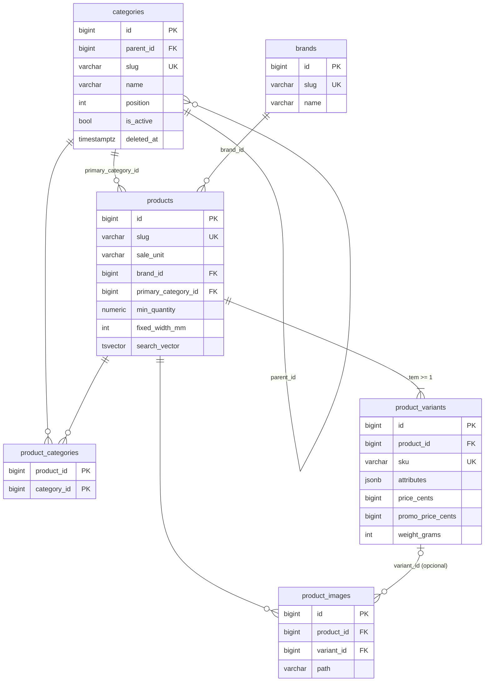
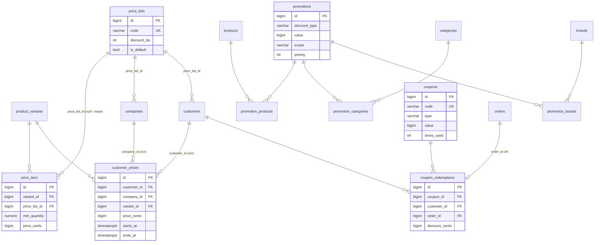
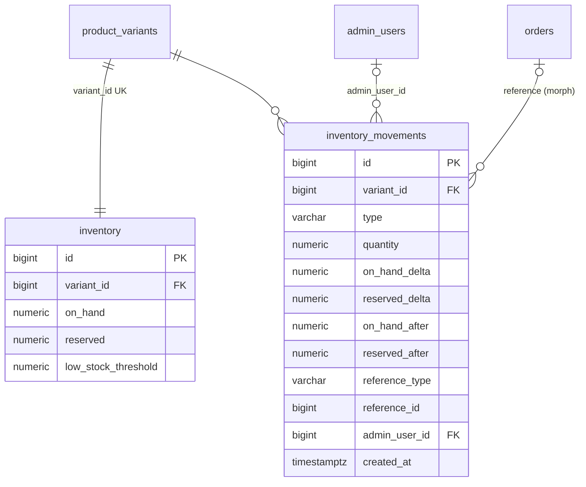
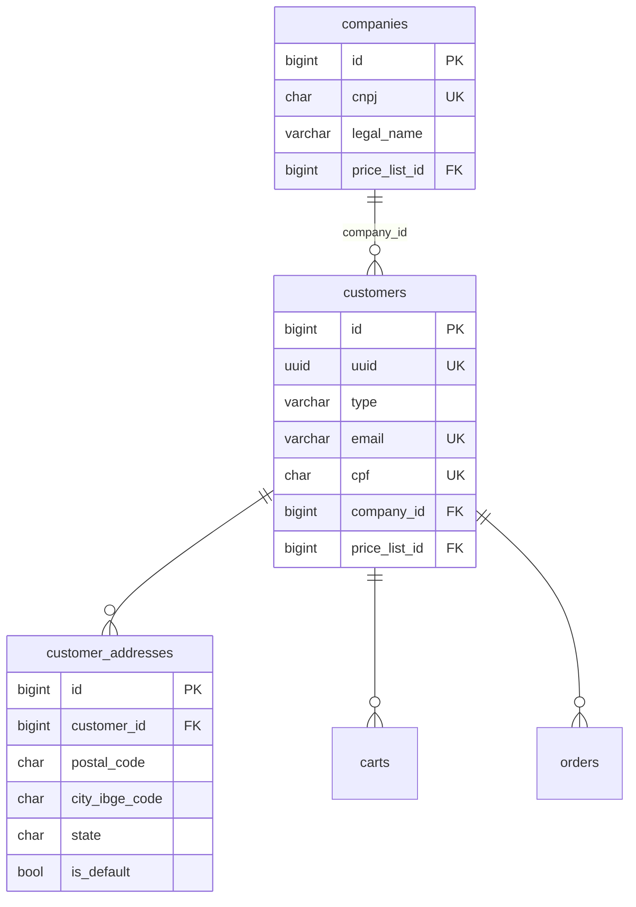
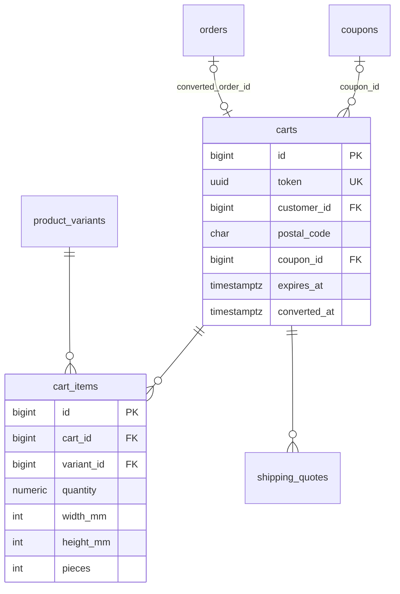
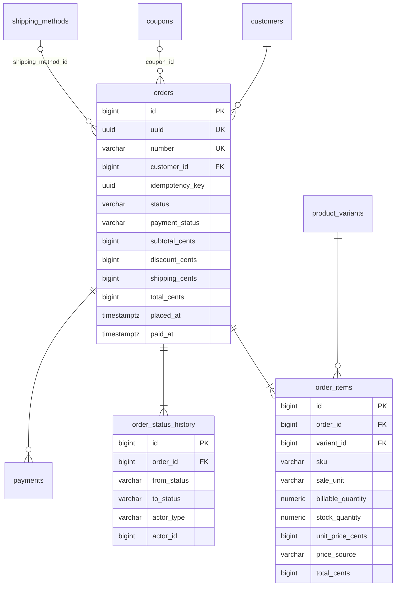
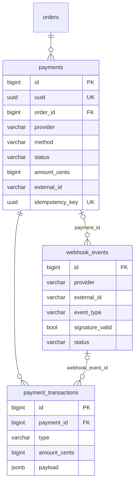
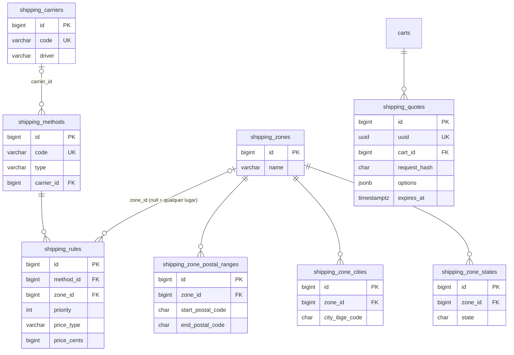
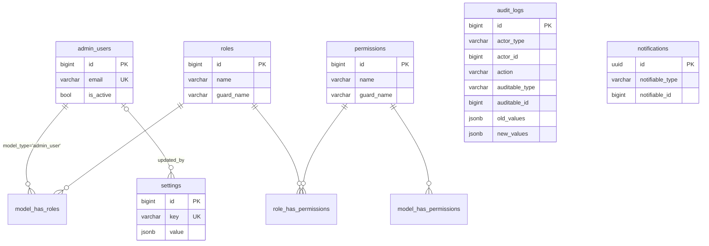

# Modelo de Dados — PostgreSQL 16

> Autor: Agente 3 (Database Engineer). Status: **proposto para implementação literal**
> em migrations Laravel. Segue integralmente `docs/DECISIONS.md` (ADRs 001–017).
> Documentação em pt-BR; identificadores (tabelas, colunas, índices, valores de enum)
> em inglês.
>
> Qualquer divergência deste documento em relação a `DECISIONS.md` deve virar ADR antes
> de ser implementada. Onde este documento toma uma decisão nova, ela está marcada com
> **[DB-xx]** e resumida na seção 9.

## Sumário

0. [Visão geral, extensões e ordem das migrations](#0-visão-geral-extensões-e-ordem-das-migrations)
1. [Convenções](#1-convenções)
2. [Diagramas ER (mermaid)](#2-diagramas-er)
3. [Dicionário de dados — tabela por tabela](#3-dicionário-de-dados)
4. [Concorrência e integridade](#4-concorrência-e-integridade)
5. [Auditoria, soft delete e histórico](#5-auditoria-soft-delete-e-histórico)
6. [Volume estimado e índices para consultas-chave](#6-volume-estimado-e-índices-para-consultas-chave)
7. [Especificação de seed](#7-especificação-de-seed)
8. [Manutenção agendada (jobs de limpeza)](#8-manutenção-agendada)
9. [Decisões que outros agentes precisam conhecer](#9-decisões-para-outros-agentes)

---

## 0. Visão geral, extensões e ordem das migrations

### 0.1 Extensões (primeira migration, `0001_01_01_000000_create_extensions`)

```sql
CREATE EXTENSION IF NOT EXISTS unaccent;    -- busca sem acento (ADR-014)
CREATE EXTENSION IF NOT EXISTS pg_trgm;     -- busca "contém" no painel (nome, e-mail)
CREATE EXTENSION IF NOT EXISTS btree_gist;  -- EXCLUDE de vigência sobreposta (customer_prices)

-- Configuração de full-text em português sem acentos.
-- to_tsvector(regconfig, text) é IMMUTABLE, então pode ser usada em índices/colunas.
CREATE TEXT SEARCH CONFIGURATION public.pt_unaccent (COPY = pg_catalog.portuguese);
ALTER TEXT SEARCH CONFIGURATION public.pt_unaccent
    ALTER MAPPING FOR hword, hword_part, word WITH unaccent, portuguese_stem;

-- unaccent() não é IMMUTABLE; wrapper para uso em índices de expressão (ibge_cities, painel)
CREATE FUNCTION public.f_unaccent(text) RETURNS text
    LANGUAGE sql IMMUTABLE PARALLEL SAFE STRICT
    AS $$ SELECT public.unaccent('public.unaccent'::regdictionary, $1) $$;

-- trigger genérica para tabelas append-only (seção 3.3.2)
CREATE FUNCTION public.forbid_mutation() RETURNS trigger LANGUAGE plpgsql AS
$$ BEGIN RAISE EXCEPTION '% is append-only', TG_TABLE_NAME; END $$;
```

`down()`: `DROP TEXT SEARCH CONFIGURATION IF EXISTS public.pt_unaccent;` e `DROP EXTENSION`
na ordem inversa.

`gen_random_uuid()` é nativo no PG 16 (não precisa de `pgcrypto`).

### 0.2 Ordem das migrations (dependências de FK)

| # | Migration | Tabelas |
|---|---|---|
| 1 | extensions | (extensões + `pt_unaccent`) |
| 2 | laravel_defaults | `sessions`, `cache`, `cache_locks`, `jobs`, `job_batches`, `failed_jobs` |
| 3 | identity | `admin_users`, `admin_password_reset_tokens` |
| 4 | permission (spatie) | `permissions`, `roles`, `model_has_permissions`, `model_has_roles`, `role_has_permissions` |
| 5 | pricing_base | `price_lists` |
| 6 | customers | `companies`, `customers`, `customer_password_reset_tokens`, `customer_addresses` |
| 7 | catalog | `categories`, `brands`, `products`, `product_categories`, `product_variants`, `product_images` |
| 8 | pricing | `price_tiers`, `customer_prices` |
| 9 | promotions | `promotions`, `promotion_products`, `promotion_categories`, `promotion_brands`, `coupons` |
| 10 | inventory | `inventory`, `inventory_movements` |
| 11 | shipping | `ibge_cities`, `shipping_carriers`, `shipping_methods`, `shipping_zones`, `shipping_zone_postal_ranges`, `shipping_zone_cities`, `shipping_zone_states`, `shipping_rules` |
| 12 | orders | sequência `order_number_seq`, `orders`, `order_items`, `order_status_history`, `coupon_redemptions` |
| 13 | cart | `carts`, `cart_items`, `shipping_quotes` |
| 14 | payments | `payments`, `payment_transactions`, `webhook_events` |
| 15 | cross_cutting | `audit_logs`, `notifications`, `settings` |

A migration padrão `create_users_table` do Laravel **não é usada** (não existe tabela
`users`); remova-a e mova `sessions`/`password_reset_tokens` conforme acima.
`personal_access_tokens` (Sanctum tokens) **não** é criada: usamos Sanctum stateful
(cookies), sem tokens de API.

---

## 1. Convenções

### 1.1 Chaves e identificadores

- **PK**: `id bigint GENERATED BY DEFAULT AS IDENTITY PRIMARY KEY` (Laravel `$table->id()`
  no PostgreSQL gera `bigserial`; ambos aceitáveis — preferir `id()` por simplicidade).
- **Pivots** usam PK composta (sem `id`).
- **[DB-01] `uuid`** (tipo `uuid`, `NOT NULL`, `UNIQUE`, default `gen_random_uuid()`;
  Eloquent preenche com UUIDv7 via `HasUuids` configurado para a coluna `uuid`) apenas em
  entidades expostas externamente por ID:
  - `customers.uuid` — referência pública em e-mails/links, nunca expor `id` sequencial.
  - `orders.uuid` — rotas do cliente (`/api/v1/me/orders/{uuid}`), ADR-012.
  - `payments.uuid` — referência enviada ao gateway (`external_reference`) e em URLs de retorno.
  - `carts.token` — é o próprio UUID do carrinho (header `X-Cart-Token`, ADR-007).
  - `shipping_quotes.uuid` — retornado na cotação ao cliente.
  - `admin_users`, catálogo, cupons etc. **não** têm `uuid` (acesso só pelo painel autenticado
    por `id` ou pelo `slug` público).
- `route key` do cliente: `uuid`; do painel: `id`.

### 1.2 Tipos

| Conceito | Tipo | Regra |
|---|---|---|
| Dinheiro | `bigint` sufixo `_cents` | `CHECK (col >= 0)` (ou `> 0` quando indicado) |
| Percentual | `integer` sufixo `_bp` (basis points; 1000 = 10,00%) | `CHECK (col BETWEEN 0 AND 10000)` |
| Quantidade | `numeric(12,3)` | `CHECK (col > 0)` onde for quantidade pedida |
| Dimensão de material vendável | `integer` sufixo `_mm` | `CHECK (col > 0)` |
| Peso logístico | `integer` sufixo `_grams` | `CHECK (col >= 0)` |
| Dimensão de embalagem | `numeric(8,1)` sufixo `_cm` | `CHECK (col > 0)` |
| Volume | `bigint` sufixo `_cm3` | `CHECK (col >= 0)` |
| Data/hora | `timestamptz` (Laravel `timestampTz`, `timestampsTz()`, `softDeletesTz()`) | sempre UTC na aplicação |
| Texto curto | `varchar(n)` com `n` explícito | |
| Texto longo | `text` | |
| CEP | `char(8)` só dígitos | `CHECK (col ~ '^[0-9]{8}$')` |
| UF | `char(2)` | `CHECK (col IN (<UF_LIST>))` |
| CPF / CNPJ | `char(11)` só dígitos / `char(14)` **alfanumérico** (CNPJ alfanumérico vigente desde 07/2026: 12 posições `[0-9A-Z]` + 2 DV numéricos) | `CHECK (col ~ '^[0-9]{11}$')` / `CHECK (col ~ '^[0-9A-Z]{12}[0-9]{2}$')` |
| Código IBGE de município | `char(7)` | `CHECK (col ~ '^[0-9]{7}$')` |
| Telefone | `varchar(20)` só dígitos (E.164 sem `+`, ex. `5547999998888`) | `CHECK (col ~ '^[0-9]{10,13}$')` |
| E-mail | `varchar(255)` armazenado em minúsculas | `CHECK (col = lower(col))` + índice único em `lower(col)` ou na própria coluna |
| IP | `inet` | |

`<UF_LIST>` = `'AC','AL','AP','AM','BA','CE','DF','ES','GO','MA','MT','MS','MG','PA','PB','PR','PE','PI','RJ','RN','RS','RO','RR','SC','SP','SE','TO'`.

**[DB-02] Case-insensitive sem `citext`:** e-mails, códigos de cupom e SKUs são
**normalizados na escrita** (mutators/Form Requests: e-mail → `lower`, cupom/SKU → `upper`,
`trim`) e um `CHECK` garante a normalização (`email = lower(email)`, `code = upper(code)`).
Assim um índice único simples na coluna já é case-insensitive e serve buscas por igualdade
sem expressão. Evita dependência de `citext` (suporte ruim no schema builder do Laravel).

### 1.3 Enums

**[DB-03]** Enums são `varchar(n)` + `CHECK (col IN (...))`, **nunca** `CREATE TYPE ... AS ENUM`
(alterar enum nativo exige `ALTER TYPE` fora de transação em alguns casos e complica rollback).
No PHP, cada enum vira um `enum` backed string em `app/Modules/<M>/Enums`. Para adicionar
um valor: migration que faz `DROP CONSTRAINT` + `ADD CONSTRAINT` com a nova lista.

Nome do CHECK de enum: `{table}_{column}_check`.

### 1.4 JSON

`jsonb` apenas onde a estrutura é variável e não é filtrada relacionalmente:
`product_variants.attributes`, `shipping_carriers.settings`, `shipping_quotes.options`,
`payment_transactions.payload`, `webhook_events.payload`, `audit_logs.old_values/new_values`,
`settings.value`. Nunca para dinheiro, status ou chaves de relacionamento consultadas.
Todo `jsonb` de objeto tem `CHECK (jsonb_typeof(col) = 'object')` (ou `'array'`).

### 1.5 Timestamps e soft delete

- `created_at`/`updated_at` `timestamptz NULL` (padrão `timestampsTz()`), preenchidos pelo Eloquent.
- Tabelas **imutáveis** (append-only) têm só `created_at timestamptz NOT NULL DEFAULT now()`
  e o model usa `const UPDATED_AT = null`: `inventory_movements`, `order_status_history`,
  `payment_transactions`, `audit_logs`, `coupon_redemptions` (exceto `cancelled_at`).
- `deleted_at timestamptz NULL` (`softDeletesTz()`) somente nas tabelas listadas em ADR-016
  + `customer_addresses` (ver seção 5).
- **Unicidade com soft delete**: sempre índice único **parcial** `WHERE deleted_at IS NULL`
  (criado via `DB::statement`), nunca `->unique()` simples nessas colunas.

### 1.6 Nomenclatura

| Objeto | Padrão | Exemplo |
|---|---|---|
| FK (coluna) | `{singular}_id` | `product_id`, `primary_category_id` |
| FK (constraint) | `{table}_{column}_foreign` (padrão Laravel) | `orders_customer_id_foreign` |
| Índice | `{table}_{cols}_index` | `orders_status_placed_at_index` |
| Único | `{table}_{cols}_unique` | `companies_cnpj_unique` |
| Único parcial | `{table}_{cols}_active_unique` | `products_slug_active_unique` |
| Índice parcial / expressão | `{table}_{purpose}_index` | `orders_paid_report_index` |
| CHECK | `{table}_{rule}_check` | `inventory_reserved_lte_on_hand_check` |
| Booleans | `is_*`/`has_*`, `NOT NULL DEFAULT` explícito | `is_active` |
| Datas de evento | `*_at` | `paid_at` |

### 1.7 Política de `ON DELETE`

| Situação | Ação | Exemplos |
|---|---|---|
| Histórico de negócio / referência de pedido | `RESTRICT` (padrão) | `order_items.variant_id`, `orders.customer_id`, `inventory_movements.variant_id` |
| Filho puro, sem valor sem o pai | `CASCADE` | `cart_items`, `product_images`, `price_tiers`, pivots, `inventory`, zonas→localizações |
| Referência opcional/informativa | `SET NULL` | `carts.coupon_id`, `product_images.variant_id`, `settings.updated_by` |

Entidades com soft delete **nunca são apagadas fisicamente pela aplicação**; o `RESTRICT`
é a última barreira. `ON UPDATE` não é usado (PKs imutáveis).

### 1.8 Morph map (obrigatório)

**[DB-04]** `Relation::enforceMorphMap([...])` no `AppServiceProvider`. Colunas
`*_type` polimórficas guardam o **alias**, nunca o FQCN:

| Alias | Model |
|---|---|
| `admin_user` | `AdminUser` |
| `customer` | `Customer` |
| `order` | `Order` |
| `payment` | `Payment` |
| `product` | `Product` |
| `product_variant` | `ProductVariant` |
| `category` | `Category` |
| `brand` | `Brand` |
| `coupon` | `Coupon` |
| `promotion` | `Promotion` |
| `shipping_method` | `ShippingMethod` |
| `shipping_rule` | `ShippingRule` |
| `inventory` | `Inventory` |
| `setting` | `Setting` |
| `price_list` | `PriceList` |

Afeta `model_has_roles.model_type`, `notifications.notifiable_type`,
`audit_logs.auditable_type`, `inventory_movements.reference_type`.

---

## 2. Diagramas ER

Os diagramas mostram colunas-chave; o dicionário completo está na seção 3.

### 2.1 Catálogo



### 2.2 Preços e promoções



### 2.3 Estoque



### 2.4 Clientes



### 2.5 Carrinho



### 2.6 Pedidos



### 2.7 Pagamentos



### 2.8 Frete



### 2.9 Identidade/RBAC e transversais



---
## 3. Dicionário de dados

Legenda das tabelas de colunas: **Null** = `N` (NOT NULL) / `S` (NULL permitido).
"ts" = `created_at`, `updated_at` (`timestampsTz()`); "sd" = `deleted_at` (`softDeletesTz()`).
Todas as tabelas têm `id bigint` PK salvo indicação contrária.

### 3.1 Catálogo

#### 3.1.0 Unidade de venda — `product_units` NÃO será criada **[DB-05]**

`sale_unit` é uma coluna `varchar(20)` em `products` com CHECK em
`('UNIT','LINEAR_METER','SQUARE_METER','ROLL','KG','BOX')`. **Não** há tabela `product_units`:

- O conjunto é fechado e cada valor está acoplado a **comportamento de código**
  (validação de entrada, cálculo de área, arredondamento, UI). Adicionar uma unidade exige
  deploy de código de qualquer forma; uma tabela daria a falsa impressão de ser configurável.
- Rótulos e metadados ficam no enum PHP `App\Modules\Catalog\Enums\SaleUnit`:

| Valor | Rótulo (pt-BR) | Abrev. | Aceita decimal na entrada | Entrada do cliente | Unidade de estoque |
|---|---|---|---|---|---|
| `UNIT` | Unidade | `un` | não | quantidade | un |
| `LINEAR_METER` | Metro linear | `m` | sim (`quantity_step`) | metros | m |
| `SQUARE_METER` | Metro quadrado | `m²` | largura/altura (mm) + peças inteiras | L × A × peças | m² |
| `ROLL` | Rolo | `rolo` | não | quantidade | rolo |
| `KG` | Quilograma | `kg` | sim (`quantity_step`) | kg | kg |
| `BOX` | Caixa | `cx` | não | quantidade | cx |

O frontend recebe `sale_unit` + `sale_unit_label` + `sale_unit_abbr` via API Resource.

#### 3.1.1 `categories`

Árvore de categorias (adjacency list por `parent_id`). Profundidade máxima 3 (validada
na aplicação). Slug **global** (URL `/{category-slug}`, ADR-015).

| Coluna | Tipo | Null | Default | Constraint / observação |
|---|---|---|---|---|
| id | bigint | N | identity | PK |
| parent_id | bigint | S | | FK → `categories.id` **RESTRICT**; `CHECK (parent_id <> id)` |
| name | varchar(120) | N | | |
| slug | varchar(140) | N | | `CHECK (slug ~ '^[a-z0-9]+(-[a-z0-9]+)*$')`; não pode ser slug reservado (validação na app: `busca`, `carrinho`, `checkout`, `conta`, `entrar`, `cadastro`, `admin`, `api`, `sitemap.xml`, `robots.txt`) |
| description | text | S | | HTML sanitizado |
| image_path | varchar(500) | S | | chave no disco `s3` |
| meta_title | varchar(120) | S | | |
| meta_description | varchar(320) | S | | |
| position | integer | N | 0 | ordenação entre irmãos |
| is_active | boolean | N | true | |
| ts, sd | | | | |

- Único parcial: `categories_slug_active_unique` = `UNIQUE (slug) WHERE deleted_at IS NULL`.
- Índices:
  - `categories_parent_id_position_index (parent_id, position)` — montar menu/árvore e filhos ordenados.
- Ciclos na árvore: validados na aplicação (ao mudar `parent_id`, subir ancestrais com
  CTE recursiva e rejeitar se encontrar o próprio id).
- Não se pode soft-deletar categoria com filhos ativos ou que seja `primary_category_id` de
  produto ativo (regra de aplicação, 409).

#### 3.1.2 `brands`

| Coluna | Tipo | Null | Default | Constraint |
|---|---|---|---|---|
| id | bigint | N | identity | PK |
| name | varchar(120) | N | | |
| slug | varchar(140) | N | | mesmo CHECK de slug |
| logo_path | varchar(500) | S | | |
| is_active | boolean | N | true | |
| ts, sd | | | | |

- Único parcial: `brands_slug_active_unique` = `UNIQUE (slug) WHERE deleted_at IS NULL`.
- Índices: nenhum adicional (tabela pequena; filtro de listagem usa `products.brand_id`).

#### 3.1.3 `products`

Produto (vitrine). Regras de quantidade/dimensão no produto (ADR-004). Preço, estoque,
SKU e peso ficam nas variantes.

| Coluna | Tipo | Null | Default | Constraint / observação |
|---|---|---|---|---|
| id | bigint | N | identity | PK |
| name | varchar(200) | N | | |
| slug | varchar(220) | N | | CHECK de slug; **global** (canônico) |
| short_description | varchar(500) | S | | texto puro |
| description | text | S | | HTML sanitizado |
| sale_unit | varchar(20) | N | | CHECK `IN ('UNIT','LINEAR_METER','SQUARE_METER','ROLL','KG','BOX')`; **imutável após o primeiro pedido** (app) |
| brand_id | bigint | S | | FK → `brands.id` RESTRICT |
| primary_category_id | bigint | N | | FK → `categories.id` RESTRICT; deve existir também em `product_categories` (app mantém sincronizado) |
| min_quantity | numeric(12,3) | N | 1 | `> 0`. Em `SQUARE_METER` refere-se a **peças** |
| max_quantity | numeric(12,3) | S | | `NULL OR max_quantity >= min_quantity` |
| quantity_step | numeric(12,3) | N | 1 | `> 0`. Em `SQUARE_METER` refere-se a peças (=1) |
| min_billable_area_m2 | numeric(12,3) | S | | `> 0`; só `SQUARE_METER` |
| fixed_width_mm | integer | S | | `> 0`; `SQUARE_METER` (cliente informa só altura) ou `LINEAR_METER` (informativo, ex. vinil 1,22 m) |
| min_width_mm | integer | S | | `> 0`; só `SQUARE_METER` sem largura fixa |
| max_width_mm | integer | S | | `>= min_width_mm` |
| min_height_mm | integer | S | | `> 0`; só `SQUARE_METER` |
| max_height_mm | integer | S | | `>= min_height_mm` |
| meta_title | varchar(120) | S | | |
| meta_description | varchar(320) | S | | |
| is_active | boolean | N | false | nasce rascunho |
| is_featured | boolean | N | false | vitrine da home |
| pickup_only | boolean | N | false | item só pode ser retirado (volumoso/frágil); o motor de frete oferece só `pickup` (SHIPPING.md §9) |
| search_vector | tsvector | S | | mantida pela aplicação (ver abaixo) |
| ts, sd | | | | |

CHECKs (nomes `products_*_check`):

```sql
CHECK (min_quantity > 0),
CHECK (quantity_step > 0),
CHECK (max_quantity IS NULL OR max_quantity >= min_quantity),
-- unidades inteiras (SQUARE_METER conta peças)
CHECK (sale_unit NOT IN ('UNIT','ROLL','BOX','SQUARE_METER')
       OR (min_quantity = trunc(min_quantity) AND quantity_step = trunc(quantity_step)
           AND (max_quantity IS NULL OR max_quantity = trunc(max_quantity)))),
-- campos de área só em SQUARE_METER
CHECK (sale_unit = 'SQUARE_METER' OR (min_billable_area_m2 IS NULL
       AND min_width_mm IS NULL AND max_width_mm IS NULL
       AND min_height_mm IS NULL AND max_height_mm IS NULL)),
-- largura fixa só em SQUARE_METER / LINEAR_METER
CHECK (fixed_width_mm IS NULL OR sale_unit IN ('SQUARE_METER','LINEAR_METER')),
-- largura fixa XOR faixa de largura
CHECK (fixed_width_mm IS NULL OR (min_width_mm IS NULL AND max_width_mm IS NULL)),
CHECK (min_billable_area_m2 IS NULL OR min_billable_area_m2 > 0),
CHECK (fixed_width_mm IS NULL OR fixed_width_mm > 0),
CHECK (min_width_mm IS NULL OR min_width_mm > 0),
CHECK (min_height_mm IS NULL OR min_height_mm > 0),
CHECK (max_width_mm IS NULL OR min_width_mm IS NULL OR max_width_mm >= min_width_mm),
CHECK (max_height_mm IS NULL OR min_height_mm IS NULL OR max_height_mm >= min_height_mm)
```

- Único parcial: `products_slug_active_unique` = `UNIQUE (slug) WHERE deleted_at IS NULL`.
- Índices:
  - `products_primary_category_id_index (primary_category_id)` — FK / breadcrumb / canonical.
  - `products_brand_id_index (brand_id)` — filtro por marca.
  - `products_listing_index (is_featured, created_at DESC) WHERE is_active AND deleted_at IS NULL` — home/destaques e "novidades".
  - `products_search_vector_index USING GIN (search_vector)` — busca (ADR-014).
  - `products_name_trgm_index USING GIN (name gin_trgm_ops)` — busca "contém" no painel e fallback de autocomplete.

**Busca [DB-06]:** `search_vector` é coluna **mantida** (não `GENERATED`), porque inclui
nome da marca e das categorias (outras tabelas). Recalculada por `ProductSearchIndexer`
(job em fila) ao salvar produto/variante/marca/categoria:

```sql
UPDATE products p SET search_vector =
    setweight(to_tsvector('pt_unaccent', coalesce(p.name,'')), 'A') ||
    setweight(to_tsvector('pt_unaccent', coalesce(b.name,'')), 'B') ||
    setweight(to_tsvector('pt_unaccent', coalesce(string_agg(c.name, ' '),'')), 'B') ||
    setweight(to_tsvector('pt_unaccent', coalesce(p.short_description,'')), 'C') ||
    setweight(to_tsvector('pt_unaccent', coalesce(regexp_replace(p.description,'<[^>]+>',' ','g'),'')), 'D')
FROM ... WHERE p.id = :id;
```

Consulta: `search_vector @@ websearch_to_tsquery('pt_unaccent', :q)` ordenado por
`ts_rank_cd`, **unido** a `EXISTS (variant WHERE sku LIKE upper(:q) || '%')` (SKU por prefixo).

#### 3.1.4 `product_categories` (pivot N:N)

| Coluna | Tipo | Null | Default | Constraint |
|---|---|---|---|---|
| product_id | bigint | N | | FK → `products.id` **CASCADE** |
| category_id | bigint | N | | FK → `categories.id` **CASCADE** |
| position | integer | N | 0 | ordem do produto dentro da categoria (vitrine manual) |

- PK `(product_id, category_id)`.
- Índice `product_categories_category_id_position_index (category_id, position)` — listagem por categoria.
- A listagem de uma categoria inclui produtos das subcategorias: a app resolve os ids
  descendentes (CTE recursiva, cacheada no Redis) e usa `category_id = ANY(:ids)`.

#### 3.1.5 `product_variants`

Unidade vendável (ADR-004). Carrinho, preço, estoque e pedido referenciam a variante.

| Coluna | Tipo | Null | Default | Constraint / observação |
|---|---|---|---|---|
| id | bigint | N | identity | PK |
| product_id | bigint | N | | FK → `products.id` **RESTRICT** |
| sku | varchar(40) | N | | `CHECK (sku ~ '^[A-Z0-9-]{3,40}$')` (RN-CAT-003; maiúsculas, normalizado na escrita) |
| gtin | varchar(14) | S | | EAN/GTIN; `CHECK (gtin ~ '^[0-9]{8,14}$')` |
| name | varchar(200) | N | | ex. "Brilho", "Padrão" |
| attributes | jsonb | N | `'{}'` | `CHECK (jsonb_typeof(attributes) = 'object')`; ex. `{"cor":"branco","acabamento":"brilho","largura":"1,22 m"}` — **apenas exibição**; valores string |
| price_cents | bigint | N | | `> 0`; preço base por unidade de venda |
| promo_price_cents | bigint | S | | `NULL OR (promo_price_cents > 0 AND promo_price_cents < price_cents)` |
| promo_starts_at | timestamptz | S | | NULL = desde já |
| promo_ends_at | timestamptz | S | | NULL = sem fim; `CHECK (promo_starts_at IS NULL OR promo_ends_at IS NULL OR promo_ends_at > promo_starts_at)` |
| cost_cents | bigint | S | | `>= 0`; custo para margem (nunca exposto na loja) |
| weight_grams | integer | N | 0 | `>= 0`; peso **por unidade de venda** (por m, por m², por un, por rolo, por caixa). `0` = dado ausente para o motor de frete (exceto `KG`, que usa a própria quantidade) |
| package_length_cm | numeric(8,1) | S | | `> 0`; comprimento da embalagem de 1 unidade de venda (UNIT/ROLL/BOX/KG); ignorado em LINEAR_METER/SQUARE_METER (calculado pela largura) |
| package_width_cm | numeric(8,1) | S | | `> 0`; em LINEAR_METER/SQUARE_METER = **diâmetro** do material enrolado |
| package_height_cm | numeric(8,1) | S | | `> 0`; idem (o motor usa `max(width, height)`) |
| roll_length_m | numeric(10,3) | S | | `> 0`; comprimento do rolo (ROLL; ou bobina de origem para LINEAR_METER/SQUARE_METER) |
| units_per_box | integer | S | | `> 0`; itens dentro da caixa (BOX) — informativo/exibição |
| units_per_package | integer | S | | `> 0`; unidades de venda por volume de envio (NULL = 1); usado pelo motor de frete (SHIPPING.md §2.3) |
| fixed_width_mm | integer | S | | `> 0`; sobrescreve `products.fixed_width_mm` para esta variante |
| is_active | boolean | N | true | |
| position | integer | N | 0 | ordem de exibição; **variante padrão** = menor `position` ativa |
| ts, sd | | | | |

Validação de completude das dimensões de embalagem por `sale_unit` fica na app (SHIPPING.md §2.2), pois
LINEAR_METER/SQUARE_METER não usam `package_length_cm`.

- Único parcial: `product_variants_sku_active_unique` = `UNIQUE (sku text_pattern_ops) WHERE deleted_at IS NULL`
  — serve igualdade **e** busca por prefixo `sku LIKE 'VIN-%'`.
- Índices:
  - `product_variants_product_id_position_index (product_id, position)` — carregar variantes do produto.
  - `product_variants_product_price_index (product_id, price_cents) WHERE is_active AND deleted_at IS NULL` — filtro/ordenação por faixa de preço na listagem.
- Regra de app: produto ativo precisa de ≥ 1 variante ativa; a criação de produto cria a
  variante "Padrão" e a linha de `inventory` na mesma transação.
- Nota: o preço "a partir de" e o filtro de preço usam `price_cents` base (sem tabela de
  preço/promoção); o preço final é sempre do `PriceResolver`.

#### 3.1.6 `product_images`

| Coluna | Tipo | Null | Default | Constraint |
|---|---|---|---|---|
| id | bigint | N | identity | PK |
| product_id | bigint | N | | FK → `products.id` **CASCADE** |
| variant_id | bigint | S | | FK → `product_variants.id` **SET NULL** (imagem volta a ser do produto) |
| disk | varchar(20) | N | `'s3'` | |
| path | varchar(500) | N | | chave no storage (ex. `products/123/abc.webp`) |
| alt | varchar(255) | S | | acessibilidade/SEO |
| width_px | integer | S | | `> 0` |
| height_px | integer | S | | `> 0` |
| position | integer | N | 0 | 0 = capa |
| ts | | | | |

- Índices: `product_images_product_id_position_index (product_id, position)` — galeria e capa;
  `product_images_variant_id_index (variant_id)` — FK.
- Sem soft delete: arquivo removido do storage por job após o delete.

### 3.2 Preços e promoções

Resolução conforme ADR-005 (menor preço entre candidatos; cupom depois, no subtotal).

#### 3.2.1 `price_lists`

| Coluna | Tipo | Null | Default | Constraint |
|---|---|---|---|---|
| id | bigint | N | identity | PK |
| code | varchar(40) | N | | `UNIQUE`; `CHECK (code ~ '^[a-z0-9_]+$')`; seeds: `retail`, `wholesale`, `reseller`; demais livres (ex. `custom_grafica_x`) |
| name | varchar(120) | N | | "Varejo", "Atacado"… |
| kind | varchar(20) | N | `'custom'` | CHECK `IN ('retail','wholesale','reseller','custom')` |
| discount_bp | integer | S | | `BETWEEN 1 AND 9999`; desconto linear sobre o preço base quando a variante **não** tem faixa específica nesta tabela |
| is_default | boolean | N | false | tabela aplicada a quem não tem tabela atribuída |
| is_active | boolean | N | true | |
| ts | | | | |

- Único parcial: `price_lists_is_default_unique` = `UNIQUE (is_default) WHERE is_default` (no máximo uma default).
- Sem soft delete (desative com `is_active`); FK RESTRICT impede delete de tabela em uso.
- **Tabela efetiva do cliente [DB-07]:** `customers.price_list_id` → senão
  `companies.price_list_id` → senão a tabela `is_default` (varejo). A default (`retail`) não
  gera candidato extra: seu preço é o base.

Candidato "tabela de preço" para a variante V, quantidade Q, tabela T:
1. faixa de `price_tiers` com `price_list_id = T`, `min_quantity <= Q`, maior `min_quantity`;
2. senão, se `T.discount_bp` não nulo: `round_half_up(price_cents × (10000 − discount_bp) / 10000)`;
3. senão, sem candidato.

#### 3.2.2 `price_tiers`

Faixas por quantidade. `price_list_id NULL` = faixa do **preço base**.

| Coluna | Tipo | Null | Default | Constraint |
|---|---|---|---|---|
| id | bigint | N | identity | PK |
| variant_id | bigint | N | | FK → `product_variants.id` **CASCADE** |
| price_list_id | bigint | S | | FK → `price_lists.id` **CASCADE** |
| min_quantity | numeric(12,3) | N | | `> 0`; em unidade faturada (m², m, kg, un…) |
| price_cents | bigint | N | | `> 0` |
| ts | | | | |

- Único: `price_tiers_variant_list_qty_unique` = `UNIQUE NULLS NOT DISTINCT (variant_id, price_list_id, min_quantity)`
  (PG 15+; via `DB::statement`). Garante no máximo uma faixa por limiar, inclusive na base.
- O mesmo índice serve a consulta do resolver
  (`WHERE variant_id = ? AND price_list_id IS NOT DISTINCT FROM ? AND min_quantity <= ? ORDER BY min_quantity DESC LIMIT 1`).

#### 3.2.3 `customer_prices`

Preço específico negociado para um cliente **ou** empresa, com vigência.

| Coluna | Tipo | Null | Default | Constraint |
|---|---|---|---|---|
| id | bigint | N | identity | PK |
| customer_id | bigint | S | | FK → `customers.id` **CASCADE** |
| company_id | bigint | S | | FK → `companies.id` **CASCADE** |
| variant_id | bigint | N | | FK → `product_variants.id` **CASCADE** |
| price_cents | bigint | N | | `> 0` |
| starts_at | timestamptz | S | | NULL = desde sempre |
| ends_at | timestamptz | S | | NULL = sem fim; `CHECK (starts_at IS NULL OR ends_at IS NULL OR ends_at > starts_at)` |
| created_by | bigint | S | | FK → `admin_users.id` SET NULL |
| ts | | | | |

- `CHECK (num_nonnulls(customer_id, company_id) = 1)` — exatamente um dono.
- Sem sobreposição de vigência (btree_gist):
  ```sql
  ALTER TABLE customer_prices ADD CONSTRAINT customer_prices_customer_no_overlap
    EXCLUDE USING gist (customer_id WITH =, variant_id WITH =,
      tstzrange(coalesce(starts_at,'-infinity'), coalesce(ends_at,'infinity'), '[)') WITH &&)
    WHERE (customer_id IS NOT NULL);
  ALTER TABLE customer_prices ADD CONSTRAINT customer_prices_company_no_overlap
    EXCLUDE USING gist (company_id WITH =, variant_id WITH =,
      tstzrange(coalesce(starts_at,'-infinity'), coalesce(ends_at,'infinity'), '[)') WITH &&)
    WHERE (company_id IS NOT NULL);
  ```
  (os índices GiST das EXCLUDE servem também à consulta do resolver).
- Índice `customer_prices_variant_id_index (variant_id)` — FK e relatório "quem tem preço especial neste item".
- Se cliente tem preço próprio **e** a empresa também, ambos são candidatos (vence o menor).

#### 3.2.4 `promotions`

Promoção automática (sem código) por produto/categoria/marca ou loja inteira.

| Coluna | Tipo | Null | Default | Constraint |
|---|---|---|---|---|
| id | bigint | N | identity | PK |
| name | varchar(150) | N | | |
| description | varchar(500) | S | | texto exibido ("Semana do Vinil") |
| discount_type | varchar(10) | N | | CHECK `IN ('percent','fixed')` |
| value | bigint | N | | `percent`: basis points `1..10000`; `fixed`: centavos de desconto **por unidade de venda** `> 0` |
| scope | varchar(10) | N | `'targeted'` | CHECK `IN ('all','targeted')`; `all` = toda a loja (ignora alvos) |
| starts_at | timestamptz | N | | |
| ends_at | timestamptz | S | | `NULL OR ends_at > starts_at` |
| is_active | boolean | N | true | |
| priority | integer | N | 100 | desempate de exibição (menor = mais importante); o preço vencedor é sempre o menor |
| ts, sd | | | | |

- `CHECK (discount_type <> 'percent' OR value BETWEEN 1 AND 10000)`, `CHECK (value > 0)`.
- Índice `promotions_active_window_index (starts_at, ends_at) WHERE is_active AND deleted_at IS NULL` — carregar promoções vigentes (cacheadas por 1 min).
- Preço com promoção `fixed` nunca fica < 1 centavo (`max(1, preço − value)`).

#### 3.2.5 Alvos de promoção — 3 pivots **[DB-08]**

Decisão: **três pivots tipadas** em vez de `promotion_targets` polimórfica, para ter FK real
(integridade + CASCADE) e índices simples. As três têm PK composta e **CASCADE** nos dois lados.

| Tabela | Colunas | Índice extra |
|---|---|---|
| `promotion_products` | `promotion_id` FK → promotions, `product_id` FK → products | `(product_id)` — "promoções que atingem este produto" |
| `promotion_categories` | `promotion_id`, `category_id` FK → categories | `(category_id)` |
| `promotion_brands` | `promotion_id`, `brand_id` FK → brands | `(brand_id)` |

Promoção por categoria **inclui subcategorias** (resolvido na app) e casa com qualquer
categoria do produto (`product_categories`), não só a principal.

#### 3.2.6 `coupons`

| Coluna | Tipo | Null | Default | Constraint |
|---|---|---|---|---|
| id | bigint | N | identity | PK |
| code | varchar(40) | N | | `CHECK (code = upper(code) AND code ~ '^[A-Z0-9_-]{3,40}$')` |
| description | varchar(255) | S | | |
| type | varchar(20) | N | | CHECK `IN ('percent','fixed','free_shipping')` |
| value | bigint | N | 0 | `percent`: bp `1..10000`; `fixed`: centavos `> 0`; `free_shipping`: `0` |
| min_order_cents | bigint | N | 0 | `>= 0`; comparado ao subtotal (itens, após preços resolvidos) |
| max_discount_cents | bigint | S | | `> 0`; teto para `percent` |
| starts_at | timestamptz | S | | |
| ends_at | timestamptz | S | | `NULL OR starts_at IS NULL OR ends_at > starts_at` |
| usage_limit | integer | S | | `> 0`; total de usos |
| usage_limit_per_customer | integer | S | | `> 0` |
| times_used | integer | N | 0 | `>= 0`; contador desnormalizado, alterado só sob lock (seção 4) |
| is_active | boolean | N | true | |
| ts, sd | | | | |

- `CHECK ((type = 'percent' AND value BETWEEN 1 AND 10000) OR (type = 'fixed' AND value > 0) OR (type = 'free_shipping' AND value = 0))`.
- Único parcial: `coupons_code_active_unique` = `UNIQUE (code) WHERE deleted_at IS NULL`.
- Não há CHECK `times_used <= usage_limit` (admin pode reduzir o limite abaixo do uso atual);
  o limite é imposto no checkout sob `FOR UPDATE`.

#### 3.2.7 `coupon_redemptions`

Uso de cupom, criado **na criação do pedido** (mesma transação).

| Coluna | Tipo | Null | Default | Constraint |
|---|---|---|---|---|
| id | bigint | N | identity | PK |
| coupon_id | bigint | N | | FK → `coupons.id` RESTRICT |
| customer_id | bigint | N | | FK → `customers.id` RESTRICT |
| order_id | bigint | N | | FK → `orders.id` RESTRICT; **UNIQUE** (um cupom por pedido) |
| discount_cents | bigint | N | | `>= 0`; desconto efetivo (itens + frete) |
| created_at | timestamptz | N | now() | |
| cancelled_at | timestamptz | S | | preenchido quando o pedido é cancelado/expira (uso devolvido; `times_used -= 1`) |

- Índice `coupon_redemptions_coupon_customer_active_index (coupon_id, customer_id) WHERE cancelled_at IS NULL` — contar usos por cliente.
- Sem `updated_at`; única atualização permitida: `cancelled_at`.

### 3.3 Estoque

#### 3.3.1 `inventory`

Uma linha por variante (1:1), criada junto com a variante. Estoque em unidade de estoque
do produto (m, m², un, kg, rolo, cx — ADR-004).

| Coluna | Tipo | Null | Default | Constraint |
|---|---|---|---|---|
| id | bigint | N | identity | PK |
| variant_id | bigint | N | | FK → `product_variants.id` **CASCADE**; **UNIQUE** |
| on_hand | numeric(12,3) | N | 0 | `>= 0` |
| reserved | numeric(12,3) | N | 0 | `>= 0` |
| low_stock_threshold | numeric(12,3) | S | | `>= 0`; NULL = usa `settings.inventory.default_low_stock_threshold` |
| low_stock_alerted_at | timestamptz | S | | alerta já emitido; limpo quando disponível volta acima do limite (um alerta por variante — RN-EST-010) |
| updated_at | timestamptz | S | | (sem `created_at` útil; manter `timestampsTz()` por simplicidade) |
| created_at | timestamptz | S | | |

- CHECKs: `inventory_on_hand_non_negative_check (on_hand >= 0)`,
  `inventory_reserved_non_negative_check (reserved >= 0)`,
  `inventory_reserved_lte_on_hand_check (reserved <= on_hand)`.
- Disponível = `on_hand - reserved` (calculado; não armazenado).
- **Sem coluna `version`** **[DB-09]**: toda escrita é feita sob `SELECT ... FOR UPDATE`
  (lock pessimista, ADR-008); lock otimista seria redundante. A **única** forma de alterar
  `on_hand`/`reserved` é o serviço `InventoryService`, que grava o movimento na mesma
  transação. Nunca `UPDATE` direto fora dele (inclusive no painel).
- Relatório de estoque baixo: `WHERE on_hand - reserved <= coalesce(low_stock_threshold, :default)` —
  com ~15 mil linhas um seq scan é adequado; **sem índice** dedicado.

#### 3.3.2 `inventory_movements` (imutável)

| Coluna | Tipo | Null | Default | Constraint |
|---|---|---|---|---|
| id | bigint | N | identity | PK |
| variant_id | bigint | N | | FK → `product_variants.id` **RESTRICT** |
| type | varchar(10) | N | | CHECK `IN ('in','out','reserve','release','return','adjust')` |
| quantity | numeric(12,3) | N | | `> 0`; magnitude do movimento |
| on_hand_delta | numeric(12,3) | N | | com sinal |
| reserved_delta | numeric(12,3) | N | | com sinal |
| on_hand_after | numeric(12,3) | N | | `>= 0` |
| reserved_after | numeric(12,3) | N | | `>= 0`, `<= on_hand_after` |
| reason | varchar(255) | S | | obrigatório (app) para `adjust` e `in` manual |
| reference_type | varchar(40) | S | | morph alias (`order`, …) |
| reference_id | bigint | S | | `CHECK (num_nulls(reference_type, reference_id) IN (0,2))` |
| admin_user_id | bigint | S | | FK → `admin_users.id` RESTRICT; NULL = sistema/cliente |
| created_at | timestamptz | N | now() | |

CHECK de coerência por tipo (`inventory_movements_type_delta_check`):

```sql
CHECK (
  (type = 'in'      AND on_hand_delta =  quantity AND reserved_delta = 0) OR
  (type = 'out'     AND on_hand_delta = -quantity AND reserved_delta = -quantity) OR
  (type = 'reserve' AND on_hand_delta = 0         AND reserved_delta =  quantity) OR
  (type = 'release' AND on_hand_delta = 0         AND reserved_delta = -quantity) OR
  (type = 'return'  AND on_hand_delta =  quantity AND reserved_delta = 0) OR
  (type = 'adjust'  AND abs(on_hand_delta) = quantity AND reserved_delta = 0)
)
```

- Índices:
  - `inventory_movements_variant_created_index (variant_id, created_at DESC)` — kardex da variante no painel.
  - `inventory_movements_reference_index (reference_type, reference_id)` — movimentos de um pedido (idempotência de `release`/`out`: a app verifica se já existe movimento do tipo para o pedido+variante antes de aplicar).
  - `inventory_movements_created_at_index (created_at)` — relatórios por período.
- Sem `updated_at`, sem soft delete. Correções = novo movimento `adjust`.
- Defesa em profundidade: trigger `inventory_movements_immutable BEFORE UPDATE OR DELETE ... FOR EACH ROW
  EXECUTE FUNCTION public.forbid_mutation()` (função criada na migration de extensões). Mesma trigger em
  `order_status_history`, `order_items`, `payment_transactions` e `audit_logs`.

### 3.4 Clientes

#### 3.4.1 `companies`

| Coluna | Tipo | Null | Default | Constraint |
|---|---|---|---|---|
| id | bigint | N | identity | PK |
| legal_name | varchar(200) | N | | razão social |
| trade_name | varchar(200) | S | | nome fantasia |
| cnpj | char(14) | N | | `CHECK (cnpj ~ '^[0-9A-Z]{12}[0-9]{2}$')` (aceita CNPJ alfanumérico; armazenado sem máscara, maiúsculo); **UNIQUE**; DV validado na app |
| state_registration | varchar(20) | S | | IE, 2–14 dígitos: `CHECK (state_registration ~ '^[0-9]{2,14}$')`. "ISENTO" na API ⇒ `state_registration_exempt = true` e IE NULL |
| state_registration_exempt | boolean | N | false | `CHECK (state_registration_exempt <> (state_registration IS NOT NULL))` — ou IE, ou isento (RN-CLI-006) |
| price_list_id | bigint | S | | FK → `price_lists.id` RESTRICT |
| ts | | | | |

- Sem soft delete (segue o ciclo do cliente; LGPD → anonimização, seção 5).
- Preparada para N clientes por empresa (ADR-006): `customers.company_id` não é único.

#### 3.4.2 `customers` (guard `customer`)

| Coluna | Tipo | Null | Default | Constraint |
|---|---|---|---|---|
| id | bigint | N | identity | PK |
| uuid | uuid | N | gen_random_uuid() | **UNIQUE** |
| type | varchar(10) | N | | CHECK `IN ('individual','company')` |
| name | varchar(150) | N | | nome da pessoa (em PJ: responsável) |
| email | varchar(255) | N | | `CHECK (email = lower(email))` |
| password | varchar(255) | N | | hash bcrypt/argon |
| cpf | char(11) | S | | `^[0-9]{11}$`; obrigatório p/ `individual` **no checkout** (app) |
| phone | varchar(20) | S | | só dígitos |
| company_id | bigint | S | | FK → `companies.id` RESTRICT |
| price_list_id | bigint | S | | FK → `price_lists.id` RESTRICT; sobrescreve a da empresa |
| email_verified_at | timestamptz | S | | |
| marketing_opt_in | boolean | N | false | consentimento LGPD |
| marketing_opt_in_at | timestamptz | S | | quando consentiu/revogou |
| terms_version | varchar(20) | N | | versão dos Termos/Privacidade aceita (RN-LGPD-002) |
| terms_accepted_at | timestamptz | N | | |
| terms_accepted_ip | inet | S | | |
| is_active | boolean | N | true | bloqueio pelo painel |
| last_login_at | timestamptz | S | | |
| anonymized_at | timestamptz | S | | LGPD (seção 5) |
| remember_token | varchar(100) | S | | |
| ts, sd | | | | |

- CHECKs: `(type = 'company') = (company_id IS NOT NULL)` — PJ sempre tem empresa, PF nunca.
- Únicos parciais:
  - `customers_email_active_unique` = `UNIQUE (email) WHERE deleted_at IS NULL`
  - `customers_cpf_active_unique` = `UNIQUE (cpf) WHERE cpf IS NOT NULL AND deleted_at IS NULL`
- Índices:
  - `customers_company_id_index (company_id)` — FK / usuários da empresa.
  - `customers_name_trgm_index USING GIN (name gin_trgm_ops)` e `customers_email_trgm_index USING GIN (email gin_trgm_ops)` — busca "contém" no painel.
  - `customers_created_at_index (created_at)` — relatório de novos cadastros.
- CPF/CNPJ **não** são criptografados (precisam de unicidade/busca exata); são mascarados
  em logs/audit (ADR-016).

#### 3.4.3 `customer_password_reset_tokens` / `admin_password_reset_tokens`

Estrutura padrão Laravel, uma tabela por broker (`config/auth.php` → `passwords.customers.table`,
`passwords.admins.table`).

| Coluna | Tipo | Null | Constraint |
|---|---|---|---|
| email | varchar(255) | N | PK |
| token | varchar(255) | N | hash |
| created_at | timestamptz | S | |

Expiração 60 min / throttle 60 s (config).

#### 3.4.4 `customer_addresses`

| Coluna | Tipo | Null | Default | Constraint |
|---|---|---|---|---|
| id | bigint | N | identity | PK |
| customer_id | bigint | N | | FK → `customers.id` **CASCADE** |
| label | varchar(50) | S | | "Loja", "Casa" |
| recipient_name | varchar(150) | N | | |
| phone | varchar(20) | S | | |
| postal_code | char(8) | N | | CEP só dígitos |
| street | varchar(200) | N | | |
| number | varchar(20) | N | | aceita "S/N" |
| complement | varchar(100) | S | | |
| district | varchar(100) | N | | bairro |
| city | varchar(100) | N | | |
| state | char(2) | N | | `<UF_LIST>` |
| city_ibge_code | char(7) | S | | preenchido pelo `PostalCodeLookup`; necessário para zonas por cidade |
| reference | varchar(200) | S | | ponto de referência |
| is_default | boolean | N | false | |
| ts, sd | | | | |

- Único parcial: `customer_addresses_default_unique` = `UNIQUE (customer_id) WHERE is_default AND deleted_at IS NULL`.
- Índice `customer_addresses_customer_id_index (customer_id) WHERE deleted_at IS NULL`.
- Soft delete porque o endereço pode ter sido usado em pedido (o pedido tem snapshot, mas
  `orders.customer_address_id` aponta para ele).

### 3.5 Carrinho

#### 3.5.1 `carts`

| Coluna | Tipo | Null | Default | Constraint |
|---|---|---|---|---|
| id | bigint | N | identity | PK |
| token | uuid | N | gen_random_uuid() | **UNIQUE**; valor do header `X-Cart-Token` |
| customer_id | bigint | S | | FK → `customers.id` **CASCADE** |
| postal_code | char(8) | S | | último CEP informado (cotação) |
| coupon_id | bigint | S | | FK → `coupons.id` **SET NULL** |
| expires_at | timestamptz | N | | visitante: now()+30 dias; renovado a cada escrita |
| converted_at | timestamptz | S | | checkout concluído |
| converted_order_id | bigint | S | | FK → `orders.id` RESTRICT |
| ts | | | | |

- `CHECK ((converted_at IS NULL) = (converted_order_id IS NULL))`.
- **Um carrinho ativo por cliente**: `carts_customer_active_unique` =
  `UNIQUE (customer_id) WHERE customer_id IS NOT NULL AND converted_at IS NULL`.
- Índices: `carts_expires_at_index (expires_at) WHERE converted_at IS NULL` — job de limpeza.
- Merge no login (ADR-007): em transação, `SELECT ... FOR UPDATE` no carrinho do cliente
  (ou cria) e no do visitante, move/mescla itens pela chave de mesclagem abaixo e **apaga** o
  carrinho do visitante. Cupom: mantém o do carrinho do cliente; se não houver, herda o do visitante.

#### 3.5.2 `cart_items`

Apenas o que o cliente escolheu (ADR-007); preços recalculados a cada leitura.

| Coluna | Tipo | Null | Default | Constraint |
|---|---|---|---|---|
| id | bigint | N | identity | PK |
| cart_id | bigint | N | | FK → `carts.id` **CASCADE** |
| variant_id | bigint | N | | FK → `product_variants.id` **CASCADE** |
| quantity | numeric(12,3) | S | | `> 0`; **NULL em SQUARE_METER** |
| width_mm | integer | S | | `> 0`; só SQUARE_METER (com largura fixa o backend grava a largura fixa) |
| height_mm | integer | S | | `> 0`; só SQUARE_METER |
| pieces | integer | S | | `> 0`; só SQUARE_METER |
| ts | | | | |

- CHECK de forma (`cart_items_shape_check`):
  ```sql
  CHECK (
    (quantity IS NOT NULL AND width_mm IS NULL AND height_mm IS NULL AND pieces IS NULL) OR
    (quantity IS NULL AND width_mm IS NOT NULL AND height_mm IS NOT NULL AND pieces IS NOT NULL)
  )
  ```
  (a coerência com `products.sale_unit` é validada na app, pois envolve outra tabela.)
- **Chave de mesclagem [DB-10]**: `cart_items_merge_unique` =
  `UNIQUE NULLS NOT DISTINCT (cart_id, variant_id, width_mm, height_mm)`.
  - Unidades não-área: mesma variante → **soma `quantity`** (1 linha por variante).
  - `SQUARE_METER`: mesma variante **e** mesmas medidas → **soma `pieces`**; medidas diferentes
    → linhas distintas.
  - Implementação: `INSERT ... ON CONFLICT ON CONSTRAINT cart_items_merge_unique DO UPDATE SET
    quantity = cart_items.quantity + EXCLUDED.quantity, pieces = cart_items.pieces + EXCLUDED.pieces`
    (a soma de NULL+NULL continua NULL — correto). Depois revalida `max_quantity`/step; se
    exceder, 422.
- Índice `cart_items_variant_id_index (variant_id)` — FK.
- Limite de 100 itens por carrinho (app).

### 3.6 Pedidos

#### 3.6.1 Sequência `order_number_seq` **[DB-11]**

```sql
CREATE SEQUENCE order_number_seq AS bigint START WITH 1 INCREMENT BY 1 NO CYCLE;
```

- No checkout (dentro da transação): `SELECT nextval('order_number_seq')` e a app formata
  `'CV-' . str_pad($n, 6, '0', STR_PAD_LEFT)` → `CV-000123` (acima de 999999 cresce:
  `CV-1000000`, sem truncar — por isso não usamos `lpad` no SQL, que truncaria).
- Buracos na numeração são aceitáveis (rollback consome o valor). Prefixo vem de
  `settings.orders.number_prefix` (default `CV-`), gravado já formatado em `orders.number`.

#### 3.6.2 `orders`

Nunca soft delete; nunca apagado. Snapshot completo do cliente, endereço e frete (ADR-016).

| Coluna | Tipo | Null | Default | Constraint / observação |
|---|---|---|---|---|
| id | bigint | N | identity | PK |
| uuid | uuid | N | gen_random_uuid() | **UNIQUE** |
| number | varchar(20) | N | | **UNIQUE**; `CHECK (number ~ '^[A-Z]{1,5}-[0-9]{6,}$')` |
| customer_id | bigint | N | | FK → `customers.id` **RESTRICT** |
| idempotency_key | uuid | N | | header `Idempotency-Key` |
| status | varchar(20) | N | `'pending_payment'` | CHECK `IN ('pending_payment','paid','processing','shipped','delivered','ready_for_pickup','picked_up','cancelled')` |
| payment_status | varchar(10) | N | `'pending'` | CHECK `IN ('pending','approved','failed','refunded','expired')` |
| payment_method | varchar(20) | N | | CHECK `IN ('pix','credit_card','boleto','invoice')` |
| subtotal_cents | bigint | N | | `>= 0`; Σ `order_items.subtotal_cents` |
| discount_cents | bigint | N | 0 | `>= 0`, `<= subtotal_cents`; desconto de cupom sobre itens |
| shipping_cents | bigint | N | 0 | `>= 0`; frete cotado |
| shipping_discount_cents | bigint | N | 0 | `>= 0`, `<= shipping_cents`; cupom `free_shipping` |
| total_cents | bigint | N | | `>= 0` |
| coupon_id | bigint | S | | FK → `coupons.id` RESTRICT |
| coupon_code | varchar(40) | S | | snapshot; `CHECK ((coupon_id IS NULL) = (coupon_code IS NULL))` |
| customer_type | varchar(10) | N | | snapshot; `IN ('individual','company')` |
| customer_name | varchar(150) | N | | snapshot |
| customer_email | varchar(255) | N | | snapshot |
| customer_document | varchar(14) | N | | CPF (11 dígitos) ou CNPJ (14, alfanumérico); CHECK `orders_customer_document_check` (SQL abaixo) |
| customer_phone | varchar(20) | S | | snapshot |
| customer_company_name | varchar(200) | S | | razão social (PJ) |
| customer_state_registration | varchar(20) | S | | IE (PJ) |
| customer_address_id | bigint | S | | FK → `customer_addresses.id` RESTRICT (referência; dados abaixo são snapshot) |
| shipping_recipient_name | varchar(150) | S | | NULL se retirada |
| shipping_phone | varchar(20) | S | | |
| shipping_postal_code | char(8) | S | | |
| shipping_street | varchar(200) | S | | |
| shipping_number | varchar(20) | S | | |
| shipping_complement | varchar(100) | S | | |
| shipping_district | varchar(100) | S | | |
| shipping_city | varchar(100) | S | | |
| shipping_state | char(2) | S | | `<UF_LIST>` |
| shipping_city_ibge_code | char(7) | S | | |
| shipping_reference | varchar(200) | S | | |
| shipping_method_id | bigint | S | | FK → `shipping_methods.id` RESTRICT |
| shipping_rule_id | bigint | S | | FK → `shipping_rules.id` RESTRICT (regra que casou; NULL para transportadora sem regra) |
| shipping_option_id | varchar(100) | N | | id da opção escolhida (formato do motor de frete) |
| shipping_method_name | varchar(120) | N | | snapshot |
| shipping_method_type | varchar(20) | N | | `IN ('pickup','own_delivery','table_rate','carrier')` |
| shipping_carrier_code | varchar(40) | S | | snapshot (ex. `correios`) |
| shipping_service_code | varchar(40) | S | | snapshot (ex. `SEDEX`) |
| shipping_delivery_days_min | smallint | S | | `>= 0` |
| shipping_delivery_days_max | smallint | S | | `>= shipping_delivery_days_min` |
| shipping_quote_uuid | uuid | S | | cotação usada (sem FK: cotações são expurgadas) |
| total_weight_grams | integer | N | 0 | `>= 0` |
| total_volume_cm3 | bigint | N | 0 | `>= 0` |
| notes | varchar(500) | S | | observação do cliente (RN-PED-023) |
| internal_notes | text | S | | só painel |
| placed_ip | inet | S | | |
| placed_at | timestamptz | N | now() | |
| expires_at | timestamptz | S | | prazo de pagamento (PIX 30 min); NULL após pago |
| paid_at | timestamptz | S | | |
| processing_at | timestamptz | S | | |
| shipped_at | timestamptz | S | | |
| ready_for_pickup_at | timestamptz | S | | |
| delivered_at | timestamptz | S | | entrega |
| picked_up_at | timestamptz | S | | retirada |
| picked_up_by_document | varchar(20) | S | | documento de quem retirou (RN-PED-024); mascarado na exibição |
| cancelled_at | timestamptz | S | | |
| cancel_reason_code | varchar(20) | S | | CHECK `IN ('payment_expired','customer','admin','payment_failed')`; relatório RN-REL-008 |
| cancel_reason | varchar(500) | S | | texto livre; obrigatório para cancelamento pelo painel |
| cancellation_requested_at | timestamptz | S | | cliente pediu cancelamento de pedido pago (RN-PED-020; não muda status) |
| cancellation_request_reason | varchar(500) | S | | |
| refunded_at | timestamptz | S | | estorno concluído (RN-REL-004) |
| tracking_code | varchar(100) | S | | |
| tracking_url | varchar(500) | S | | |
| estimated_delivery_date | date | S | | previsão calculada no pagamento (SHIPPING.md §8) |
| picked_up_by_name | varchar(150) | S | | quem retirou (pickup) |
| ts | | | | |

CHECKs (`orders_*_check`):

```sql
CHECK (customer_document ~ '^([0-9]{11}|[0-9A-Z]{12}[0-9]{2})$'),
CHECK (customer_type IN ('individual','company')),
CHECK (shipping_method_type IN ('pickup','own_delivery','table_rate','carrier')),
CHECK (total_cents = subtotal_cents - discount_cents + shipping_cents - shipping_discount_cents),
CHECK (discount_cents <= subtotal_cents),
CHECK (shipping_discount_cents <= shipping_cents),
CHECK (shipping_method_type = 'pickup' OR (shipping_postal_code IS NOT NULL
       AND shipping_street IS NOT NULL AND shipping_number IS NOT NULL
       AND shipping_district IS NOT NULL AND shipping_city IS NOT NULL
       AND shipping_state IS NOT NULL AND shipping_recipient_name IS NOT NULL)),
CHECK (status <> 'cancelled' OR (cancelled_at IS NOT NULL AND cancel_reason_code IS NOT NULL)),
CHECK (payment_status <> 'refunded' OR refunded_at IS NOT NULL),
CHECK (status <> 'picked_up' OR (picked_up_at IS NOT NULL AND picked_up_by_name IS NOT NULL)),
CHECK (status NOT IN ('paid','processing','shipped','delivered','ready_for_pickup','picked_up')
       OR paid_at IS NOT NULL),
CHECK (status NOT IN ('ready_for_pickup','picked_up') OR shipping_method_type = 'pickup'),
CHECK (status NOT IN ('shipped','delivered') OR shipping_method_type <> 'pickup')
```

- Únicos: `orders_uuid_unique`, `orders_number_unique`,
  `orders_customer_idempotency_unique (customer_id, idempotency_key)` (ADR-009).
- Índices:
  - `orders_customer_placed_index (customer_id, placed_at DESC)` — "Meus pedidos".
  - `orders_status_placed_index (status, placed_at DESC)` — lista do painel filtrada por status.
  - `orders_payment_status_placed_index (payment_status, placed_at DESC)` — filtro financeiro.
  - `orders_placed_at_index (placed_at DESC)` — lista do painel sem filtro/por período.
  - `orders_paid_report_index (paid_at) WHERE payment_status = 'approved'` — relatório de vendas por dia.
  - `orders_pending_expiry_index (expires_at) WHERE status = 'pending_payment'` — job de expiração.
  - `orders_coupon_id_index (coupon_id) WHERE coupon_id IS NOT NULL` — relatório de cupom.
  - `orders_customer_document_index (customer_document)` e `orders_customer_email_index (customer_email)` — busca no painel por CPF/CNPJ/e-mail do snapshot.
  - `orders_shipping_method_id_index (shipping_method_id)` — FK / fila de separação por método.
  - `orders_refunded_at_index (refunded_at) WHERE refunded_at IS NOT NULL` — relatório de estornos.
  - `orders_cancellation_requested_index (cancellation_requested_at) WHERE cancellation_requested_at IS NOT NULL AND status IN ('paid','processing')` — fila de solicitações no painel.
- Transições válidas: definidas na máquina de estados da app (ADR-008); o banco garante só
  as invariantes acima. Toda mudança de `status` grava `order_status_history` na mesma transação.
- `payment_status = 'refunded'` só a partir de `approved` (app).

#### 3.6.3 `order_items`

| Coluna | Tipo | Null | Default | Constraint / observação |
|---|---|---|---|---|
| id | bigint | N | identity | PK |
| order_id | bigint | N | | FK → `orders.id` **RESTRICT** (pedidos nunca são apagados) |
| variant_id | bigint | N | | FK → `product_variants.id` **RESTRICT** |
| product_id | bigint | N | | FK → `products.id` RESTRICT (desnormalizado p/ relatórios) |
| product_name | varchar(200) | N | | snapshot |
| variant_name | varchar(200) | N | | snapshot |
| sku | varchar(40) | N | | snapshot |
| sale_unit | varchar(20) | N | | snapshot; mesmo CHECK de `products.sale_unit` |
| quantity | numeric(12,3) | S | | entrada do cliente (NULL em SQUARE_METER) |
| width_mm | integer | S | | SQUARE_METER |
| height_mm | integer | S | | SQUARE_METER |
| pieces | integer | S | | SQUARE_METER |
| billable_quantity | numeric(12,3) | N | | `> 0`; quantidade **faturada** (m² após área mínima; demais = quantity) |
| stock_quantity | numeric(12,3) | N | | `> 0`; quantidade baixada/reservada no estoque (m² real L×A×peças; demais = quantity) |
| base_unit_price_cents | bigint | N | | `> 0`; preço base da variante no momento (para exibir economia) |
| unit_price_cents | bigint | N | | `> 0`; preço resolvido (ADR-005) |
| price_source | varchar(20) | N | | CHECK `IN ('base','tier','price_list','variant_promo','promotion','customer_price')` |
| price_list_id | bigint | S | | FK → `price_lists.id` RESTRICT (quando `price_source = 'price_list'`) |
| promotion_id | bigint | S | | FK → `promotions.id` RESTRICT (quando `price_source = 'promotion'`) |
| subtotal_cents | bigint | N | | `>= 0`; `round_half_up(unit_price_cents × billable_quantity)` |
| discount_cents | bigint | N | 0 | `>= 0`, `<= subtotal_cents`; rateio do cupom (proporcional; resto na última linha) |
| total_cents | bigint | N | | `= subtotal_cents - discount_cents` |
| weight_grams | integer | N | | `>= 0`; peso da linha calculado por `CartLogistics` (SHIPPING.md §2.3: `ceil(weight_grams × billable_quantity)`; KG = quantidade) |
| created_at | timestamptz | N | now() | imutável após criação |

CHECKs:

```sql
CHECK (total_cents = subtotal_cents - discount_cents),
CHECK (discount_cents <= subtotal_cents),
CHECK ((quantity IS NOT NULL AND width_mm IS NULL AND height_mm IS NULL AND pieces IS NULL)
    OR (quantity IS NULL AND width_mm > 0 AND height_mm > 0 AND pieces > 0)),
CHECK ((sale_unit = 'SQUARE_METER') = (quantity IS NULL)),
CHECK (sale_unit = 'SQUARE_METER' OR (billable_quantity = quantity AND stock_quantity = quantity))
```

- Área (ADR-003): área por peça `a = ceil_to_milli(width_mm × height_mm / 1 000 000)` m²
  (arredonda **para cima** ao milésimo de m² se houver resíduo);
  `stock_quantity = a × pieces` (material real — reserva/baixa de estoque e peso);
  `billable_quantity = max(a, min_billable_area_m2) × pieces` — **decisão:** a área mínima é
  aplicada **por peça** (custo de produção de cada peça). Sem `min_billable_area_m2`,
  `billable_quantity = stock_quantity`.
- Índices: `order_items_order_id_index (order_id)`; `order_items_variant_id_index (variant_id)`;
  `order_items_product_id_index (product_id)` — relatório de vendas por produto (junto com `orders.paid_at`).
- Sem `updated_at` (`const UPDATED_AT = null`).

#### 3.6.4 `order_status_history` (imutável)

| Coluna | Tipo | Null | Default | Constraint |
|---|---|---|---|---|
| id | bigint | N | identity | PK |
| order_id | bigint | N | | FK → `orders.id` RESTRICT |
| from_status | varchar(20) | S | | NULL na criação; mesmo CHECK de `orders.status` |
| to_status | varchar(20) | N | | mesmo CHECK |
| actor_type | varchar(10) | N | | CHECK `IN ('admin','customer','system')` |
| actor_id | bigint | S | | `CHECK ((actor_type = 'system') = (actor_id IS NULL))`; sem FK (polimórfico: admin_users ou customers) |
| note | varchar(1000) | S | | motivo/observação |
| created_at | timestamptz | N | now() | |

- `CHECK (from_status IS DISTINCT FROM to_status)`.
- Índice `order_status_history_order_created_index (order_id, created_at)` — timeline do pedido.

### 3.7 Pagamentos

#### 3.7.1 `payments`

Uma tentativa de cobrança de um pedido. Um pedido pode ter várias (ex.: PIX expirou e o
cliente gerou outro), mas no máximo **uma ativa** (`pending`/`approved`).

| Coluna | Tipo | Null | Default | Constraint |
|---|---|---|---|---|
| id | bigint | N | identity | PK |
| uuid | uuid | N | gen_random_uuid() | **UNIQUE**; enviado ao gateway como referência externa |
| order_id | bigint | N | | FK → `orders.id` RESTRICT |
| provider | varchar(30) | N | | CHECK `IN ('sandbox','mercadopago')` (novos providers: migration ajusta o CHECK) |
| method | varchar(20) | N | | CHECK `IN ('pix','credit_card','boleto','invoice')` |
| status | varchar(20) | N | `'pending'` | CHECK `IN ('pending','approved','failed','expired','cancelled','refunded','partially_refunded')` |
| amount_cents | bigint | N | | `> 0` |
| refunded_cents | bigint | N | 0 | `>= 0`, `<= amount_cents` |
| external_id | varchar(191) | S | | id no gateway (preenchido após `createPayment`) |
| idempotency_key | uuid | N | gen_random_uuid() | **UNIQUE**; enviado no header `X-Idempotency-Key` ao gateway |
| pix_copy_paste | text | S | | payload EMV "copia e cola" |
| pix_qr_code_base64 | text | S | | imagem PNG base64 (se o gateway fornecer) |
| boleto_url | varchar(500) | S | | futuro |
| boleto_barcode | varchar(60) | S | | futuro |
| expires_at | timestamptz | S | | validade do PIX/boleto |
| paid_at | timestamptz | S | | |
| failed_at | timestamptz | S | | |
| refunded_at | timestamptz | S | | último estorno |
| failure_reason | varchar(255) | S | | mensagem sanitizada do gateway |
| ts | | | | |

- CHECKs: `CHECK (refunded_cents <= amount_cents)`,
  `CHECK (status NOT IN ('approved','refunded','partially_refunded') OR paid_at IS NOT NULL)`,
  `CHECK (status <> 'refunded' OR refunded_cents = amount_cents)`.
- Únicos:
  - `payments_provider_external_unique` = `UNIQUE (provider, external_id) WHERE external_id IS NOT NULL`.
  - `payments_idempotency_key_unique`, `payments_uuid_unique`.
  - `payments_order_active_unique` = `UNIQUE (order_id) WHERE status IN ('pending','approved')` — impede duas cobranças ativas simultâneas.
- Índices: `payments_order_id_index (order_id)`; `payments_pending_expiry_index (expires_at) WHERE status = 'pending'`.
- Sem soft delete (ADR-016). Dados de cartão **nunca** armazenados (ADR-010).

#### 3.7.2 `payment_transactions` (imutável)

Log de cada interação/transição com o gateway.

| Coluna | Tipo | Null | Default | Constraint |
|---|---|---|---|---|
| id | bigint | N | identity | PK |
| payment_id | bigint | N | | FK → `payments.id` RESTRICT |
| type | varchar(10) | N | | CHECK `IN ('create','approve','fail','refund','expire','cancel','sync')` |
| status_before | varchar(20) | S | | status do pagamento antes |
| status_after | varchar(20) | N | | status depois |
| amount_cents | bigint | N | 0 | `>= 0` |
| external_id | varchar(191) | S | | id da transação/estorno no gateway |
| webhook_event_id | bigint | S | | FK → `webhook_events.id` RESTRICT (quando originado por webhook) |
| admin_user_id | bigint | S | | FK → `admin_users.id` RESTRICT (estorno manual) |
| payload | jsonb | S | | resposta **sanitizada** (sem tokens, sem dados de cartão, CPF mascarado) |
| created_at | timestamptz | N | now() | |

- Índice `payment_transactions_payment_created_index (payment_id, created_at)`.

#### 3.7.3 `webhook_events`

Dedupe e trilha de webhooks (ADR-009).

| Coluna | Tipo | Null | Default | Constraint |
|---|---|---|---|---|
| id | bigint | N | identity | PK |
| provider | varchar(30) | N | | mesmo CHECK de `payments.provider` |
| external_id | varchar(191) | N | | id do **evento** no provider (ou hash sha256 do corpo se o provider não enviar id) |
| event_type | varchar(100) | N | | ex. `payment.updated` |
| payload | jsonb | N | | corpo sanitizado |
| signature_valid | boolean | N | | resultado da validação HMAC |
| status | varchar(10) | N | `'received'` | CHECK `IN ('received','processed','ignored','failed')` |
| attempts | smallint | N | 0 | `>= 0` |
| payment_id | bigint | S | | FK → `payments.id` RESTRICT (resolvido no processamento) |
| processed_at | timestamptz | S | | |
| error | text | S | | última falha (sanitizada) |
| received_ip | inet | S | | |
| created_at | timestamptz | N | now() | |
| updated_at | timestamptz | S | | |

- **Único parcial [DB-12]**: `webhook_events_provider_external_unique` =
  `UNIQUE (provider, external_id) WHERE signature_valid`.
  Eventos com assinatura inválida são **gravados** (forense) mas **não** entram no dedupe —
  senão um atacante poderia "reservar" um `external_id` com assinatura falsa e bloquear o
  evento legítimo. Eventos inválidos nunca são processados e retornam 401.
- Fluxo: `INSERT ... ON CONFLICT (provider, external_id) WHERE signature_valid DO NOTHING RETURNING id`;
  sem linha retornada → duplicado → 200 sem reprocessar.
- Índices: `webhook_events_status_created_index (status, created_at) WHERE status IN ('received','failed')` — reprocessamento; `webhook_events_payment_id_index (payment_id)`.
- Retenção: 180 dias (job), exceto os ligados a `payment_transactions` (RESTRICT impede).

### 3.8 Frete

Estrutura alinhada a ADR-011; a semântica fina do motor é do agente de Frete (`SHIPPING.md`).
O schema abaixo é suficientemente expressivo para: "SE cidade = Blumenau E peso ≤ 10 kg
ENTÃO R$ 20" e "SE total do pedido ≥ R$ 500 ENTÃO grátis".

#### 3.8.1 `shipping_carriers`

| Coluna | Tipo | Null | Default | Constraint |
|---|---|---|---|---|
| id | bigint | N | identity | PK |
| name | varchar(100) | N | | "Correios", "Jadlog" |
| code | varchar(40) | N | | **UNIQUE**; `^[a-z0-9_]+$` |
| driver | varchar(40) | N | | chave do driver no `ShippingCarrierManager` (ex. `correios`, `melhorenvio`, `fake`) |
| credentials | text | S | | **criptografado** (cast `encrypted:array`): tokens/senhas da API. Nunca retornado pela API do painel |
| settings | jsonb | N | `'{}'` | parâmetros **não sensíveis** (CEP de origem, serviços habilitados, markup) |
| is_active | boolean | N | false | |
| ts | | | | |

- `credentials` é `text` (não `jsonb`) porque o conteúdo é o blob cifrado do Laravel. **[DB-13]**
- Sem soft delete (desative com `is_active`; `shipping_methods.carrier_id` RESTRICT).

#### 3.8.2 `shipping_methods`

| Coluna | Tipo | Null | Default | Constraint |
|---|---|---|---|---|
| id | bigint | N | identity | PK |
| name | varchar(120) | N | | exibido ao cliente |
| code | varchar(60) | N | | `^[a-z0-9-]+$` |
| type | varchar(20) | N | | CHECK `IN ('pickup','own_delivery','table_rate','carrier')` |
| carrier_id | bigint | S | | FK → `shipping_carriers.id` RESTRICT |
| carrier_service_code | varchar(40) | S | | serviço da transportadora (ex. `SEDEX`) |
| description | varchar(500) | S | | |
| delivery_days_min | smallint | N | 0 | `>= 0`; padrão (regra pode sobrescrever) |
| delivery_days_max | smallint | N | 0 | `>= delivery_days_min` |
| pickup_street | varchar(200) | S | | endereço de retirada (só `pickup`) |
| pickup_number | varchar(20) | S | | |
| pickup_complement | varchar(100) | S | | |
| pickup_district | varchar(100) | S | | |
| pickup_city | varchar(100) | S | | |
| pickup_state | char(2) | S | | |
| pickup_postal_code | char(8) | S | | |
| pickup_instructions | varchar(500) | S | | horário, documento etc. |
| is_active | boolean | N | true | |
| position | integer | N | 0 | ordem de avaliação e desempate de exibição |
| weight_basis | varchar(20) | N | `'real'` | CHECK `IN ('real','chargeable')`; peso comparado nas regras (real ou taxável/cubado) |
| cubic_divisor | integer | S | | `> 0`; NULL ⇒ `config('shipping.default_cubic_divisor')` (6000) |
| handling_days | smallint | N | 0 | `>= 0`; somado ao prazo de transportadoras |
| accepts_free_shipping_coupon | boolean | N | | sem default no banco; a app define na criação: `true` p/ own_delivery/table_rate, `false` p/ pickup/carrier |
| pickup_opening_hours | varchar(200) | S | | só `pickup` |
| ts, sd | | | | |

- CHECKs:
  - `(type = 'carrier') = (carrier_id IS NOT NULL)`
  - `type = 'pickup' OR num_nonnulls(pickup_street, pickup_city, pickup_state, pickup_postal_code) = 0`
  - `delivery_days_max >= delivery_days_min`
  - `type <> 'pickup' OR (pickup_street IS NOT NULL AND pickup_city IS NOT NULL AND pickup_state IS NOT NULL AND pickup_postal_code IS NOT NULL)`
- Único parcial: `shipping_methods_code_active_unique` = `UNIQUE (code) WHERE deleted_at IS NULL`.
- Índice: nenhum extra (dezenas de linhas; carregadas em cache).

#### 3.8.2a `ibge_cities` (referência)

Municípios do IBGE (5.570 linhas), seed a partir de CSV versionado em
`backend/database/data/ibge_cities.csv`. Usada pelo seletor de cidades do painel e para
validar `shipping_zone_cities.city_ibge_code`. Sem timestamps.

| Coluna | Tipo | Null | Constraint |
|---|---|---|---|
| ibge_code | char(7) | N | **PK**; `^[0-9]{7}$` |
| name | varchar(100) | N | |
| state | char(2) | N | `<UF_LIST>` |

Índices: `ibge_cities_state_index (state)`; `ibge_cities_name_index (lower(public.f_unaccent(name)) text_pattern_ops)` —
autocomplete por prefixo sem acento. Como `unaccent()` não é IMMUTABLE, criar o wrapper na migration de extensões:
`CREATE FUNCTION public.f_unaccent(text) RETURNS text LANGUAGE sql IMMUTABLE PARALLEL SAFE STRICT AS $$ SELECT public.unaccent('public.unaccent'::regdictionary, $1) $$;`

`shipping_zone_cities.city_ibge_code` **não** tem FK para `ibge_cities` (a tabela de referência pode
ser recarregada); a app valida a existência.

#### 3.8.3 `shipping_zones` e localizações **[DB-14]**

Decisão: **três tabelas de localização tipadas** (em vez de `shipping_zone_locations` com
`type`), para ter colunas `NOT NULL` e CHECKs específicos e índices próprios. Uma zona pode
misturar faixas de CEP, cidades e UFs; o destino pertence à zona se casar com **qualquer**
localização dela.

`shipping_zones`:

| Coluna | Tipo | Null | Default | Constraint |
|---|---|---|---|---|
| id | bigint | N | identity | PK |
| name | varchar(120) | N | | "Blumenau", "Região de Blumenau (CEP)" |
| description | varchar(255) | S | | |
| is_active | boolean | N | true | |
| ts | | | | |

Sem soft delete (zona inativa não casa; `shipping_rules.zone_id` RESTRICT impede apagar zona em uso).

`shipping_zone_postal_ranges`:

| Coluna | Tipo | Null | Constraint |
|---|---|---|---|
| id | bigint | N | PK |
| zone_id | bigint | N | FK → `shipping_zones.id` **CASCADE** |
| start_postal_code | char(8) | N | `^[0-9]{8}$` |
| end_postal_code | char(8) | N | `^[0-9]{8}$`; `CHECK (start_postal_code <= end_postal_code)` |
| ts | | | |

Índice `shipping_zone_postal_ranges_range_index (start_postal_code, end_postal_code)` —
consulta `WHERE :cep BETWEEN start_postal_code AND end_postal_code` (comparação de `char(8)`
só dígitos é lexicográfica = numérica). Índice `(zone_id)` para FK.

`shipping_zone_cities`:

| Coluna | Tipo | Null | Constraint |
|---|---|---|---|
| id | bigint | N | PK |
| zone_id | bigint | N | FK → `shipping_zones.id` **CASCADE** |
| city_ibge_code | char(7) | N | `^[0-9]{7}$` |
| city_name | varchar(100) | N | exibição no painel |
| state | char(2) | N | `<UF_LIST>` |
| ts | | | |

Único `(zone_id, city_ibge_code)`; índice `(city_ibge_code)` — "quais zonas contêm esta cidade".

`shipping_zone_states`:

| Coluna | Tipo | Null | Constraint |
|---|---|---|---|
| id | bigint | N | PK |
| zone_id | bigint | N | FK → `shipping_zones.id` **CASCADE** |
| state | char(2) | N | `<UF_LIST>` |
| ts | | | |

Único `(zone_id, state)`; índice `(state)`.

Resolução do destino: `PostalCodeLookup(cep)` → `{city_ibge_code, state}`; zonas casadas =
união das três consultas (ativas).

#### 3.8.4 `shipping_rules`

Condições e preço para métodos `own_delivery` e `table_rate` (métodos `pickup` e `carrier`
**não usam regras** — SHIPPING.md §6.4/§9). Semântica (dona: SHIPPING.md §5–6):

- **Cobertura** do método = união das zonas referenciadas por suas regras ativas; destino fora
  da cobertura ⇒ método indisponível. `zone_id NULL` = qualquer destino **coberto** pelo método
  (nunca "o Brasil inteiro").
- Candidatas: regras ativas e vigentes com `zone_id NULL` ou `zone_id` ∈ zonas casadas, ordenadas por
  `priority ASC`, **especificidade DESC** (faixa de CEP > cidade > UF > nula), `id ASC`;
  **a primeira cujas condições casarem vence** (ADR-011). Nenhuma casa ⇒ método indisponível.
- Todos os limites min/max são **inclusivos**; `valid_until` é exclusivo.

| Coluna | Tipo | Null | Default | Constraint / observação |
|---|---|---|---|---|
| id | bigint | N | identity | PK |
| method_id | bigint | N | | FK → `shipping_methods.id` RESTRICT |
| zone_id | bigint | S | | FK → `shipping_zones.id` RESTRICT; NULL = qualquer destino coberto |
| name | varchar(150) | N | | "Blumenau até 10 kg" |
| priority | integer | N | 100 | menor = avaliada antes |
| min_weight_grams | integer | S | | `>= 0`; sobre o peso efetivo do método (`weight_basis`) |
| max_weight_grams | integer | S | | ("até 5 kg" ⇒ 5000) |
| min_subtotal_cents | bigint | S | | `>= 0`; subtotal **após descontos, sem frete** |
| max_subtotal_cents | bigint | S | | |
| min_volume_cm3 | bigint | S | | `>= 0`; sobre `total_volume_cm3` |
| max_volume_cm3 | bigint | S | | |
| max_package_length_cm | numeric(8,1) | S | | `> 0`; sobre a maior dimensão entre os volumes (ex. rolo de lona 3,2 m não vai de moto) |
| price_type | varchar(30) | N | | CHECK `IN ('fixed','per_kg','fixed_plus_per_kg','percentage_of_subtotal','free')` |
| price_cents | bigint | N | 0 | `>= 0`; `fixed` e parte fixa de `fixed_plus_per_kg` |
| per_kg_cents | bigint | N | 0 | `>= 0`; `per_kg`/`fixed_plus_per_kg` |
| percentage_bp | integer | N | 0 | `0..10000`; `percentage_of_subtotal` |
| min_price_cents | bigint | S | | `>= 0`; piso (ignorado em `free`) |
| max_price_cents | bigint | S | | teto (ignorado em `free`) |
| delivery_days_min | smallint | S | | `>= 0`; sobrescreve o método |
| delivery_days_max | smallint | S | | `>= delivery_days_min` |
| valid_from | timestamptz | S | | inclusivo |
| valid_until | timestamptz | S | | exclusivo |
| is_active | boolean | N | true | |
| ts, sd | | | | |

Fórmulas (kg por kg iniciado: `kg = max(1, ceil(peso_efetivo_g / 1000))`):
`fixed` → `price_cents`; `per_kg` → `kg × per_kg_cents`; `fixed_plus_per_kg` → `price_cents + kg × per_kg_cents`;
`percentage_of_subtotal` → `round_half_up(subtotal × percentage_bp / 10000)`; `free` → 0.
Depois (exceto `free`): aplica piso/teto.

CHECKs:
```sql
CHECK (max_weight_grams   IS NULL OR min_weight_grams   IS NULL OR max_weight_grams   >= min_weight_grams),
CHECK (max_subtotal_cents IS NULL OR min_subtotal_cents IS NULL OR max_subtotal_cents >= min_subtotal_cents),
CHECK (max_volume_cm3     IS NULL OR min_volume_cm3     IS NULL OR max_volume_cm3     >= min_volume_cm3),
CHECK (max_price_cents    IS NULL OR min_price_cents    IS NULL OR max_price_cents    >= min_price_cents),
CHECK (delivery_days_max  IS NULL OR delivery_days_min  IS NULL OR delivery_days_max  >= delivery_days_min),
CHECK (valid_from IS NULL OR valid_until IS NULL OR valid_from < valid_until),
CHECK (price_type <> 'free' OR price_cents = 0),
CHECK (price_type NOT IN ('per_kg','fixed_plus_per_kg') OR per_kg_cents > 0),
CHECK (price_type <> 'percentage_of_subtotal' OR percentage_bp BETWEEN 1 AND 10000),
CHECK (percentage_bp BETWEEN 0 AND 10000),
CHECK (min_weight_grams >= 0 AND min_subtotal_cents >= 0 AND min_volume_cm3 >= 0)  -- NULL passa
```
(regra "só métodos `own_delivery`/`table_rate`" é validada na app — envolve outra tabela.)

- Índice `shipping_rules_method_priority_index (method_id, priority, id) WHERE is_active AND deleted_at IS NULL`
  — carrega regras do método já ordenadas. Índice `(zone_id)` para FK.
- **Não** há coluna `stop_processing`: "primeira que casa vence" já dá esse efeito.

#### 3.8.5 `shipping_quotes`

Cotação persistida (TTL 30 min, ADR-011). Efêmera: expurgada por job.

| Coluna | Tipo | Null | Default | Constraint |
|---|---|---|---|---|
| id | bigint | N | identity | PK |
| uuid | uuid | N | gen_random_uuid() | **UNIQUE** |
| cart_id | bigint | N | | FK → `carts.id` **CASCADE** |
| customer_id | bigint | S | | FK → `customers.id` **CASCADE** |
| postal_code | char(8) | N | | |
| city_ibge_code | char(7) | S | | resolvido |
| state | char(2) | S | | resolvido |
| request_hash | char(64) | N | | sha256 hex de (itens normalizados + CEP + cupom + tabela de preço efetiva) |
| subtotal_cents | bigint | N | | `>= 0`; base usada nas condições |
| total_weight_grams | integer | N | | `>= 0` |
| total_volume_cm3 | bigint | N | | `>= 0` |
| coupon_free_shipping | boolean | N | false | cotação feita com cupom de frete grátis aplicado |
| options | jsonb | N | | `CHECK (jsonb_typeof(options) = 'array')` |
| unavailable | jsonb | N | `'[]'` | `CHECK (jsonb_typeof(unavailable) = 'array')`; `[{method_id, method_code, reason, detail}]` para suporte |
| expires_at | timestamptz | N | | now() + 30 min |
| created_at | timestamptz | N | now() | |

Formato de `options` (contrato; superset definido em SHIPPING.md §5.1):

```json
[
  {
    "id": "2:100", "method_id": 2, "method_code": "own-delivery", "method_type": "own_delivery",
    "rule_id": 100, "carrier_code": null, "service_code": null, "name": "Entrega própria",
    "description": null, "price_cents": 2000, "original_price_cents": 2000, "is_free": false,
    "free_reason": null, "delivery_days_min": 1, "delivery_days_max": 2, "method_position": 10
  }
]
```

`id` (= `shipping_option_id`, estável entre cotações): `"{method_id}:{rule_id}"` (own_delivery/table_rate),
`"{method_id}:{service_code}"` (carrier), `"{method_id}:pickup"` (retirada). Gravado em `orders.shipping_option_id`.
Snapshot no pedido: `shipping_cents = original_price_cents`; `shipping_discount_cents = original − price`
quando `free_reason = 'coupon'`, senão 0 (frete grátis **por regra** grava `shipping_cents = 0`).

- Índices: `shipping_quotes_cart_hash_index (cart_id, request_hash, expires_at DESC)` — reaproveitar
  cotação válida idêntica; `shipping_quotes_expires_at_index (expires_at)` — expurgo.

### 3.9 Identidade e RBAC

#### 3.9.1 `admin_users` (guard `admin`)

| Coluna | Tipo | Null | Default | Constraint |
|---|---|---|---|---|
| id | bigint | N | identity | PK |
| name | varchar(150) | N | | |
| email | varchar(255) | N | | `CHECK (email = lower(email))` |
| password | varchar(255) | N | | hash |
| is_active | boolean | N | true | login bloqueado se false |
| last_login_at | timestamptz | S | | |
| last_login_ip | inet | S | | |
| remember_token | varchar(100) | S | | |
| ts, sd | | | | |

- Único parcial: `admin_users_email_active_unique` = `UNIQUE (email) WHERE deleted_at IS NULL`.
- Admin é "desativado" antes de soft delete; referências históricas (`inventory_movements`,
  `payment_transactions`) permanecem por RESTRICT.

#### 3.9.2 Tabelas do `spatie/laravel-permission`

Geradas pela migration publicada do pacote (`php artisan vendor:publish --tag=permission-migrations`),
**sem alterações de estrutura**, com `config/permission.php`:
`teams = false`, `column_names.model_morph_key = 'model_id'`, tabelas com nomes padrão.

| Tabela | Colunas | Chaves |
|---|---|---|
| `permissions` | `id`, `name varchar(255)`, `guard_name varchar(255)`, ts | UNIQUE `(name, guard_name)` |
| `roles` | `id`, `name`, `guard_name`, ts | UNIQUE `(name, guard_name)` |
| `model_has_permissions` | `permission_id` FK CASCADE, `model_type varchar`, `model_id bigint` | PK `(permission_id, model_id, model_type)`; índice `(model_id, model_type)` |
| `model_has_roles` | `role_id` FK CASCADE, `model_type`, `model_id` | PK `(role_id, model_id, model_type)`; índice `(model_id, model_type)` |
| `role_has_permissions` | `permission_id` FK CASCADE, `role_id` FK CASCADE | PK `(permission_id, role_id)` |

- Todos os roles/permissions com `guard_name = 'admin'`. `model_type = 'admin_user'` (morph map).
- Clientes **não** usam roles (autorização por Policies/ownership).
- Cache de permissões no Redis (padrão do pacote); seeder chama `forgetCachedPermissions()`.

### 3.10 Transversais

#### 3.10.1 `audit_logs` (imutável)

| Coluna | Tipo | Null | Default | Constraint |
|---|---|---|---|---|
| id | bigint | N | identity | PK |
| actor_type | varchar(10) | N | | CHECK `IN ('admin','customer','system')` |
| actor_id | bigint | S | | `CHECK ((actor_type = 'system') = (actor_id IS NULL))`; sem FK (polimórfico, sobrevive a exclusões) |
| action | varchar(100) | N | | `{entidade}.{verbo}`: `product.updated`, `order.status_changed`, `inventory.adjusted`, `admin_user.login`, `coupon.created`, `setting.updated` |
| auditable_type | varchar(40) | S | | morph alias |
| auditable_id | bigint | S | | `CHECK (num_nulls(auditable_type, auditable_id) IN (0,2))` |
| old_values | jsonb | S | | somente campos alterados; **sem** senha/token/credentials; CPF/CNPJ mascarado |
| new_values | jsonb | S | | idem |
| ip | inet | S | | |
| user_agent | varchar(512) | S | | truncado |
| request_id | varchar(64) | S | | `X-Request-Id` |
| created_at | timestamptz | N | now() | |

- Índices:
  - `audit_logs_auditable_index (auditable_type, auditable_id, created_at DESC)` — histórico de uma entidade.
  - `audit_logs_actor_index (actor_type, actor_id, created_at DESC)` — "o que este admin fez".
  - `audit_logs_created_at_index USING BRIN (created_at)` — varredura por período (tabela append-only, BRIN barato).
  - `audit_logs_action_index (action, created_at DESC)` — filtro por tipo de ação.
- Trigger `forbid_mutation` (seção 3.3.2). Particionamento por mês fica como evolução
  (> 10 M linhas).

#### 3.10.2 `notifications`

Tabela padrão do Laravel (`php artisan make:notifications-table`): `id uuid PK`, `type varchar`,
`notifiable_type varchar`, `notifiable_id bigint` (índice composto `morphs`), `data text`,
`read_at timestamptz NULL`, ts. `notifiable_type` ∈ `customer`, `admin_user` (morph map).
Usada para avisos no painel (novo pedido pago, estoque baixo) e na conta do cliente.

#### 3.10.3 `settings`

Configurações editáveis pelo painel (chave-valor tipado em JSON).

| Coluna | Tipo | Null | Default | Constraint |
|---|---|---|---|---|
| id | bigint | N | identity | PK |
| key | varchar(150) | N | | **UNIQUE**; `CHECK (key ~ '^[a-z0-9_]+(\.[a-z0-9_]+)*$')` |
| value | jsonb | N | | qualquer JSON (número, string, objeto) |
| group | varchar(50) | N | `'general'` | agrupamento na tela (`store`, `checkout`, `shipping`, `storefront`) |
| is_public | boolean | N | false | exposto em `GET /api/v1/settings` da loja |
| description | varchar(255) | S | | |
| updated_by | bigint | S | | FK → `admin_users.id` **SET NULL** |
| ts | | | | |

- Lido via `SettingsRepository` com cache Redis (invalidado no save). **Nunca** guardar
  segredos aqui (segredos ficam em `.env` ou `shipping_carriers.credentials`).
- Índice `settings_is_public_index (is_public) WHERE is_public` — endpoint público.

#### 3.10.4 Tabelas padrão do Laravel

Criadas pelas migrations padrão (estrutura sem alteração):

| Tabela | Uso | Observação |
|---|---|---|
| `sessions` | driver de sessão `database` (fallback; produção usa Redis) | `user_id` refere o guard padrão; com 2 guards, não usar para lógica |
| `cache`, `cache_locks` | driver `database` (testes/fallback) | produção: Redis |
| `jobs`, `job_batches`, `failed_jobs` | filas | produção: Redis; `failed_jobs` usado sempre (`queue.failed.driver = database-uuids`) |

---

## 4. Concorrência e integridade

### 4.1 Regras gerais

- Isolamento `READ COMMITTED` (padrão) + locks explícitos. Nada de `SERIALIZABLE`.
- Transações via `DB::transaction($callback, attempts: 3)`: repete em deadlock (`40P01`) e
  serialization failure (`40001`).
- **Nunca** chamar HTTP externo (gateway, transportadora, ViaCEP) dentro de transação que
  segura lock.
- Os CHECKs (`reserved <= on_hand`, `on_hand >= 0`, totais do pedido) são a **última barreira**:
  a app valida antes e trata violação (`23514`) como 409.

### 4.2 Ordem canônica de locks (evita deadlock)

Qualquer fluxo que precise de mais de um lock os adquire **nesta ordem** (pulando os que não usa):

| # | Recurso | Como |
|---|---|---|
| 1 | Checkout do cliente | `SELECT pg_advisory_xact_lock(1001, :customer_id)` (namespace 1001 = checkout) |
| 2 | `carts` | `FOR UPDATE` (se dois carrinhos: ordem de `id`) |
| 3 | `orders` | `FOR UPDATE` (se vários: ordem de `id`) |
| 4 | `payments` | `FOR UPDATE` |
| 5 | `coupons` | `FOR UPDATE` |
| 6 | `inventory` | `SELECT ... WHERE variant_id = ANY(:ids) ORDER BY variant_id FOR UPDATE` (ADR-008) |

### 4.3 Fluxos

**Checkout (`POST /api/v1/checkout`)** — transação T1:
1. Advisory lock do cliente (serializa duplo clique/abas; a unique de idempotência é a garantia final).
2. `SELECT id FROM orders WHERE customer_id = ? AND idempotency_key = ?` → existe: retorna o pedido (200) sem efeitos.
3. `carts` do cliente `FOR UPDATE`; valida `converted_at IS NULL`.
4. Recalcula preços (`PriceResolver`) e frete (recalcula a opção `shipping_option_id`; cotação expirada ou preço divergente → 409).
5. Cupom: `SELECT * FROM coupons WHERE id = ? FOR UPDATE`; valida janela, `is_active`, `min_order_cents`,
   `times_used < usage_limit` e `count(coupon_redemptions WHERE coupon_id=? AND customer_id=? AND cancelled_at IS NULL) < usage_limit_per_customer`.
6. `inventory` das variantes `FOR UPDATE ORDER BY variant_id`; para cada: `on_hand − reserved >= stock_quantity` senão 409;
   `UPDATE inventory SET reserved = reserved + q`; `INSERT inventory_movements (type='reserve', reference=order)`.
7. `nextval('order_number_seq')`; `INSERT orders` (status `pending_payment`, `expires_at = now() + settings.checkout.pix_expiry_minutes`),
   `order_items`, `order_status_history (NULL → pending_payment, actor customer)`.
8. Cupom: `INSERT coupon_redemptions`; `UPDATE coupons SET times_used = times_used + 1`.
9. `UPDATE carts SET converted_at = now(), converted_order_id = ?`.
10. `INSERT payments (status 'pending', idempotency_key gerada)`.
11. COMMIT. Violação de `orders_customer_idempotency_unique` (corrida que escapou do lock) → rollback e retorna o pedido existente.

Depois do commit (fora de transação): `gateway.createPayment(payment)` usando
`payments.idempotency_key`; em seguida T2: `payments FOR UPDATE` → grava `external_id`,
`pix_copy_paste`, `expires_at` + `payment_transactions (create)`. Falha do gateway →
`payments.status = 'failed'`; o cliente pode gerar nova cobrança (o índice
`payments_order_active_unique` permite porque a anterior não está ativa).

**Webhook de pagamento aprovado**:
1. Valida HMAC → `INSERT webhook_events ... ON CONFLICT DO NOTHING` (fora da T principal, commit imediato). Duplicado → 200.
2. T: localiza pagamento por `(provider, external_id)` sem lock → `orders FOR UPDATE` → `payments FOR UPDATE`.
   Já `approved` → no-op (ADR-009). Senão: `payments.status='approved', paid_at`; `payment_transactions (approve)`;
   `orders.payment_status='approved', status='paid', paid_at, expires_at=NULL`; history;
   `inventory FOR UPDATE ORDER BY variant_id` → movimento `out` (on_hand −= q, reserved −= q).
3. **Pagamento tardio** (RN-PAG-012; pedido `cancelled` com `cancel_reason_code='payment_expired'`):
   na mesma T, `inventory FOR UPDATE` ordenado; se **todos** os itens têm disponível ⇒ `reserve` + `out`,
   pedido volta a `paid` (history `cancelled → paid`, nota "reativado por pagamento tardio"; exceção
   controlada da máquina de estados — Q-06), `cancelled_at`/`cancel_reason_code` mantidos como
   registro histórico (nenhum CHECK impede essa transição). Senão ⇒ pagamento `approved`
   e estorno total disparado após commit (`refunded`), pedido segue `cancelled`. Cupom: reconsumido se
   ainda houver limite; senão o pedido segue sem nova validação (o desconto já foi pago).
4. `webhook_events.status = 'processed'`.

**Expiração de pedido não pago (job a cada minuto)**:
`SELECT id FROM orders WHERE status='pending_payment' AND expires_at < now() ORDER BY id LIMIT 100 FOR UPDATE SKIP LOCKED`;
para cada pedido (T própria): consulta o gateway **antes** (fora de T) para não expirar um pago →
T: `orders FOR UPDATE` (revalida status) → `payments FOR UPDATE` (`expired` + transaction) →
`coupons FOR UPDATE` (`times_used − 1`, `coupon_redemptions.cancelled_at`) → `inventory` ordenado
(`release`) → `orders.status='cancelled'`, `payment_status='expired'`, `cancel_reason_code='payment_expired'` + history.

**Cancelamento de pedido pago (painel)**: `orders` → `payments` (estorno: chamada ao gateway após commit,
estado `refund` registrado quando confirmado) → `coupons` → `inventory` (`return`: on_hand += q; só antes de `shipped`).

**Ajuste de estoque (painel)**: `inventory FOR UPDATE` (1 linha) → valida `novo_on_hand >= reserved` → movimento `adjust`.

**Merge de carrinho no login**: `carts` do visitante e do cliente `FOR UPDATE ORDER BY id` → upsert dos itens → delete do visitante.

### 4.4 Garantias de unicidade/idempotência

| Garantia | Constraint |
|---|---|
| Checkout idempotente | `orders (customer_id, idempotency_key)` UNIQUE |
| Número do pedido | `order_number_seq` + `orders.number` UNIQUE |
| Um carrinho ativo por cliente | `carts (customer_id) WHERE customer_id IS NOT NULL AND converted_at IS NULL` |
| Linha de carrinho mesclável | `cart_items NULLS NOT DISTINCT (cart_id, variant_id, width_mm, height_mm)` |
| Webhook processado uma vez | `webhook_events (provider, external_id) WHERE signature_valid` |
| Pagamento externo único | `payments (provider, external_id) WHERE external_id IS NOT NULL` |
| Chamada ao gateway idempotente | `payments.idempotency_key` UNIQUE |
| Uma cobrança ativa por pedido | `payments (order_id) WHERE status IN ('pending','approved')` |
| Um cupom por pedido | `coupon_redemptions.order_id` UNIQUE |
| Uma linha de estoque por variante | `inventory.variant_id` UNIQUE |
| Um endereço padrão | `customer_addresses (customer_id) WHERE is_default AND deleted_at IS NULL` |
| Uma tabela de preço default | `price_lists (is_default) WHERE is_default` |
| Sem vigência sobreposta de preço especial | `customer_prices` EXCLUDE gist |
| Movimentos idempotentes por pedido | verificação na app via `inventory_movements_reference_index` + transições de estado que só ocorrem uma vez (status travado por `FOR UPDATE`) |

---

## 5. Auditoria, soft delete e histórico

| Tabela | Soft delete | Imutável | Histórico dedicado | `audit_logs` |
|---|---|---|---|---|
| categories, brands | sim | | | create/update/delete |
| products, product_variants | sim | | | create/update/delete (preço, custo, ativo) |
| product_images | não (delete + job remove arquivo) | | | create/delete |
| price_lists, price_tiers, customer_prices | não | | | todas as alterações |
| promotions, coupons | sim | | `coupon_redemptions` | create/update/delete |
| inventory | não | | `inventory_movements` | não (movimento já é o log) |
| inventory_movements | não | **sim** | — | — |
| customers | sim (+ anonimização) | | | alterações pelo painel; login/senha do cliente |
| companies | não | | | alterações pelo painel |
| customer_addresses | sim | | | não |
| carts, cart_items, shipping_quotes | não (efêmeros, expurgo) | | | não |
| orders | **nunca** | não (status muda) | `order_status_history` | edição de dados pelo painel (endereço, notas, rastreio) |
| order_items | **nunca** | **sim** | — | — |
| order_status_history | nunca | **sim** | — | — |
| payments | **nunca** | não | `payment_transactions` | estorno manual |
| payment_transactions | nunca | **sim** | — | — |
| webhook_events | nunca (retenção 180 d) | quase (só status/processed_at/error/attempts) | — | — |
| shipping_methods, shipping_rules | sim | | | create/update/delete |
| shipping_carriers, shipping_zones (+locais) | não (`is_active`) | | | create/update/delete (sem `credentials`) |
| admin_users | sim | | | create/update/delete, login, troca de role |
| roles/permissions | não | | | atribuições |
| settings | não | | | update (old/new) |
| audit_logs | nunca | **sim** | — | — |

**LGPD — exclusão de cliente [DB-15]:** pedidos precisam ser mantidos (obrigação fiscal, 5 anos),
e `orders.customer_id` é RESTRICT. "Excluir conta" = **anonimizar** + soft delete:
`name='Cliente removido'`, `email='removed+{uuid}@invalid.local'`, `cpf=NULL`, `phone=NULL`,
`password` aleatório, `marketing_opt_in=false`, `anonymized_at=now()`, `deleted_at=now()`;
endereços soft-deletados e com campos pessoais limpos; carrinhos apagados. Snapshots nos
pedidos são mantidos pelo prazo legal e anonimizados por job após 5 anos.

---

## 6. Volume estimado e índices para consultas-chave

### 6.1 Estimativas (3 anos)

| Tabela | Linhas | Crescimento |
|---|---|---|
| products / product_variants | 3 k / 15 k | baixo |
| categories / brands | 200 / 150 | desprezível |
| price_tiers | 30 k | baixo |
| customers / companies | 60 k / 15 k | ~2 k/mês |
| carts / cart_items | ~20 k / 80 k vivos | expurgo contínuo |
| shipping_quotes | ~50 k vivos | expurgo diário |
| orders | 300 k | ~300/dia |
| order_items | 1,2 M | ~4 por pedido |
| order_status_history | 1,5 M | |
| payments / payment_transactions | 350 k / 1 M | |
| webhook_events | ~150 k vivos (retenção 180 d) | |
| inventory_movements | 4 M | reserve+out por item + entradas |
| audit_logs | 5–10 M | maior tabela; BRIN em created_at, particionar se > 10 M |

Volumes pequenos para PostgreSQL; o foco dos índices é latência das telas e relatórios.

### 6.2 Consultas-chave e índices

**Listagem de produtos por categoria com filtros** (marca, faixa de preço, unidade, em estoque):

```sql
SELECT p.* FROM products p
WHERE p.is_active AND p.deleted_at IS NULL
  AND EXISTS (SELECT 1 FROM product_categories pc
              WHERE pc.product_id = p.id AND pc.category_id = ANY(:category_ids))  -- categoria + descendentes
  AND (:brand_ids IS NULL OR p.brand_id = ANY(:brand_ids))
  AND (:sale_unit IS NULL OR p.sale_unit = :sale_unit)
  AND EXISTS (SELECT 1 FROM product_variants v
              JOIN inventory i ON i.variant_id = v.id
              WHERE v.product_id = p.id AND v.is_active AND v.deleted_at IS NULL
                AND v.price_cents BETWEEN :min AND :max
                AND (NOT :in_stock OR i.on_hand - i.reserved > 0))
ORDER BY ... LIMIT 24 OFFSET ...;
```
Índices: `product_categories_category_id_position_index`, `products_brand_id_index`,
`product_variants_product_price_index`, `inventory.variant_id` UNIQUE. Ordenação por preço usa
`(SELECT min(price_cents) FROM product_variants ...)` — ok com 15 k variantes. Se a listagem
passar de ~50 ms, evoluir para colunas desnormalizadas `products.min_price_cents`/`in_stock`
mantidas por listener (não no MVP).

**Busca**: `products_search_vector_index` (GIN) + `product_variants_sku_active_unique`
(`text_pattern_ops`, prefixo) + `products_name_trgm_index` (painel).

**Histórico de pedidos do cliente**: `WHERE customer_id = ? ORDER BY placed_at DESC` →
`orders_customer_placed_index`.

**Lista de pedidos no painel**: filtros status / payment_status / período / cliente / número / documento →
`orders_status_placed_index`, `orders_payment_status_placed_index`, `orders_placed_at_index`,
`orders_customer_placed_index`, `orders_number_unique`, `orders_customer_document_index`,
`orders_customer_email_index`. Busca por nome de cliente: via `customers_name_trgm_index` → ids → `customer_id = ANY(...)`.

**Estoque baixo**: `WHERE on_hand - reserved <= coalesce(low_stock_threshold, :default)`
→ seq scan (15 k linhas; sem índice dedicado).

**Vendas por dia**:
```sql
SELECT date_trunc('day', paid_at AT TIME ZONE 'America/Sao_Paulo') AS dia,
       count(*), sum(total_cents)
FROM orders
WHERE payment_status = 'approved' AND paid_at >= :from AND paid_at < :to
GROUP BY 1 ORDER BY 1;
```
→ `orders_paid_report_index (paid_at) WHERE payment_status = 'approved'`. Relatórios de
"vendas brutas" que incluam pedidos depois estornados usam `paid_at IS NOT NULL` com
`orders_placed_at_index`. Vendas por produto: `order_items_product_id_index` + join em `orders`.

**Jobs**: expiração (`orders_pending_expiry_index`, `payments_pending_expiry_index`), expurgo
(`carts_expires_at_index`, `shipping_quotes_expires_at_index`), reprocesso de webhook
(`webhook_events_status_created_index`).

---

## 7. Especificação de seed

Seeders idempotentes (`updateOrCreate` por chave natural: slug, sku, code, email, key).
`DatabaseSeeder` chama, nesta ordem: `SettingsSeeder`, `RolesAndPermissionsSeeder`,
`AdminUserSeeder`, `PriceListSeeder`, `CatalogSeeder` (categorias, marcas, produtos, variantes,
estoque via `InventoryService` com movimento `in` "Carga inicial"), `PricingSeeder`,
`PromotionSeeder`, `ShippingSeeder`, `CustomerSeeder`. Em `production` apenas Settings,
Roles/Permissions, PriceLists e Shipping (sem admin com senha padrão — criar via
`php artisan admin:create`).

### 7.1 Settings

| key | value | group | is_public |
|---|---|---|---|
| `store.name` | `"CV Suprimentos"` | store | true |
| `store.document` | `"11222333000181"` | store | false |
| `store.address` | `{"street":"Rua XV de Novembro","number":"1000","district":"Centro","city":"Blumenau","state":"SC","postal_code":"89010001","city_ibge_code":"4202404"}` | store | true |
| `store.phone` | `"4733330000"` | store | true |
| `store.email` | `"contato@example.com"` | store | true |
| `orders.number_prefix` | `"CV-"` | checkout | false |
| `checkout.pix_expiry_minutes` | `30` | checkout | false |
| `cart.guest_ttl_days` | `30` | checkout | false |
| `shipping.quote_ttl_minutes` | `30` | shipping | false |
| `shipping.origin_postal_code` | `"89010001"` | shipping | false |
| `inventory.default_low_stock_threshold` | `10` | inventory | false |
| `legal.terms_version` | `"2026-01"` | legal | true |
| `storefront.free_shipping_banner` | `{"enabled":true,"threshold_cents":50000,"text":"Frete grátis na região de Blumenau acima de R$ 500"}` | storefront | true |

### 7.2 RBAC (guard `admin`)

Permissões = matriz de BUSINESS_RULES.md §4.14 (nomes idênticos):
`dashboard.view`, `products.view`, `products.manage`, `prices.manage`, `promotions.manage`,
`coupons.manage` (**adicional**: permite ao vendedor gerir só cupons, conforme "✔ (só cupons)" da matriz),
`inventory.view`, `inventory.move`, `inventory.adjust`, `orders.view`, `orders.fulfill`,
`orders.pickup` (**adicional**: só `ready_for_pickup → picked_up`, para o vendedor),
`orders.cancel_unpaid`, `orders.cancel_paid`, `orders.notes`, `payments.view`, `payments.reconcile`,
`customers.view`, `customers.view_sensitive`, `customers.manage`, `customers.manage_price_list`
(**adicional**: atribuir tabela de preço), `shipping.manage`, `reports.view`, `reports.sales`,
`reports.inventory`, `reports.financial`, `admin_users.manage`, `settings.manage`, `audit_logs.view`.

Roles (nomes definidos pelo coordenador; equivalência com BUSINESS_RULES entre parênteses):

| Role | Permissões |
|---|---|
| `super-admin` | todas; `Gate::before` retorna `true` para este role. Único que tem `admin_users.manage` por padrão |
| `gerente` (`admin` em BUSINESS_RULES) | todas exceto `admin_users.manage` |
| `vendedor` (`seller`) | `dashboard.view`, `products.view`, `coupons.manage`, `inventory.view`, `orders.view`, `orders.pickup`, `orders.cancel_unpaid`, `orders.notes`, `payments.view`, `customers.view`, `customers.view_sensitive`, `customers.manage`, `reports.sales` |
| `estoquista` (`warehouse`) | `dashboard.view`, `products.view`, `inventory.view`, `inventory.move`, `inventory.adjust`, `orders.view`, `orders.fulfill`, `orders.pickup`, `orders.notes`, `reports.inventory` |
| `financeiro` (`finance`) | `dashboard.view`, `products.view`, `inventory.view`, `orders.view`, `orders.cancel_unpaid`, `orders.cancel_paid`, `orders.notes`, `payments.view`, `payments.reconcile`, `customers.view`, `customers.view_sensitive`, `reports.view`, `reports.sales`, `reports.financial`, `audit_logs.view` |

`reports.view` = todos os relatórios; `reports.sales`/`reports.inventory` = subconjuntos (👁 da matriz).

Admin: `name='Administrador'`, `email='admin@example.com'`, senha de `env('SEED_ADMIN_PASSWORD', 'password')`
(somente `local`/`testing`), role `super-admin`.

### 7.3 Tabelas de preço

| code | name | kind | discount_bp | is_default |
|---|---|---|---|---|
| `retail` | Varejo | retail | NULL | true |
| `wholesale` | Atacado | wholesale | 1000 (10%) | false |
| `reseller` | Revendedor | reseller | 1500 (15%) | false |

### 7.4 Categorias

Todas `is_active=true`, raiz (`parent_id NULL`), `position` na ordem abaixo:

| position | name | slug |
|---|---|---|
| 1 | Lonas | `lonas` |
| 2 | Vinis | `vinis` |
| 3 | Adesivos | `adesivos` |
| 4 | Papéis | `papeis` |
| 5 | Bobinas | `bobinas` |
| 6 | Tintas | `tintas` |
| 7 | Fitas | `fitas` |
| 8 | Ilhós | `ilhos` |
| 9 | Ferramentas | `ferramentas` |
| 10 | Acessórios | `acessorios` |

Subcategorias (para testar árvore): `vinis` → `vinil-adesivo` ("Vinil Adesivo"), `vinil-transparente` ("Vinil Transparente");
`tintas` → `tintas-eco-solventes`, `tintas-serigraficas`.

### 7.5 Marcas (fictícias)

`imprimax` (Imprimax), `vinilsul` (VinilSul), `coloraco` (Coloraço), `papelnorte` (PapelNorte), `ferrovale` (FerroVale).

### 7.6 Produtos, variantes e estoque

Todos `is_active=true`; `min_quantity=1`, `quantity_step=1` salvo indicação. Preços em R$
(gravar em centavos). "Estoque" = `on_hand` inicial; "Alerta" = `low_stock_threshold`.

| # | Produto (slug) | Categoria principal (+ outras) | Marca | sale_unit | Regras | Variantes: SKU — nome — preço — peso (g/unid.) — estoque / alerta |
|---|---|---|---|---|---|---|
| 1 | Vinil Adesivo Branco (`vinil-adesivo-branco-122m`) | vinis (+ vinil-adesivo, adesivos) | vinilsul | LINEAR_METER | `fixed_width_mm=1220`, `min_quantity=1`, `quantity_step=0.100`, `max_quantity=50` | `VIN-BR-122-BR` — Brilho — 15,90 — 250 — 500 / 50; `VIN-BR-122-FO` — Fosco — 16,90 — 250 — 300 / 50 |
| 2 | Vinil Adesivo Preto Fosco 1,22 m (`vinil-adesivo-preto-fosco-122m`) | vinis (+ vinil-adesivo) | vinilsul | LINEAR_METER | `fixed_width_mm=1220`, step 0.100 | `VIN-PT-122-FO` — Padrão — 16,90 — 250 — 200 / 30 |
| 3 | Vinil Transparente 1,00 m (`vinil-transparente-100m`) | vinis (+ vinil-transparente) | vinilsul | LINEAR_METER | `fixed_width_mm=1000`, step 0.500 | `VIN-TR-100` — Padrão — 18,90 — 220 — 120 / 20 |
| 4 | Lona Frontlight 440g (`lona-frontlight-440g`) | lonas | imprimax | SQUARE_METER | `min_billable_area_m2=1.000`, `min_width_mm=300`, `max_width_mm=3200`, `min_height_mm=300`, `max_height_mm=50000`, `max_quantity=100` (peças) | `LON-FL-440-SM` — Sob medida — 30,00 — 460 — 800 / 100; `LON-FL-440-120` — Largura 1,20 m — 30,00 — 460 — 400 / 50, **`fixed_width_mm=1200`** (override da variante) |
| 5 | Lona Backlight 500g (`lona-backlight-500g`) | lonas | imprimax | SQUARE_METER | `min_billable_area_m2=0.500`, largura 300–3200, altura 300–30000 | `LON-BL-500` — Padrão — 45,00 — 520 — 150 / 30 |
| 6 | Adesivo Perfurado One Way 1,37 m (`adesivo-perfurado-one-way`) | adesivos | vinilsul | SQUARE_METER | `fixed_width_mm=1370`, altura 200–50000, `min_billable_area_m2=0.500` | `ADP-OW-137` — Padrão — 55,00 — 300 — 90 / 20 |
| 7 | Adesivo Jateado 1,22 m (`adesivo-jateado-122m`) | adesivos | vinilsul | LINEAR_METER | `fixed_width_mm=1220`, step 0.100 | `ADJ-122` — Padrão — 21,90 — 240 — **8 / 20** (estoque baixo) |
| 8 | Máscara de Transferência 1,00 m (`mascara-transferencia-100m`) | adesivos (+ acessorios) | vinilsul | LINEAR_METER | `fixed_width_mm=1000`, step 0.500 | `MTR-100` — Padrão — 6,90 — 80 — 400 / 50 |
| 9 | Bobina Papel Sulfite 90g (`bobina-papel-sulfite-90g`) | bobinas (+ papeis) | papelnorte | ROLL | `max_quantity=20` | `BOB-SUL90-914` — 914 mm × 50 m — 350,00 — 4500 — 40 / 5 (`roll_length_m=50`, embalagem 95×12×12 cm); `BOB-SUL90-610` — 610 mm × 50 m — 259,00 — 3000 — 25 / 5 (`roll_length_m=50`, 64×12×12 cm) |
| 10 | Bobina Papel Kraft 80g 1,20 m (`bobina-papel-kraft-80g`) | bobinas (+ papeis) | papelnorte | ROLL | | `BOB-KRA80-120` — 1,20 m × 100 m — 189,00 — 10200 — 12 / 3 (`roll_length_m=100`, 125×18×18 cm) |
| 11 | Papel Sulfite A4 75g — Caixa 10 resmas (`papel-sulfite-a4-75g-caixa`) | papeis | papelnorte | **BOX** | | `PAP-A4-75-CX10` — Padrão — 299,00 — 24000 — 60 / 10 (`units_per_box=10`, 45×30×22 cm) |
| 12 | Tinta Eco-solvente 1 L (`tinta-eco-solvente-1l`) | tintas (+ tintas-eco-solventes) | coloraco | UNIT | `max_quantity=24` | `TIN-ECO-1L-C` Ciano, `-M` Magenta, `-Y` Amarelo, `-K` Preto — 329,00 cada — 1150 — 20 / 4 cada (Preto: **0 / 4**, sem estoque); `attributes {"cor":"ciano"}` etc. |
| 13 | Tinta Serigráfica Plastisol Branca (`tinta-plastisol-branca`) | tintas (+ tintas-serigraficas) | coloraco | **KG** | `min_quantity=0.500`, `quantity_step=0.500`, `max_quantity=25` | `TIN-PLA-BR` — Padrão — 89,90/kg — 1050 — 45.000 / 10 |
| 14 | Ilhós nº 0 latão (`ilhos-n0-latao`) | ilhos | ferrovale | UNIT | `min_quantity=10`, `quantity_step=10` | `ILH-0-LAT` — Padrão — 0,50 — 1 — 20000 / 2000 |
| 15 | Ilhós nº 0 latão — Caixa 1000 un (`ilhos-n0-latao-caixa-1000`) | ilhos | ferrovale | **BOX** | | `ILH-0-LAT-CX1000` — Padrão — 380,00 — 1100 — 50 / 10 (`units_per_box=1000`, 20×15×10 cm) |
| 16 | Fita Dupla Face 19 mm × 20 m (`fita-dupla-face-19mm`) | fitas | imprimax | UNIT | | `FIT-DF-19` — Padrão — 12,90 — 60 — 300 / 50 |
| 17 | Fita VHB 12 mm × 20 m (`fita-vhb-12mm`) | fitas | imprimax | UNIT | | `FIT-VHB-12` — Padrão — 89,00 — 90 — 80 / 10 |
| 18 | Espátula de Feltro (`espatula-feltro`) | ferramentas | ferrovale | UNIT | | `FER-ESP-FEL` — Padrão — 8,90 — 30 — 500 / 50 |
| 19 | Estilete Profissional 18 mm (`estilete-profissional-18mm`) | ferramentas | ferrovale | UNIT | | `FER-EST-18` — Padrão — 24,90 — 120 — 150 / 20 |
| 20 | Aplicador de Ilhós Manual (`aplicador-ilhos-manual`) | ferramentas (+ ilhos) | ferrovale | UNIT | | `FER-APL-ILH` — Padrão — 189,00 — 1800 — 15 / 3 |
| 21 | Kit Bastão + Ponteiras para Banner 1 m (`kit-bastao-banner-1m`) | acessorios | ferrovale | UNIT | | `ACE-BAS-100` — Padrão — 6,90 — 150 — 400 / 50 (embalagem 105×3×3 cm) |

Todos os produtos: `is_featured=true` para #1, #4, #9, #12; `meta_title`/`meta_description`
preenchidos em #1 e #4 (ex. `"Vinil Adesivo Branco 1,22 m | CV Suprimentos"`). Pelo menos uma
imagem placeholder (`products/placeholder.webp`) por produto. Após o seed, rodar
`ProductSearchIndexer` para todos.

### 7.7 Preços, promoções e cupons

- `price_tiers` (base, `price_list_id NULL`): `VIN-BR-122-BR` ≥ 10 m → 14,90; ≥ 50 m → 13,90.
  `ILH-0-LAT` ≥ 500 un → 0,40; ≥ 2000 → 0,35. `LON-FL-440-SM` ≥ 20 m² → 27,00.
- `price_tiers` (lista `wholesale`): `VIN-BR-122-BR` ≥ 1 m → 14,50; ≥ 50 m → 13,20.
- `customer_prices`: empresa do cliente PJ, `LON-FL-440-SM` → 25,90, sem vigência.
- Promoção de variante: `FIT-DF-19` `promo_price_cents=990` de now() até now()+30 dias.
- `promotions`: "Semana do Vinil" — `percent`, `value=1000` (10%), `scope='targeted'`, alvo `promotion_categories = vinis`,
  `starts_at=now()`, `ends_at=now()+7 dias`, `priority=10`.
- `coupons`: `BEMVINDO10` — percent 1000, `max_discount_cents=5000`, `usage_limit_per_customer=1`;
  `FRETEGRATIS` — free_shipping, `min_order_cents=20000`, `usage_limit=100`;
  `DESC20` — fixed 2000, `min_order_cents=15000`, `ends_at=now()+30 dias`.

### 7.8 Frete

Alinhado a SHIPPING.md §5.3 (mesmos códigos de método). IDs abaixo são ilustrativos — o seeder
referencia por `code`/`name`, nunca por id fixo.

**Transportadora:** `correios` (driver `correios`, `is_active=false`, sem credenciais) — placeholder.

**Métodos:**

| code | name | type | prazo (dias) | position | accepts_free_shipping_coupon | extra |
|---|---|---|---|---|---|---|
| `pickup-store` | Retirada na empresa | pickup | 1–1 | 0 | false | endereço = `store.address`; `pickup_opening_hours='Seg–Sex 8h–18h'`; instruções "Apresente o número do pedido" |
| `own-delivery` | Entrega própria | own_delivery | 1–2 | 10 | true | `weight_basis='real'` |
| `table-regional` | Transportadora regional (tabela) | table_rate | 2–4 | 20 | true | `weight_basis='chargeable'` |
| `table-cep` | Frete por CEP | table_rate | 3–6 | 30 | true | |

**Zonas:**

| name | localizações |
|---|---|
| Blumenau | cidade `4202404` Blumenau/SC |
| Gaspar | cidade `4205902` Gaspar/SC |
| Indaial | cidade `4207502` Indaial/SC |
| Pomerode | cidade `4213203` Pomerode/SC |
| Joinville | cidade `4209102` Joinville/SC |
| CEP Blumenau (faixa) | faixa CEP `89000000`–`89099999` |
| CEP Grande Florianópolis | faixa CEP `88000000`–`88139999` |
| Santa Catarina | UF `SC` |

**Regras** (limites inclusivos; peso em gramas; `pickup-store` **não tem regras**):

| method | zone | name | priority | condições | price_type | preço | prazo |
|---|---|---|---|---|---|---|---|
| own-delivery | **NULL** | Grátis acima de R$ 500 | 10 | `min_subtotal_cents=50000`, `max_weight_grams=100000` | free | 0 | |
| own-delivery | Blumenau | Entrega Blumenau | 100 | `max_weight_grams=100000` | fixed | 20,00 | 1/1 |
| own-delivery | Gaspar | Entrega Gaspar | 100 | `max_weight_grams=100000` | fixed | 30,00 | 1/2 |
| own-delivery | Indaial | Entrega Indaial | 100 | `max_weight_grams=100000` | fixed | 35,00 | 2/2 |
| own-delivery | Pomerode | Entrega Pomerode | 100 | `max_weight_grams=100000`, `max_package_length_cm=200` | fixed | 35,00 | 2/2 |
| table-regional | Blumenau | Blumenau até 5 kg | 10 | `max_weight_grams=5000` | fixed | 15,00 | |
| table-regional | Blumenau | Blumenau até 10 kg | 20 | `min_weight_grams=5001`, `max_weight_grams=10000` | fixed | 20,00 | |
| table-regional | Blumenau | Blumenau até 20 kg | 30 | `min_weight_grams=10001`, `max_weight_grams=20000` | fixed | 28,00 | |
| table-regional | Joinville | Joinville até 30 kg | 50 | `max_weight_grams=30000` | fixed_plus_per_kg | 25,00 + 1,50/kg | 3/4 |
| table-regional | Santa Catarina | SC até 30 kg | 200 | `max_weight_grams=30000` | fixed_plus_per_kg | 30,00 + 2,00/kg, `min_price_cents=3500` | 3/6 |
| table-cep | CEP Blumenau (faixa) | CEP 89000000–89099999 | 100 | `max_weight_grams=30000` | fixed | 18,00 | |
| table-cep | CEP Grande Florianópolis | CEP 88000000–88139999 | 100 | `max_weight_grams=30000` | fixed | 45,00 | |
| table-cep | NULL | Grátis acima de R$ 500 | 10 | `min_subtotal_cents=50000`, `max_weight_grams=30000` | free | 0 | |

Casos que o seed viabiliza (subtotal após descontos): Blumenau 7,2 kg / R$ 320 → retirada 0, entrega
própria 20, regional 20, por CEP 18; Blumenau R$ 500 → entrega própria e por CEP grátis, regional 20;
Joinville 7,2 kg → regional 25 + 8 × 1,50 = 37, sem entrega própria (`out_of_coverage`);
Florianópolis 12 kg → regional (SC) 30 + 12 × 2 = 54, por CEP 45; São Paulo → só retirada;
carrinho com item `pickup_only` → só retirada.

### 7.9 Clientes

| Tipo | Dados |
|---|---|
| PF | `name='Maria da Silva'`, `email='maria@example.com'`, `cpf='52998224725'` (CPF de teste válido), `phone='47999990001'`, senha `password`, `email_verified_at=now()`, `terms_version='2026-01'`, `terms_accepted_at=now()`; endereço padrão "Casa": Rua das Palmeiras 123, Victor Konder, Blumenau/SC, CEP `89012000`, IBGE `4202404` |
| PJ | empresa `legal_name='Gráfica Exemplo Ltda'`, `trade_name='Gráfica Exemplo'`, `cnpj='11222333000181'`, `state_registration_exempt=false`, `state_registration='255123456'`, `price_list_id=reseller`; cliente `type='company'`, `name='João Pereira'`, `email='compras@graficaexemplo.com.br'`, `phone='47999990002'`, senha `password`, `terms_version='2026-01'`, `terms_accepted_at=now()`; endereço padrão "Gráfica": Rua Itajaí 500, Vorstadt, Blumenau/SC, CEP `89015200`, IBGE `4202404`; + endereço "Filial Joinville": Rua do Príncipe 100, Centro, Joinville/SC, CEP `89201000`, IBGE `4209102` |

---

## 8. Manutenção agendada

| Job | Frequência | Ação |
|---|---|---|
| `ExpirePendingOrders` | 1 min | seção 4.3 |
| `PurgeExpiredCarts` | diário | `DELETE FROM carts WHERE (converted_at IS NULL AND expires_at < now()) OR converted_at < now() - interval '30 days'` (cascata em itens/cotações) |
| `shipping:prune-quotes` | diário | `DELETE FROM shipping_quotes WHERE expires_at < now() - interval '7 days'` |
| `PurgeWebhookEvents` | diário | apaga `processed`/`ignored` > 180 dias não referenciados |
| `PurgePasswordResetTokens` | diário | `auth:clear-resets` para os dois brokers |
| `PruneFailedJobs` | semanal | `queue:prune-failed --hours=720` |

---

## 9. Decisões para outros agentes

| Id | Decisão | Impacta |
|---|---|---|
| DB-01 | `uuid` só em customers, orders, payments, shipping_quotes; `carts.token` é uuid | Backend, Front |
| DB-02 | Sem `citext`: e-mail minúsculo, cupom/SKU maiúsculo normalizados na escrita + CHECK | Backend (mutators/FormRequests) |
| DB-03 | Enums = `varchar` + CHECK; PHP backed enums espelham as listas | Backend |
| DB-04 | `enforceMorphMap` com aliases (`admin_user`, `customer`, `order`…) | Backend, spatie |
| DB-05 | Sem tabela `product_units`; enum PHP `SaleUnit` com rótulo/abrev. | Backend, Front |
| DB-06 | `products.search_vector` mantida por `ProductSearchIndexer`; config `pt_unaccent` | Backend |
| DB-07 | Tabela efetiva: cliente → empresa → default; `price_lists.discount_bp` como fallback sem faixa | Backend (PriceResolver) |
| DB-08 | Alvos de promoção em 3 pivots (products/categories/brands); categoria inclui descendentes | Backend |
| DB-09 | `inventory` sem `version`; só `InventoryService` altera, sempre `FOR UPDATE` | Backend |
| DB-10 | `cart_items`: `quantity` NULL em SQUARE_METER; merge por `(cart, variant, width, height)` somando quantity/pieces | Backend, Front |
| DB-11 | Número do pedido: `nextval('order_number_seq')` formatado na app (`CV-` + 6 dígitos mínimo) | Backend |
| DB-12 | Dedupe de webhook só para `signature_valid = true` | Backend, Security |
| DB-13 | `shipping_carriers.credentials` = `text` com cast `encrypted:array`; `settings` jsonb não sensível | Shipping, Security |
| DB-14 | Zonas: 3 tabelas (faixas de CEP, cidades IBGE, UFs); destino casa se casar qualquer uma | Shipping |
| DB-15 | Exclusão de cliente = anonimização + soft delete | Backend, Security |
| — | SQUARE_METER: `min/max_quantity`/`step` referem-se a **peças**; área mínima aplicada **por peça**; `order_items.billable_quantity` (faturado) ≠ `stock_quantity` (estoque) | Backend, Front, Shipping |
| — | Schema de frete alinhado a SHIPPING.md §5.1.1 (todos os itens a reconciliar aceitos): `shipping_rules` usa `min/max_subtotal_cents`, `max_package_length_cm`, `per_kg_cents`, `price_type` ∈ fixed/per_kg/fixed_plus_per_kg/percentage_of_subtotal/free, `valid_from/valid_until`; só own_delivery/table_rate têm regras; + `shipping_methods.weight_basis/cubic_divisor/handling_days/accepts_free_shipping_coupon/pickup_opening_hours`; + `shipping_quotes.coupon_free_shipping/unavailable`; + `products.pickup_only`; + `product_variants.units_per_package`; + `ibge_cities`; + `orders.estimated_delivery_date/picked_up_by_name` | Shipping, Backend |
| — | `weight_grams` é por unidade de venda (0 = ausente); peso da linha calculado por `CartLogistics` (SHIPPING.md) e gravado em `order_items.weight_grams` | Shipping |
| — | `shipping_quotes.options[].id` = `"{method_id}:{rule_id}"` / `"{method_id}:{service_code}"` / `"{method_id}:pickup"`; gravado em `orders.shipping_option_id` | Shipping, Backend, Front |
| — | Cupom `free_shipping` → `orders.shipping_discount_cents`; `total = subtotal − discount + shipping − shipping_discount` (CHECK) | Backend |
| — | `payments`: no máximo uma ativa por pedido; gateway chamado **fora** da transação com `payments.idempotency_key` | Backend |
| — | CNPJ aceito **alfanumérico** (`^[0-9A-Z]{12}[0-9]{2}$`) em `companies.cnpj` e `orders.customer_document` (vigente desde 07/2026; fecha Q-13 do lado do banco) | Backend, Front, Security |
| — | Roles seed com nomes do coordenador (`super-admin`, `gerente`, `vendedor`, `estoquista`, `financeiro`) e permissões com nomes da matriz de BUSINESS_RULES §4.14 (+ `coupons.manage`, `orders.pickup`, `customers.manage_price_list`, `reports.sales`, `reports.inventory`, `reports.financial`). BUSINESS_RULES usa `admin/seller/warehouse/finance` — **conflito de nomes a resolver em ADR** | Admin, Backend, PO |
| — | Pedido: `cancel_reason_code` (`payment_expired`/`customer`/`admin`/`payment_failed`), `cancellation_requested_at`, `refunded_at`, `picked_up_at`, `picked_up_by_*`; pagamento tardio reativa pedido expirado se houver estoque (RN-PAG-012) | Backend |
| — | `customers.terms_version/terms_accepted_at/terms_accepted_ip` (RN-LGPD-002) | Backend, Front |
