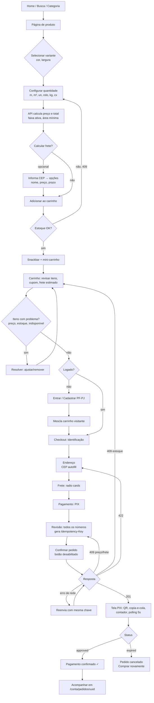
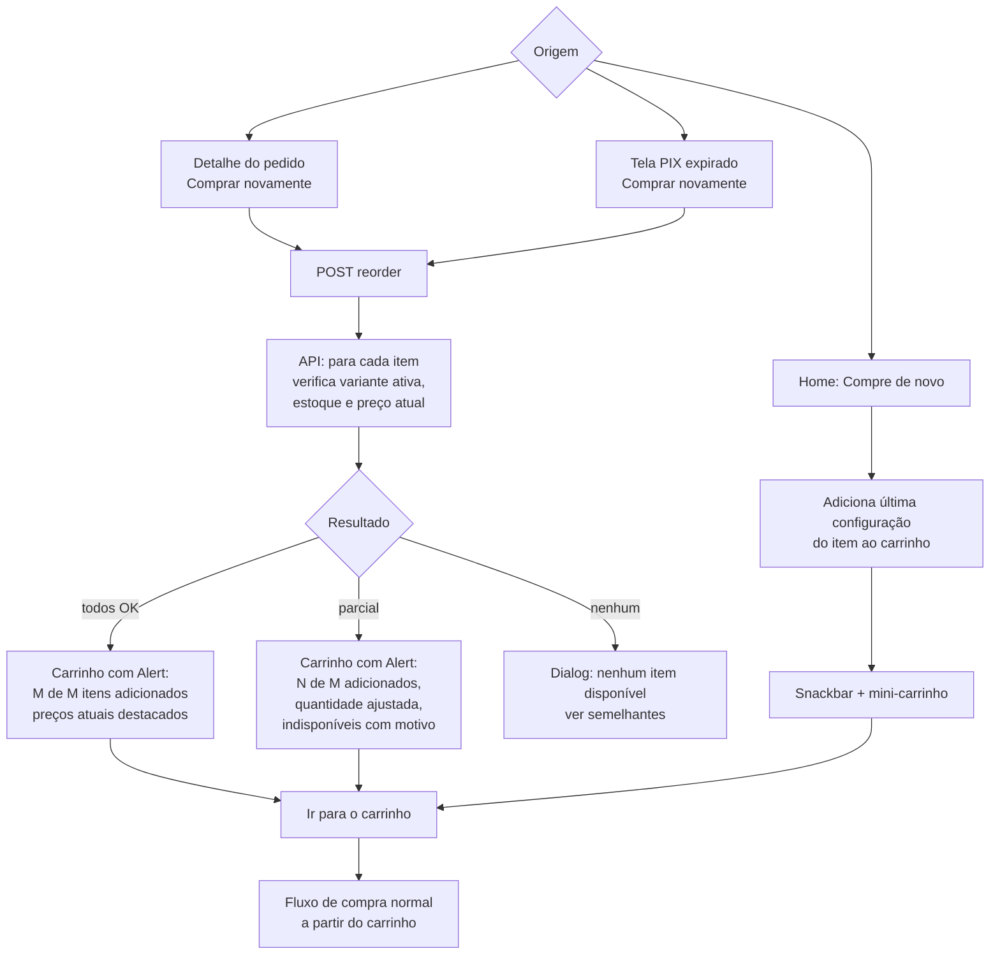
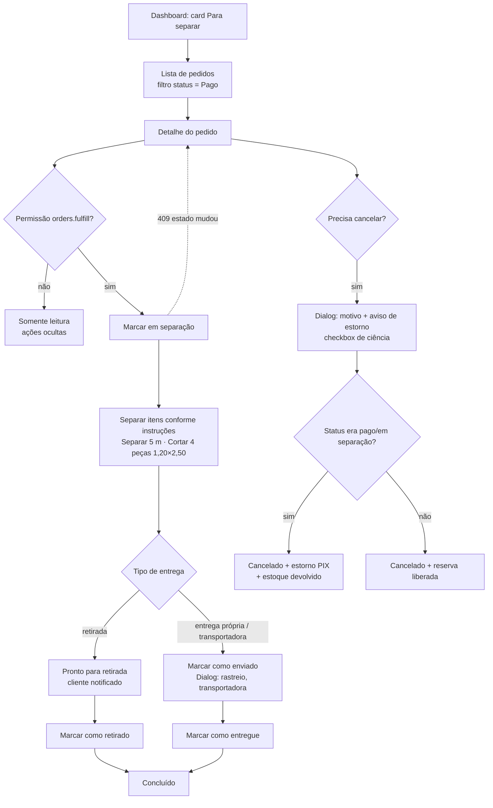
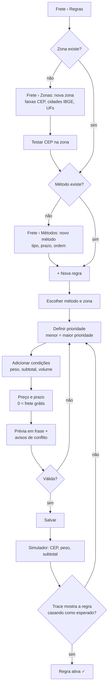

# UX/UI — Loja e Painel (especificação de experiência)

> Documento de referência para os agentes de **Storefront** (`storefront/`) e **Admin**
> (`admin/`). Complementa e **obedece** a `docs/DECISIONS.md` (vinculante). Onde este
> documento citar comportamento de backend (preço, frete, estoque, estados), a fonte da
> verdade é o ADR correspondente.
>
> Stack: React + TypeScript strict + Vite + MUI + TanStack Query + React Hook Form + Zod
> + React Router + `react-helmet-async`.

## Sumário

1. [Princípios de design](#1-princípios-de-design)
2. [Identidade visual e tema MUI](#2-identidade-visual-e-tema-mui)
3. [Loja — arquitetura de informação e rotas](#3-loja--arquitetura-de-informação-e-rotas)
4. [Loja — especificação de telas](#4-loja--especificação-de-telas)
5. [Painel administrativo](#5-painel-administrativo)
6. [Padrões globais de UX](#6-padrões-globais-de-ux)
7. [Fluxos de usuário (mermaid)](#7-fluxos-de-usuário)
8. [Orçamento de performance](#8-orçamento-de-performance)
9. [Checklist de aceite por tela](#9-checklist-de-aceite-por-tela)

---

## 1. Princípios de design

### 1.1 As oito perguntas

Nosso cliente é profissional (gráfica, instalador, empresa de sinalização). Ele compra
com pressa, muitas vezes no celular, no meio de um serviço. Em **qualquer** tela que
mostre um produto ou um pedido, ele deve responder sem esforço:

| # | Pergunta | Onde a resposta aparece |
|---|---|---|
| 1 | **O que estou comprando?** | Nome + variante (cor/largura) + SKU + foto, sempre juntos |
| 2 | **Quanto?** | Quantidade com unidade explícita: `5 m`, `3,00 m²`, `2 rolos` |
| 3 | **Qual unidade?** | Sufixo no preço (`R$ 15,90 /m`) e rótulo no configurador |
| 4 | **Quanto custa?** | Preço unitário + conta visível (`5 m × R$ 15,90 = R$ 79,50`) + total |
| 5 | **Quanto pesa?** | `Peso aprox.: 1,2 kg` no produto, no carrinho (total) e no checkout |
| 6 | **Como será entregue?** | Nome da opção de frete (Retirada, Entrega própria, Transportadora) |
| 7 | **Quanto custa o frete?** | Preço por opção; "Grátis" em verde quando 0 |
| 8 | **Quando chega?** | Prazo em dias úteis ("até 2 dias úteis") ou "Retire hoje após 14h" |

Regra de ouro: **nunca mostrar um preço sem unidade**, e **nunca mostrar um total sem
mostrar a conta** que o gerou (quando a quantidade não for 1 unidade inteira).

### 1.2 Princípios

1. **Comercial e profissional, não template genérico.** Densidade de informação maior
   que em loja B2C de moda: tabelas técnicas, SKU visível, faixas de preço, largura do
   material. Visual limpo, sem banners gigantes nem carrosséis automáticos.
2. **Mobile-first.** Projetar em 360 px e expandir. Ações primárias na zona do polegar
   (barra fixa inferior na página de produto e no carrinho, no mobile).
3. **Rápido.** Skeletons em vez de spinners de página inteira; dados em cache
   (TanStack Query); rotas com code-splitting; imagens responsivas (ver §8).
4. **Acessível — WCAG 2.1 AA.** Contraste ≥ 4,5:1 para texto normal e ≥ 3:1 para texto
   grande/ícones/bordas de componentes; tudo operável por teclado; foco visível;
   rótulos em todos os campos; mensagens de erro associadas via `aria-describedby`;
   anúncios de mudanças de preço/total em `aria-live="polite"`.
5. **Hierarquia clara.** Por tela, **um** botão primário (laranja para compra, azul para
   demais ações). Preço e total são os elementos tipográficos mais fortes depois do
   título.
6. **Backend é a fonte da verdade (ADR-005, ADR-012).** O frontend pode **estimar**
   para feedback imediato, mas o valor exibido como definitivo vem sempre da API.
   Enquanto a API recalcula, o valor fica em estado "recalculando" (ver §6.9).
7. **Erros explicáveis.** Toda mensagem diz o que aconteceu e o que fazer
   ("Estoque disponível: 12 m. Ajuste a quantidade.").
8. **Consistência entre loja e painel.** Mesmos formatadores, mesmos nomes de status,
   mesma paleta-base. O painel é mais denso (tamanho `small` em tabelas e inputs).

---

## 2. Identidade visual e tema MUI

### 2.1 Marca

- **Nome (placeholder):** **Comunika Suprimentos** — usado na loja e no painel
  ("Comunika Suprimentos · Painel").
- **Tagline:** "Suprimentos para comunicação visual, do jeito que você compra."
- **Logo placeholder:** wordmark "comunika" em Manrope 800, cor primária, com o "k"
  estilizado em laranja (secundária); abaixo, "SUPRIMENTOS" em Inter 600, 10 px,
  espaçamento de letras 0,16em. Versão reduzida (favicon/app icon): "k" laranja em
  quadrado azul com raio 8 px.
- **Tom de voz:** direto, técnico quando precisa, cordial sem gírias. Trata o cliente
  por "você".

### 2.2 Paleta de cores

Contraste calculado contra branco (`#FFFFFF`) salvo indicação. AA texto normal = 4,5:1.

| Token | Hex | Uso | Contraste |
|---|---|---|---|
| `primary.main` | `#0B4F8A` | Marca, header, links, botões de navegação, foco | 8,4:1 com branco ✔ |
| `primary.dark` | `#083A66` | Hover/pressed do primário | 11,6:1 ✔ |
| `primary.light` | `#E8F1FA` | Fundo de chip selecionado, linha selecionada, CEP chip | texto `primary.main` sobre ele 7,4:1 ✔ |
| `primary.contrastText` | `#FFFFFF` | Texto sobre primário | — |
| `secondary.main` | `#C2410C` | **CTA de compra** ("Adicionar ao carrinho", "Finalizar compra", "Confirmar pedido"), badge do carrinho | 5,2:1 com branco ✔ |
| `secondary.dark` | `#9A3412` | Hover/pressed do CTA | 7,3:1 ✔ |
| `secondary.light` | `#FFF1E8` | Fundo de destaque de promoção | texto `secondary.dark` 6,6:1 ✔ |
| `success.main` | `#1B7F3B` | "Em estoque", "Frete grátis", "Pago", confirmação | 5,0:1 ✔ |
| `success.light` (bg) | `#E8F5EC` | Fundo de Alert/Chip de sucesso | texto `#14602C` 6,8:1 ✔ |
| `warning.main` | `#B45309` | "Últimas unidades", "Preço alterado", "Aguardando pagamento" | 5,0:1 ✔ |
| `warning.light` (bg) | `#FFF4E5` | Fundo de Alert de aviso | texto `#663C00` 8,7:1 ✔ |
| `error.main` | `#C62828` | Erros de validação, "Indisponível", "Cancelado" | 5,6:1 ✔ |
| `error.light` (bg) | `#FDECEC` | Fundo de Alert de erro | texto `#8E1C1C` 7,9:1 ✔ |
| `info.main` | `#0277BD` | Informações neutras, "Enviado" | 4,8:1 ✔ |
| `info.light` (bg) | `#E6F4FB` | Fundo de Alert informativo | texto `#01579B` 6,6:1 ✔ |
| `text.primary` | `#1A2027` | Texto principal, preços | 16,4:1 ✔ |
| `text.secondary` | `#4A5563` | Texto auxiliar, rótulos, SKU | 7,6:1 ✔ (7,1:1 sobre `#F5F7FA`) |
| `text.disabled` | `#8A94A3` | Somente desabilitado (isento pela WCAG) | 3,0:1 |
| `divider` | `#E1E5EB` | Linhas de tabela e divisores (decorativo) | — |
| `border.input` | `#8A94A3` | Borda de inputs/cards clicáveis (componente ≥ 3:1) | 3,0:1 ✔ |
| `background.default` | `#F5F7FA` | Fundo das páginas | — |
| `background.paper` | `#FFFFFF` | Cards, dialogs, drawers | — |
| `grey.50…900` | `#F9FAFB` `#F3F4F6` `#E5E7EB` `#D1D5DB` `#9CA3AF` `#6B7280` `#4B5563` `#374151` `#1F2937` `#111827` | Escala neutra | — |
| `header.bg` | `#0B4F8A` | Barra do header da loja | — |
| `footer.bg` | `#0F172A` | Rodapé | texto `#E2E8F0` 14,5:1 ✔ |

Notas de contraste e uso:

- **Nunca** usar cor como único portador de informação: chips de status sempre têm
  texto; estoque tem ícone + texto; erros têm ícone + texto.
- `warning.main` (#B45309) só como texto/ícone ou fundo com texto branco em tamanho
  ≥ 14 px 600. Para Alerts usar a variante "standard" (fundo claro + texto escuro).
- Laranja é **reservado para comprar**. Se tudo for laranja, nada é CTA.
- Preço promocional: preço atual em `text.primary` (não vermelho), preço anterior
  riscado em `text.secondary`, selo "Promoção" em `secondary.light`/`secondary.dark`.
- Foco: contorno 2 px `primary.main` + offset 2 px; sobre fundo azul (header), contorno
  `#FFB74D` (contraste 4,8:1 contra `#0B4F8A`).

**Admin — modo escuro: SIM, opcional.** O painel é usado por horas seguidas
(separação, expedição). Implementar com `colorSchemes` do MUI (CSS variables),
padrão = preferência do sistema, alternância no menu do usuário, persistida em
`localStorage` (conveniência por usuário). A loja **não** tem modo escuro no MVP.

Paleta escura do painel:

| Token (dark) | Hex | Nota |
|---|---|---|
| `background.default` | `#0F141A` | — |
| `background.paper` | `#171E26` | — |
| `text.primary` | `#E6EAF0` | 13,9:1 sobre paper ✔ |
| `text.secondary` | `#A9B3C1` | 7,9:1 ✔ |
| `primary.main` | `#6FA8DC` | 6,7:1 sobre paper ✔ (texto do botão `#0F141A`, 7,3:1) |
| `secondary.main` | `#F28C4B` | 6,9:1 ✔ (texto do botão `#0F141A`, 7,6:1) |
| `success.main` | `#5CC985` | ✔ |
| `warning.main` | `#F2B45C` | ✔ |
| `error.main` | `#F28B82` | ✔ |
| `divider` | `#2A3440` | — |

### 2.3 Tipografia

- **Títulos:** **Manrope** (Google Fonts) pesos 700 e 800.
- **Texto e UI:** **Inter** (Google Fonts) pesos 400, 500, 600, 700.
- **Números:** Inter com `font-variant-numeric: tabular-nums` (feature `tnum`) em
  **todos** os preços, quantidades, totais, pesos, tabelas e contadores — dígitos de
  largura fixa evitam "pulos" quando o total muda e alinham colunas.
- Carregamento: `<link rel="preconnect">` para `fonts.googleapis.com` e
  `fonts.gstatic.com`, `display=swap`, apenas os pesos listados, subset `latin`
  (inclui acentos pt-BR). Fallback: `system-ui, -apple-system, "Segoe UI", Roboto, Arial, sans-serif`.

Escala (loja; valores mobile → desktop ≥ 900 px):

| Variante MUI | Fonte | Tamanho | Peso | Altura de linha | Uso |
|---|---|---|---|---|---|
| `h1` | Manrope | 26 → 34 px | 800 | 1,2 | Título de página / nome do produto |
| `h2` | Manrope | 22 → 28 px | 700 | 1,25 | Seções |
| `h3` | Manrope | 18 → 22 px | 700 | 1,3 | Subseções, títulos de card grandes |
| `h4` | Inter | 16 → 18 px | 600 | 1,35 | Títulos de card, passos do checkout |
| `price` (custom) | Inter tnum | 24 → 30 px | 700 | 1,1 | Preço principal do produto |
| `total` (custom) | Inter tnum | 20 → 24 px | 700 | 1,2 | Totais de carrinho/checkout |
| `body1` | Inter | 16 px | 400 | 1,5 | Texto padrão (mínimo 16 px em inputs → evita zoom no iOS) |
| `body2` | Inter | 14 px | 400 | 1,45 | Texto auxiliar, células de tabela |
| `caption` | Inter | 12 px | 500 | 1,4 | SKU, notas, legendas |
| `overline` | Inter | 11 px | 600 | 1,4, caixa alta, 0,08em | Rótulos de seção |
| `button` | Inter | 15 px | 600 | 1 | Sem caixa alta (`textTransform: none`) |

Painel: mesma família, base `body2` (14 px) em tabelas, `h1` 24 px.

### 2.4 Espaçamento, raio, elevação, grid

- **Espaçamento:** `theme.spacing` base **4 px**. Escala usada: 4, 8, 12, 16, 24, 32,
  48, 64 (`spacing(1)` = 4 px). Gutter lateral: 16 px mobile, 24 px tablet, 32 px desktop.
- **Largura máxima de conteúdo:** 1280 px (loja), fluido (painel).
- **Breakpoints:** `xs 0`, `sm 600`, `md 900`, `lg 1200`, `xl 1536` (padrão MUI).
- **Raio:** `shape.borderRadius = 8`. Botões e inputs 8 px; cards 12 px; chips 16 px
  (pílula); dialogs 16 px; imagens de produto 8 px.
- **Elevação:** preferir **borda** (`1px solid divider`) a sombra. Sombras só em:
  header fixo ao rolar (`elevation 2`), drawers/menus (`elevation 8`), dialogs
  (`elevation 16`), barra fixa inferior mobile (sombra para cima). Cards de produto:
  borda; no hover (desktop) `elevation 3` + borda `primary.main`.
- **Alvos de toque:** mínimo 44 × 44 px (steppers, ícones de remover, chips de filtro).

### 2.5 Iconografia

`@mui/icons-material`, estilo **Outlined** (consistência), tamanho 20 px em texto, 24 px
em ações. Ícones decorativos com `aria-hidden`; ícones-botão sempre com `aria-label`.

| Conceito | Ícone |
|---|---|
| Busca | `SearchOutlined` |
| Carrinho | `ShoppingCartOutlined` |
| Conta | `PersonOutlineOutlined` |
| CEP / local | `LocationOnOutlined` |
| Frete / entrega | `LocalShippingOutlined` |
| Retirada | `StorefrontOutlined` |
| Estoque ok | `CheckCircleOutline` |
| Estoque baixo | `ErrorOutline` |
| Indisponível | `RemoveCircleOutline` |
| Peso | `ScaleOutlined` |
| Medida/largura | `StraightenOutlined` |
| Área | `AspectRatioOutlined` |
| PIX | `PixOutlined` |
| Copiar | `ContentCopyOutlined` |
| WhatsApp | `WhatsApp` |
| Recomprar | `ReplayOutlined` |
| Cupom | `LocalOfferOutlined` |
| Remover | `DeleteOutlineOutlined` |
| Editar | `EditOutlined` |
| Filtros | `TuneOutlined` |
| Grade / lista | `GridViewOutlined` / `ViewListOutlined` |

### 2.6 Tokens do tema MUI (descrição para implementação)

Criar `src/theme/` em cada SPA (idealmente um pacote/arquivo espelhado — as duas SPAs
são independentes, então duplicar o arquivo `tokens.ts` e mantê-lo idêntico):

- `tokens.ts`: constantes puras (cores da §2.2, escala de espaçamento, raios, fontes).
- `theme.ts` (loja): `createTheme` com:
  - `palette`: primary/secondary/success/warning/error/info com `main/dark/light/contrastText`
    da tabela; `text`, `divider`, `background`; extensão tipada
    (`declare module '@mui/material/styles'`) para `palette.header`, `palette.footer`,
    `palette.border.input`.
  - `typography`: `fontFamily` Inter; `h1–h3` Manrope; variantes customizadas `price`
    e `total` (com `fontVariantNumeric: 'tabular-nums'`) registradas via module
    augmentation em `TypographyVariants` e `TypographyPropsVariantOverrides`;
    `button.textTransform = 'none'`; `responsiveFontSizes` **não** — tamanhos por
    breakpoint explícitos.
  - `shape.borderRadius = 8`; `spacing = 4`.
  - `components` (overrides/defaultProps):
    - `MuiButton`: `disableElevation`, `size="large"` na loja (altura 48 px),
      `variant="contained"` padrão; foco com outline visível (`:focus-visible`).
    - `MuiTextField`: `variant="outlined"`, `fullWidth`, `size="medium"` (loja) /
      `size="small"` (painel); `InputLabel` sempre visível (sem placeholder como rótulo).
    - `MuiCard`: `variant="outlined"`, raio 12.
    - `MuiChip`: raio 16, `fontWeight 600`.
    - `MuiTableCell`: números alinhados à direita via classe utilitária `num`
      (tabular-nums).
    - `MuiLink`: `underline="hover"`, cor primária; sublinhado sempre dentro de texto
      corrido.
    - `MuiCssBaseline`: `body { background: #F5F7FA }`, `.num { font-variant-numeric: tabular-nums }`,
      `@media (prefers-reduced-motion: reduce)` zera transições.
    - `MuiSkeleton`: `animation="wave"` (vira `false` com reduced motion).
    - `MuiSnackbar`: `anchorOrigin` bottom-center (mobile) / bottom-left (desktop),
      `autoHideDuration 5000`.
- `theme.ts` (painel): mesma base com `cssVariables: true`,
  `colorSchemes: { light, dark }` (paleta §2.2), densidade: `MuiButton size small`,
  `MuiTextField size small`, `MuiTable size small`, `MuiListItem dense`.

---

## 3. Loja — arquitetura de informação e rotas

### 3.1 Mapa do site

```text
/                                   Home
├── /busca?q=&page=&sort=&...       Resultados de busca
├── /{categoria}                    Listagem de categoria (inclui subcategorias via filtro/URL)
│   └── /{categoria}/{produto}      Página de produto
├── /carrinho                       Carrinho (visitante ou logado)
├── /checkout                       Checkout em passos (exige login — ADR-007)
│   └── /checkout/pedido/{uuid}     Confirmação + pagamento PIX
├── /entrar                         Login           (?redirect=/checkout)
├── /cadastro                       Cadastro PF/PJ  (?redirect=)
├── /recuperar-senha                Solicitar link de redefinição
├── /redefinir-senha?token=&email=  Definir nova senha (link do e-mail)
├── /conta                          Visão geral (requer login)
│   ├── /conta/pedidos              Lista de pedidos
│   │   └── /conta/pedidos/{uuid}   Detalhe do pedido
│   ├── /conta/enderecos            Endereços (CRUD)
│   ├── /conta/dados                Dados cadastrais PF/PJ (inclui empresa)
│   └── /conta/senha                Alterar senha
├── /institucional/{slug}           Sobre, trocas e devoluções, privacidade (LGPD), termos
└── *                               404
```

**Slugs reservados:** ADR-015 lista `busca`, `carrinho`, `checkout`, `conta`, `entrar`,
`cadastro`. Esta especificação também precisa de `recuperar-senha`,
`redefinir-senha` e `institucional`. **Ação:** registrar a extensão em
`DECISIONS.md` (nova ADR ou emenda à ADR-015) antes de implementar. O backend deve
impedir categorias com esses slugs.

**Ordem de resolução no React Router:** rotas estáticas primeiro; depois
`/:categorySlug/:productSlug`; depois `/:categorySlug`; depois `*` (404). Se a API
responder 404 para a categoria/produto, renderizar a página 404 **na mesma URL**
(sem redirect), com `<meta name="robots" content="noindex">`.

**Estado na URL:** filtros, ordenação, página e modo grade/lista da listagem e busca
vivem na query string (`?marca=3m,avery&preco=0-100&unidade=LINEAR_METER&estoque=1&ordem=preco_asc&pagina=2&vista=lista`)
— compartilhável, "voltar" funciona, SEO não indexa (canonical sem filtros).

**Rotas protegidas:** `/checkout*` e `/conta*` → se 401, redireciona para
`/entrar?redirect=<rota atual>`.

### 3.2 Header

Mobile (≤ 899 px) — duas linhas; a linha de busca permanece fixa ao rolar:

```text
┌──────────────────────────────────────────────┐
│ ☰  comunika            👤   🛒(3)            │  ← 56 px, fundo primary
│ [🔍 Buscar por nome ou SKU…            ]     │  ← 48 px
│ 📍 Entregar em 89010-000 ▾                   │  ← chip CEP (32 px)
└──────────────────────────────────────────────┘
```

Desktop (≥ 900 px):

```text
┌───────────────────────────────────────────────────────────────────────────────┐
│ Retirada grátis em Blumenau · Frete grátis acima de R$ 500 · (47) 99999-0000  │ ← barra fina (32 px)
├───────────────────────────────────────────────────────────────────────────────┤
│ comunika   [🔍 Buscar por nome ou SKU…                    ]  📍 Entregar em   👤 Olá, Ana ▾  🛒 3 │
│ SUPRIMENTOS                                                     89010-000 ▾      Minha conta    R$ 412,30 │
├───────────────────────────────────────────────────────────────────────────────┤
│ ☰ Categorias ▾ │ Lonas │ Vinis │ Adesivos │ Papéis │ Bobinas │ Tintas │ Fitas │ Ilhós │ Ferramentas │ Acessórios │
└───────────────────────────────────────────────────────────────────────────────┘
```

Componentes:

- **Logo** → link para `/` (`aria-label="Comunika Suprimentos — página inicial"`).
- **Busca com autocomplete** (`Autocomplete` MUI em modo `freeSolo`):
  - Dispara a partir de 2 caracteres, debounce 250 ms, cancela request anterior
    (`AbortController` via TanStack Query).
  - Sugestões agrupadas: **Produtos** (até 6: miniatura 40 px, nome, SKU em `caption`,
    preço com unidade), **Categorias** (até 3). Se o termo parecer SKU (sem espaço,
    contém dígito/hífen), mostrar primeiro o match exato de SKU com selo "SKU".
  - Enter sem item selecionado → `/busca?q=termo`. Item → página do produto/categoria.
  - Última linha: "Ver todos os resultados para 'termo'".
  - Termo destacado em negrito nas sugestões.
  - Acessibilidade: padrão combobox ARIA do MUI; `aria-label="Buscar produtos por nome ou SKU"`;
    status "6 sugestões disponíveis" em região `aria-live`.
  - No mobile, o foco no campo abre a busca em tela cheia (Dialog `fullScreen`) com
    botão "Voltar" e buscas recentes (localStorage, até 5, com "Limpar").
- **Menu de categorias:** desktop = barra horizontal com as principais + "Categorias ▾"
  (mega-menu com subcategorias em colunas, abre em clique **e** hover com atraso
  150 ms; fecha com Esc). Mobile = Drawer esquerdo com árvore (accordion) +
  links "Minha conta", "Meus pedidos", "Atendimento/WhatsApp".
- **Conta:** visitante → "Entrar / Cadastrar"; logado → "Olá, {primeiro nome}" com
  menu: Minha conta, Meus pedidos, Endereços, Sair. PJ mostra nome fantasia abaixo.
- **Carrinho:** ícone com `Badge` (cor secundária) = **número de itens (linhas)**,
  não soma de quantidades (evita "7,5"). Desktop mostra subtotal abaixo.
  `aria-label="Carrinho, 3 itens, subtotal R$ 412,30"`. Clique abre o **mini-carrinho**
  (Drawer direito) no desktop; no mobile navega para `/carrinho`.
- **Chip de CEP** "📍 Entregar em 89010-000": abre Dialog com campo CEP (máscara),
  "Não sei meu CEP" (link Correios, nova aba), e — se logado — lista de endereços
  salvos para escolher. O CEP fica salvo (localStorage para visitante; endereço
  padrão para logado) e **pré-preenche** o cálculo de frete no produto, carrinho e
  checkout. Sem CEP: "📍 Informe seu CEP".

### 3.3 Footer

```text
┌─────────────────────────────────────────────────────────────────────┐
│ comunika SUPRIMENTOS                                                │
│ Suprimentos para comunicação visual, do jeito que você compra.      │
│                                                                     │
│ INSTITUCIONAL      ATENDIMENTO              COMPRA SEGURA           │
│ Sobre nós          (47) 3333-0000           [PIX]                   │
│ Trocas e devol.    WhatsApp (47) 99999-0000  Pagamento via PIX      │
│ Política de priv.  contato@comunika…        (cartão e boleto em     │
│ Termos de uso      Seg–Sex 8h–18h, Sáb 8h–12h breve)                │
│                                                                     │
│ ENTREGA                                                             │
│ Retirada grátis na loja: Rua X, 123 – Blumenau/SC (seg–sex 8h–18h)  │
│ Entrega própria em Blumenau e região · Transportadoras p/ o Brasil  │
│ Frete grátis acima de R$ 500 (consulte regiões)                     │
│─────────────────────────────────────────────────────────────────────│
│ Comunika Suprimentos Ltda · CNPJ 00.000.000/0001-00 · Blumenau/SC   │
│ Seus dados são tratados conforme a LGPD. Política de privacidade ·  │
│ Encarregado (DPO): privacidade@comunika…                            │
└─────────────────────────────────────────────────────────────────────┘
```

- No mobile, as colunas viram `Accordion` (exceto "Atendimento", sempre aberta).
- Endereço, telefones, texto de frete grátis e horário vêm de **Configurações** do
  painel (API pública de settings) — nada fixo no código.
- **Botão flutuante de WhatsApp** (FAB 56 px, canto inferior direito, acima da barra
  fixa do produto/carrinho no mobile), `aria-label="Falar no WhatsApp"`, abre
  `wa.me` com mensagem pré-preenchida contendo a URL da página atual. Oculto no checkout.
- **Banner de cookies/LGPD** na primeira visita: barra inferior não modal, "Usamos
  cookies essenciais para o funcionamento da loja e, com seu consentimento, para
  análise de uso." [Aceitar] [Somente essenciais] [Saiba mais]. Não bloquear a tela.

### 3.4 Layouts base

- `StoreLayout`: header + `<main id="conteudo">` + footer. Primeiro elemento focável:
  link "Pular para o conteúdo".
- `CheckoutLayout`: header **reduzido** (logo + "Compra segura 🔒" + ajuda WhatsApp),
  sem menu/busca/footer completo (reduz fuga), footer mínimo (CNPJ, privacidade).
- `AccountLayout`: `StoreLayout` + navegação lateral (desktop) ou `Tabs` roláveis
  (mobile): Visão geral · Pedidos · Endereços · Dados · Senha · Sair.

---

## 4. Loja — especificação de telas

Cada tela segue a estrutura: **Objetivo · Layout (mobile/desktop) · Componentes · Dados
· Ações · Validação · Vazio · Carregando · Erro · Sucesso · Acessibilidade**. Itens
que seguem o padrão global (§6) apenas o referenciam.

### 4.0 Componentes compartilhados da loja

| Componente | Descrição |
|---|---|
| `Price` | Recebe `cents`, `unit` (`sale_unit`), `compareAtCents?`, `source?`. Renderiza `R$ 15,90 /m`, preço anterior riscado, selo de origem ("Preço atacado", "Promoção"). `aria-label="15 reais e 90 centavos por metro"`. |
| `UnitSuffix` | Mapa de sufixos: `UNIT` "/un", `LINEAR_METER` "/m", `SQUARE_METER` "/m²", `ROLL` "/rolo", `KG` "/kg", `BOX` "/cx". |
| `QuantityLabel` | Formata quantidade + unidade: `5 un`, `5 m`, `3,00 m²`, `2 rolos`, `2,5 kg`, `1 caixa`. |
| `ConfigurationSummary` | Linha de configuração: `5 m` ou `1,20 m × 2,50 m × 1 peça = 3,00 m²`. |
| `StockBadge` | Regra RN-CAT-017: `Em estoque` (verde, ✓; disponível > `low_stock_threshold`) · `Últimas unidades` (âmbar; 0 < disponível ≤ threshold — no produto/carrinho mostra "Restam 3,5 m") · `Indisponível` (vermelho; disponível < `min_quantity`). Número exato de estoque só aparece em "Últimas unidades" ou quando a quantidade pedida excede o disponível. |
| `ProductCard` | Ver §4.2. |
| `QuantityStepper` | Ver §4.4.4. |
| `ShippingEstimator` | CEP + lista de opções (nome, preço, prazo). Ver §4.4.6. |
| `OrderStatusChip` | Ver tabela de status §6.1.4. |
| `SummaryPanel` | Resumo de valores (subtotal, desconto, frete, total, peso). Reutilizado em carrinho e checkout. |
| `EmptyState` | Ilustração simples (ícone 48 px em círculo `primary.light`), título, texto, CTA. |
| `ErrorState` | Ícone, "Não foi possível carregar…", botão "Tentar novamente" (refetch), código `X-Request-Id` em `caption` para suporte. |

---

### 4.1 Home (`/`)

**Objetivo:** levar rapidamente o profissional à categoria/produto certo; recompra
rápida para quem já é cliente; comunicar vantagens logísticas.

**Mobile:**

```text
┌────────────────────────────────┐
│ [header]                       │
├────────────────────────────────┤
│ ┌────────────────────────────┐ │
│ │ Lonas e vinis com entrega  │ │  Hero estático (1 imagem, sem carrossel
│ │ própria em Blumenau        │ │  automático), 16:9 mobile
│ │ [Ver lonas]  [Ver vinis]   │ │
│ └────────────────────────────┘ │
│ ── Benefícios (scroll horiz.) ─│
│ [🏬 Retirada grátis em Blumenau] [🚚 Entrega própria] [📦 Frete grátis acima de R$ 500] │
│                                │
│ Compre de novo  (logado)  Ver todos › │
│ [card][card][card] →  (scroll) │
│                                │
│ Categorias                     │
│ ┌──────┐┌──────┐┌──────┐       │  grade 3 col (mobile), 5 col (desktop)
│ │Lonas ││Vinis ││Adesiv│       │  ícone/foto + nome
│ └──────┘└──────┘└──────┘       │
│ ┌──────┐┌──────┐┌──────┐       │
│ │Papéis││Bobin.││Tintas│       │
│ └──────┘└──────┘└──────┘       │
│  ... Fitas, Ilhós, Ferramentas, Acessórios
│                                │
│ Mais vendidos        Ver todos ›│
│ ┌─────────┐┌─────────┐         │  grade 2 col
│ │ [img]   ││ [img]   │         │
│ │ Vinil…  ││ Lona…   │         │
│ │R$15,90/m││R$30,00/m²│        │
│ │[Ver]    ││[Ver]    │         │
│ └─────────┘└─────────┘         │
│ Promoções                      │
│ ...                            │
│ [footer]                       │
└────────────────────────────────┘
```

**Desktop (≥ 1200 px):**

```text
┌──────────────────────────────────────────────────────────────────────┐
│ [header]                                                             │
├──────────────────────────────────────────────────────────────────────┤
│ ┌───────────────────────────────────────┐ ┌────────────────────────┐ │
│ │ HERO (texto à esquerda, foto à dir.)  │ │ Compre de novo (logado)│ │
│ │ Lonas e vinis com entrega própria     │ │ • Vinil Branco 1,22 m  │ │
│ │ [Ver lonas] [Ver vinis]               │ │   último: 10 m [+ Carr]│ │
│ └───────────────────────────────────────┘ │ • Lona 440 g           │ │
│ [🏬 Retirada grátis em Blumenau] [🚚 Entrega própria na região]     │ │
│ [📦 Frete grátis acima de R$ 500]         │   Ver pedidos anteriores│ │
│                                           └────────────────────────┘ │
│ Categorias  [Lonas][Vinis][Adesivos][Papéis][Bobinas]                │
│             [Tintas][Fitas][Ilhós][Ferramentas][Acessórios]          │
│ Mais vendidos                                            Ver todos › │
│ [card][card][card][card][card]                                       │
│ Promoções                                                            │
│ [card][card][card][card][card]                                       │
└──────────────────────────────────────────────────────────────────────┘
```

Visitante: a coluna "Compre de novo" é substituída por um card "Compra para sua
empresa? Cadastre seu CNPJ e acesse preços de atacado" [Criar conta PJ].

**Componentes:** Hero (imagem `fetchpriority="high"`, é o LCP), `BenefitsBar`,
`CategoryTile`, `ProductCard` (carrosséis horizontais com scroll-snap e botões
‹ › no desktop), `ReorderList`.

**Dados:** categorias de 1º nível (nome, slug, imagem); vitrines (mais vendidos,
promoções, destaques) com preço já resolvido para o cliente; "Compre de novo" =
variantes dos últimos pedidos pagos do cliente (nome, variante, última configuração
comprada, preço atual).

**Ações:** navegar; "+ Carrinho" no "Compre de novo" adiciona **a mesma configuração
do último pedido** (ex.: 10 m) e abre o mini-carrinho; "Ver" no card leva ao produto
(cards de listagem **não** adicionam direto quando a unidade exige configuração —
m², m linear, kg; para `UNIT/ROLL/BOX` o card pode ter "Adicionar" com quantidade 1).

**Vazio:** vitrine sem produtos → seção não renderiza. "Compre de novo" sem histórico →
card "Seus produtos comprados aparecerão aqui para recomprar em 1 clique".

**Carregando:** Hero com cor sólida `primary.light` reservando a altura (sem CLS);
tiles e cards com `Skeleton` no formato exato (imagem 1:1, 2 linhas de texto, 1 de preço).

**Erro:** vitrine com erro some silenciosamente (log no console/observabilidade) —
home nunca mostra tela de erro inteira, exceto se categorias falharem: `ErrorState`
compacto com "Tentar novamente".

**Sucesso:** snackbar "Adicionado ao carrinho" + mini-carrinho (ver §4.4.7).

**A11y:** carrosséis são listas (`<ul>`) roláveis por teclado, botões ‹ › com
`aria-label="Ver mais produtos"`; hero sem texto em imagem; benefícios com ícone
decorativo e texto.

---

### 4.2 Listagem de categoria (`/{categoria}`)

**Objetivo:** encontrar a variante certa comparando preço **por unidade**, largura e
disponibilidade.

**Mobile:**

```text
┌────────────────────────────────┐
│ Início › Vinis                 │ breadcrumb (rolável)
│ Vinis adesivos        248 prod.│ h1 + total
│ [Subcat: Brilho][Fosco][Transp.]│ chips de subcategoria (scroll)
│ [⚙ Filtros (2)] [↕ Ordenar ▾] [▦|☰]│ barra fixa ao rolar
│ Filtros ativos: [3M ✕][Em estoque ✕] Limpar │
│ ┌─────────────┐┌─────────────┐ │
│ │  [imagem]   ││  [imagem]   │ │
│ │ ✓ Em estoque││ ! Últimas un.│ │
│ │ Vinil Adesivo││ Vinil Fosco │ │
│ │ Branco Brilho││ Preto       │ │
│ │ SKU VN-BR122 ││ SKU VN-PF122│ │
│ │ Largura 1,22 m││Largura 1,22 m│
│ │ R$ 15,90 /m ││ R$ 17,40 /m │ │
│ │ a partir de  ││             │ │ (quando há faixas: "a partir de R$ 13,50 /m")
│ │ [Ver opções]││ [Ver opções]│ │
│ └─────────────┘└─────────────┘ │
│ ...                            │
│ [ Carregar mais (24 de 248) ]  │
└────────────────────────────────┘
Filtros → Drawer inferior (fullscreen) com [Limpar] [Ver 57 produtos]
```

**Desktop:**

```text
┌──────────────────────────────────────────────────────────────────────┐
│ Início › Vinis                                                       │
│ Vinis adesivos                                         248 produtos   │
├───────────────────┬──────────────────────────────────────────────────┤
│ FILTROS   Limpar  │ [3M ✕] [Em estoque ✕]     Ordenar: [Relevância ▾] [▦][☰] │
│ Subcategoria      │ ┌────────┐┌────────┐┌────────┐┌────────┐          │
│ ☐ Brilho (120)    │ │ card   ││ card   ││ card   ││ card   │          │
│ ☐ Fosco (80)      │ └────────┘└────────┘└────────┘└────────┘          │
│ ☐ Transparente(48)│ ...                                               │
│ Marca             │                                                    │
│ ☑ 3M (40)         │ Modo lista (☰):                                    │
│ ☐ Avery (22)      │ ┌──────────────────────────────────────────────┐   │
│ + ver mais        │ │[img] Vinil Adesivo Branco Brilho  Largura 1,22 m │
│ Faixa de preço    │ │      SKU VN-BR122 · 3M   ✓ Em estoque        │   │
│ [R$ 0 ]—[R$ 100]  │ │      R$ 15,90 /m  (51+ m: R$ 13,50 /m) [Ver] │   │
│ ═══●══════●═══    │ └──────────────────────────────────────────────┘   │
│ Unidade de venda  │                                                    │
│ ◉ Todas ○ Metro   │ ‹ 1 2 3 … 11 ›   (paginação numerada no desktop)    │
│ ○ m² ○ Rolo ○ Un. │                                                    │
│ ☑ Somente em estoque                                                   │
└───────────────────┴──────────────────────────────────────────────────┘
```

**Filtros:**

| Filtro | Controle | URL |
|---|---|---|
| Subcategoria | Checkbox (multi) com contagem; mobile também como chips no topo | `sub=brilho,fosco` |
| Marca | Checkbox (multi), 5 visíveis + "ver mais" com busca interna se > 10 | `marca=3m,avery` |
| Faixa de preço | Slider duplo + 2 inputs BRL; aplica ao soltar/blur. **Rótulo:** "Preço por unidade de venda" | `preco=0-100` (reais) |
| Unidade de venda | Radio: Todas, Unidade, Metro linear, m², Rolo, kg, Caixa (só as presentes) | `unidade=LINEAR_METER` |
| Em estoque | Switch/checkbox "Somente em estoque" | `estoque=1` |

- Desktop: filtros aplicam imediatamente (debounce 300 ms para preço). Mobile: aplicam
  ao tocar "Ver N produtos" (contagem atualizada ao vivo).
- **Ordenação:** Relevância (padrão na busca) · Mais vendidos (padrão na categoria) ·
  Menor preço · Maior preço · Nome A–Z · Lançamentos.
- **Grade/Lista:** grade 2 col (mobile) / 3–4 col (desktop); lista útil para
  profissionais comparando SKUs. Preferência salva em localStorage e refletida na URL.
- **Paginação:** 24 por página. Mobile: "Carregar mais" (mantém URL `pagina=`); desktop:
  paginação numerada. Nunca scroll infinito sem botão (rodapé inacessível).

**Card de produto (dados):** imagem 1:1 (lazy, `srcset`), `StockBadge`, nome (máx. 2
linhas, ellipsis), SKU (quando o produto tem 1 variante) ou "4 opções de cor",
marca, **atributo-chave** (largura "Largura 1,22 m", gramatura "440 g/m²", conteúdo
"Rolo 50 m", "Caixa c/ 1000 un"), **preço com unidade** "R$ 15,90 /m", preço
promocional com anterior riscado, "a partir de R$ X /m" se houver faixa/variante mais
barata, selo de origem do preço para cliente com tabela ("Preço atacado").
Toda a área do card é um link (um único `<a>` contendo o título; demais elementos não
focáveis), botão secundário opcional para `UNIT/ROLL/BOX`.

**Vazio (filtros sem resultado):** "Nenhum produto com esses filtros." [Limpar filtros]
+ sugestão: remover o último filtro aplicado ("Remover 'Somente em estoque'").
Categoria sem produtos: "Em breve novos produtos nesta categoria." + link para
categorias irmãs.

**Carregando:** primeira carga = 8 skeleton cards; troca de filtro = mantém resultados
anteriores com opacidade 0,6 + `LinearProgress` no topo da grade
(`placeholderData: keepPreviousData`), anunciando "Carregando resultados".

**Erro:** `ErrorState` na área de resultados; filtros continuam utilizáveis.

**A11y:** filtros em `<form>` com `fieldset/legend`; contagem de resultados anunciada
em `aria-live="polite"` ("57 produtos encontrados"); chips de filtro ativos com
`aria-label="Remover filtro marca 3M"`; o Drawer de filtros é modal (foco preso,
Esc fecha, foco retorna ao botão "Filtros").

**SEO:** `title` "Vinis adesivos | Comunika Suprimentos", description da categoria,
canonical sem query, `BreadcrumbList` JSON-LD.

---

### 4.3 Resultados de busca (`/busca?q=`)

**Objetivo:** mesmo que 4.2, a partir de texto livre ou SKU.

- Layout idêntico à listagem; h1 = `Resultados para "vinil branco"` + total.
- Filtro adicional **Categoria** (checkbox com contagem) no topo da lista de filtros.
- **Match exato de SKU:** se `q` corresponde exatamente a um SKU, mostrar banner
  "SKU VN-BR122 encontrado" com o card em destaque; se for o único resultado,
  redirecionar direto ao produto (com a variante pré-selecionada, `?sku=VN-BR122`).
- **Vazio:** `Nenhum resultado para "xyz".` Dicas: "Verifique a ortografia", "Use
  termos mais gerais (ex.: 'lona' em vez de 'lona 440g fosca')", "Busque pelo SKU".
  Mostrar tiles de categorias + "Não achou? Fale no WhatsApp" (com o termo na mensagem).
- `q` vazio → redireciona para `/`. Termo com < 2 caracteres → mensagem "Digite pelo
  menos 2 caracteres".
- **SEO:** `noindex, follow`.

---

### 4.4 Página de produto (`/{categoria}/{produto}`) — tela central

**Objetivo:** configurar exatamente o que se quer comprar, ver o custo total e o frete,
e adicionar ao carrinho com confiança.

#### 4.4.1 Layout

Mobile:

```text
┌────────────────────────────────┐
│ Início › Vinis › Brilho        │
│ ┌────────────────────────────┐ │
│ │        [galeria]           │ │ swipe; indicador 1/5; toque = zoom fullscreen
│ └────────────────────────────┘ │
│ • • ○ ○ ○                      │
│ Vinil Adesivo Branco           │ h1
│ SKU VN-BR122 · Marca 3M        │ caption (SKU copiável)
│ ✓ Em estoque                   │
│                                │
│ R$ 15,90 / metro               │ price + unidade por extenso
│ Preço atacado                  │ origem (se houver)
│ ┌ Preço por quantidade ──────┐ │
│ │ 1–10 m   R$ 15,90 /m        │ │ faixa ativa destacada
│ │ 11–50 m  R$ 14,50 /m        │ │
│ │ 51+ m    R$ 13,50 /m        │ │
│ └────────────────────────────┘ │
│ Cor: Branco                    │
│ (●Branco)(○Preto)(○Transp.)    │ swatches com nome
│ Largura: 1,22 m                │
│ [1,00 m] [●1,22 m] [1,52 m]    │ toggle buttons
│                                │
│ ── Configurador (ver 4.4.4) ── │
│                                │
│ Peso aprox.: 1,2 kg            │
│ ── Frete ──────────────────────│
│ 📍 89010-000 [Alterar]         │
│ ○ Retirada na loja  Grátis  Hoje após 14h │
│ ○ Entrega própria   R$ 20,00  1 dia útil  │
│ ○ Transportadora X  R$ 38,90  3–5 dias úteis│
│                                │
│ Descrição  ▾                   │ accordions
│ Especificações técnicas ▾      │
│ Produtos relacionados →        │
├────────────────────────────────┤
│ R$ 79,50       [Adicionar ao carrinho] │ barra fixa inferior (total + CTA)
└────────────────────────────────┘
```

Desktop (≥ 900 px): duas colunas 7/5; a coluna direita (compra) é `position: sticky`.

```text
┌──────────────────────────────────────────────────────────────────────────┐
│ Início › Vinis › Brilho › Vinil Adesivo Branco                           │
├────────────────────────────────────────┬─────────────────────────────────┤
│ ┌──┐ ┌───────────────────────────────┐ │ Vinil Adesivo Branco            │
│ │th│ │                               │ │ SKU VN-BR122 · 3M · ✓ Em estoque│
│ ├──┤ │         imagem principal       │ │                                 │
│ │th│ │         (zoom no hover)       │ │ R$ 15,90 / metro                │
│ ├──┤ │                               │ │ ┌ Preço por quantidade ───────┐ │
│ │th│ └───────────────────────────────┘ │ │ 1–10 m R$ 15,90 · 11–50 m   │ │
│ └──┘                                    │ │ R$ 14,50 · 51+ m R$ 13,50   │ │
│                                        │ └─────────────────────────────┘ │
│ Descrição                               │ Cor  (●)(○)(○)  Largura [1,22 m]│
│ Texto…                                  │ ┌ Configurador ───────────────┐ │
│                                        │ │ ...                          │ │
│ Especificações técnicas                 │ └─────────────────────────────┘ │
│ ┌───────────────────┬─────────────────┐ │ Total  R$ 79,50                  │
│ │ Largura           │ 1,22 m          │ │ Peso aprox.: 1,2 kg              │
│ │ Espessura         │ 0,08 mm         │ │ [ Adicionar ao carrinho ]        │
│ │ Acabamento        │ Brilho          │ │ Frete para 89010-000 [Alterar]   │
│ │ Adesivo           │ Permanente      │ │ (opções)                          │
│ │ Durabilidade ext. │ 5 anos          │ │ 💬 Dúvidas? Fale no WhatsApp      │
│ │ Aplicação         │ Plotter de recorte│ └─────────────────────────────────┘
│ └───────────────────┴─────────────────┘                                    │
│ Produtos relacionados  [card][card][card][card][card]                        │
└──────────────────────────────────────────────────────────────────────────┘
```

#### 4.4.2 Galeria

- Imagem principal 1:1 (ou 4:3 conforme cadastro), miniaturas verticais (desktop) /
  swipe com pontos (mobile). Troca de variante troca a imagem se a variante tiver fotos.
- Zoom: hover-lens no desktop; toque abre `Dialog fullScreen` com pinch-zoom.
- `alt` = nome do produto + variante + ordem ("Vinil Adesivo Branco — foto 2 de 5").
- Sem imagem: placeholder neutro com ícone da categoria.

#### 4.4.3 Identificação, variantes, preço e faixas

- **Nome** (h1), **SKU** da variante selecionada (botão copiar discreto, snackbar
  "SKU copiado"), **marca** (link para busca por marca).
- **Seletor de variantes:** por atributo (Cor, Largura, Gramatura…). Cor = swatches
  circulares 40 px **com nome visível** abaixo/ao lado (não só cor); largura = `ToggleButtonGroup`.
  Combinações inexistentes: opção desabilitada com tooltip "Indisponível nesta cor";
  combinação sem estoque: opção habilitada com risco diagonal e `StockBadge` atualiza.
  A variante vai para a URL (`?sku=VN-BR122`) sem novo histórico (`replace`).
- **Preço unitário:** `Price` grande + unidade por extenso ("/ metro", "/ m²",
  "/ rolo", "/ unidade", "/ kg", "/ caixa"). Promoção: preço anterior riscado +
  "-15%". Origem do preço (ADR-005): selo "Preço atacado" / "Seu preço" / "Promoção".
- **Tabela de faixas** (quando existem `price_tiers` ou faixas de tabela de preço):
  formato compacto `1–10 m R$ 30,00 · 11–50 m R$ 27,00 · 51+ m R$ 24,00` (desktop
  inline; mobile tabela de 2 colunas). A **faixa ativa** para a quantidade atual fica
  destacada (fundo `primary.light`, ✓) e abaixo do total aparece a dica
  "Faltam 6 m para pagar R$ 27,00 /m" quando a próxima faixa estiver a ≤ 30% de distância.
  Para m², as faixas são por área (`1–10 m²`).
- Visitante com possível preço PJ: link "Tem CNPJ? Entre para ver seu preço".

#### 4.4.4 Configurador de quantidade (por unidade de venda)

Regras comuns (ADR-003/004):

- Valores enviados à API como **string decimal** (`"5.5"`), nunca float calculado.
  O frontend pode **pré-visualizar** o total localmente com aritmética inteira
  (centavos × milésimos / 1000, arredondamento half-up) e, em paralelo, consulta a API
  de preço (`POST /api/v1/products/{slug}/price-preview`, API.md §3.A — ver ADR-028) com debounce 300 ms; o
  valor da API substitui a prévia. Divergência → vale a API.
- Respeitar `min_quantity`, `max_quantity`, `quantity_step`; valor inválido é
  **corrigido no blur** para o múltiplo válido mais próximo (arredonda para cima) com
  aviso "Ajustamos para 5,5 m (vendido em múltiplos de 0,5 m)".
- Entrada aceita vírgula ou ponto; exibe com vírgula. `inputMode="decimal"` para
  decimais, `inputMode="numeric"` para inteiros.
- Botões `[-]` / `[+]` de 44 × 44 px; `[-]` desabilitado no mínimo, `[+]` no máximo ou
  no estoque disponível. Segurar o botão **não** repete (evita cliques acidentais).
- O total e a conta ficam numa região `aria-live="polite"` (anuncia após 500 ms de
  inatividade: "Total: 79 reais e 50 centavos").
- Quantidade > disponível: mensagem inline "Disponível: 12 m" e CTA desabilitado com
  texto "Quantidade indisponível".

**a) `UNIT` / `ROLL` / `BOX` — inteiros**

```text
Quantidade (rolos)
[-]  [ 2 ]  [+]        Rolo de 50 m
2 rolos × R$ 480,00 = R$ 960,00
```

- Stepper inteiro (step = `quantity_step`, geralmente 1). Rótulo com a unidade no
  plural correto: "1 rolo / 2 rolos", "1 caixa / 2 caixas", "1 un / 2 un".
- BOX/ROLL mostram o conteúdo: "Caixa com 1.000 ilhós", "Rolo de 50 m × 1,22 m".
- Conta: `2 rolos × R$ 480,00 = R$ 960,00` (só aparece quando quantidade > 1).

**b) `LINEAR_METER` — metros decimais**

Exemplo de referência (vinil):

```text
Vinil Adesivo Branco
R$ 15,90
metro
Largura: 1,22m
Quantidade: [-] 5 [+]
```

Renderização completa:

```text
Largura: 1,22 m                       ← read-only, da variante (📏)
Quantidade (metros)
[-]  [ 5      ] m  [+]                ← step 0,5 → [+] soma 0,5; mínimo 1 m
Vendido em múltiplos de 0,5 m · mínimo 1 m
5 m × R$ 15,90 = R$ 79,50
```

- Input numérico com sufixo "m" (`InputAdornment`), stepper somando `quantity_step`.
- Exibição da quantidade: sem casas decimais desnecessárias (`5 m`, `5,5 m`, `2,25 m`).
- Conta sempre visível: `5 m × R$ 15,90 = R$ 79,50`.

**c) `SQUARE_METER` — largura × altura × peças**

Exemplo de referência (lona):

```text
Lona
R$ 30,00
m²
Largura: 1,20m
Altura: 2,50m
Área: 3,00m²
Total: R$ 90,00
```

Renderização completa — **largura fixa** (`fixed_width_mm`):

```text
Largura: 1,20 m (fixa)                ← texto read-only, não é input
Altura (m)      [ 2,50    ] m         ← obrigatória; min/max da variante
Peças           [-] [ 1 ] [+]         ← inteiro ≥ 1
────────────────────────────────
Área: 3,00 m²                         ← 1,20 m × 2,50 m × 1 peça
3,00 m² × R$ 30,00 = R$ 90,00
Total: R$ 90,00
```

**Largura variável** (`min_width_mm`/`max_width_mm`):

```text
Largura (m)     [ 1,20 ] m            helper: "Entre 0,50 m e 3,20 m"
Altura (m)      [ 2,50 ] m            helper: "Entre 0,50 m e 50,00 m"
Peças           [-] [ 1 ] [+]
Área: 3,00 m²
Total: R$ 90,00
```

- Largura/altura em metros com até 2 casas (centímetro), `inputMode="decimal"`,
  sufixo "m". Helper text com os limites. Opcional: alternar para centímetros
  ("Usar cm") — **fora do MVP**.
- **Área ao vivo**: `Área: 3,00 m²` sempre com 2 casas; texto secundário com a
  fórmula `1,20 m × 2,50 m × 1 peça`.
- **Área mínima faturável** (`min_billable_area`): aplicada **por peça** (ver ADR-019). Se a
  área de uma peça for menor, exibir Alert info abaixo da área:
  `Área por peça 0,60 m². Cobramos a área mínima de 1,00 m² por peça deste material.`
  e a conta usa a área faturada: `1,00 m² (mínimo) × 1 peça × R$ 30,00 = R$ 30,00`
  (com 3 peças: `3,00 m² faturados`). Os valores exibidos vêm de `area_m2`/
  `min_area_applied` da prévia de preço, nunca de cálculo local.
- Campos vazios → área "—" e CTA desabilitado com "Informe a altura".
- O estoque é em m² (ADR-004): se a área total excede o disponível, "Disponível: 25,00 m²".

**d) `KG` — decimal**

```text
Quantidade (kg)
[-]  [ 2,5    ] kg  [+]       step 0,5 · mínimo 0,5 kg
2,5 kg × R$ 42,00 = R$ 105,00
```

- Igual ao metro linear, com sufixo "kg" e até 3 casas decimais aceitas
  conforme `quantity_step`.

#### 4.4.5 Disponibilidade e peso

- `StockBadge` ao lado do SKU. Abaixo do configurador, quando pertinente:
  "✓ Em estoque — pronto para envio" ou "! Restam 12 m" (baixo estoque) ou
  "Indisponível" (CTA vira botão outline "Avise-me quando chegar" — **fora do MVP**:
  no MVP mostrar "Fale no WhatsApp para previsão").
- **Peso estimado:** `Peso aprox.: 1,2 kg` (peso da variante × quantidade, formatado
  com 1 casa até 10 kg e inteiro acima: `12 kg`); tooltip/ícone ⓘ "Peso usado para
  calcular o frete. Pode variar com a embalagem."

#### 4.4.6 Calculadora de frete (produto)

```text
Calcular frete
[ 89010-000 ] [Calcular]          (pré-preenchido pelo chip de CEP)
Blumenau/SC
┌───────────────────────────────────────────────────┐
│ 🏬 Retirada na loja       Grátis     Hoje após 14h │
│ 🚚 Entrega própria        R$ 20,00   1 dia útil    │
│ 📦 Transportadora Rápida  R$ 38,90   3–5 dias úteis│
└───────────────────────────────────────────────────┘
Frete calculado para 5 m (1,2 kg). Valores finais no checkout.
```

- Cotação usa a configuração atual (quantidade/dimensões) **+ itens já no carrinho?**
  **Não** — no produto cota apenas este item; texto explica "para este item".
- Produto `pickup_only` (SHIPPING.md: itens volumosos/frágeis): em vez da calculadora,
  Alert info "🏬 Disponível somente para retirada na loja em Blumenau/SC" com endereço
  e horário; no carrinho/checkout, se houver item `pickup_only`, apenas opções de
  retirada aparecem, com a explicação "Seu carrinho tem itens disponíveis só para
  retirada: Chapa ACM 3 m".
- Opções indisponíveis com motivo (ex.: dados logísticos ausentes) não são listadas
  como opção; se sobrar só retirada, texto "Para este produto, no momento, apenas
  retirada na loja."
- Recalcula ao mudar quantidade (debounce 600 ms) somente se já houver cotação
  exibida. Opções ordenadas por preço; "Grátis" em `success.main`.
- CEP inválido (formato): "CEP inválido. Use 8 dígitos, ex.: 89010-000".
  CEP inexistente (`GET /postal-codes/{cep}` → 404 `not_found`; ao salvar endereço → 422 `errors.postal_code`): "Não encontramos esse CEP."
  Sem opções: "Não entregamos neste CEP. Retirada disponível em Blumenau/SC." (se
  retirada existir) ou "Fale conosco no WhatsApp".
- Erro/timeout: "Não foi possível calcular o frete agora." [Tentar novamente].
- Rate limit (429): "Muitas consultas seguidas. Aguarde alguns segundos."

#### 4.4.7 Adicionar ao carrinho

- CTA `secondary` grande "Adicionar ao carrinho" (mobile: na barra fixa com o total).
- Clique → botão em loading (spinner no lugar do ícone, texto mantém), `POST` ao
  carrinho (com `X-Cart-Token`). **Não otimista** (preço/estoque validados na API).
- **Sucesso:** snackbar "Vinil Adesivo Branco — 5 m adicionado ao carrinho" [Ver carrinho]
  **e**, no desktop, abre o **mini-carrinho** (Drawer direito, 400 px) com: item recém
  adicionado destacado, lista resumida, subtotal, "Frete grátis acima de R$ 500 —
  faltam R$ 120,50" (barra de progresso), [Ver carrinho] [Finalizar compra].
  No mobile: apenas snackbar com ação "Ver carrinho" (Drawer ocuparia a tela toda).
  Badge do carrinho anima (escala 1,2 → 1, desligado com reduced motion).
- Mesmo item/configuração já no carrinho: a API soma quantidades (para `SQUARE_METER`,
  mesmas dimensões somam peças); snackbar "Quantidade atualizada no carrinho".
- **Erros:** 409 estoque → "Estoque insuficiente. Disponível: 12 m." (atualiza o
  máximo do stepper); 422 → erros no campo do configurador; rede → snackbar de erro
  com "Tentar novamente".

#### 4.4.8 Descrição, especificações, relacionados

- **Descrição**: HTML sanitizado do cadastro; no mobile em `Accordion` (aberto por
  padrão o primeiro).
- **Especificações técnicas**: tabela chave/valor (`<table>` com `<th scope="row">`),
  inclui dados logísticos úteis (largura, comprimento do rolo, gramatura, espessura,
  acabamento, durabilidade, compatibilidade: plotter/eco-solvente/UV/látex).
- **Breadcrumbs**: Início › Categoria › Subcategoria › Produto (último sem link,
  `aria-current="page"`). JSON-LD `BreadcrumbList` e `Product` (com `offers`, preço,
  `priceCurrency BRL`, `availability`, `unitCode` — MTR, MTK, KGM, C62).
- **Relacionados**: até 8 cards (mesma categoria/complementares: "Para aplicar este
  vinil": espátulas, estilete). Lazy (renderiza ao entrar na viewport).

#### 4.4.9 Estados da página de produto

| Estado | Comportamento |
|---|---|
| Carregando | Skeleton: bloco imagem 1:1, 2 linhas de título, bloco de preço, 3 retângulos do configurador. Título da aba "Carregando…" até o nome chegar. |
| Erro de rede | `ErrorState` em página inteira com "Tentar novamente". |
| 404 / produto inativo | Página 404 com "Este produto não está mais disponível" + busca + produtos da categoria (se a API informar categoria). |
| Variante indisponível | Preço visível, CTA desabilitado "Indisponível", frete oculto. |
| Recalculando preço | Total com opacidade 0,6 + `aria-busy="true"`, CTA habilitado (a API revalida). |
| Sucesso | Snackbar + mini-carrinho (§4.4.7). |

**A11y:** ordem de leitura = nome → preço → variantes → configurador → total → CTA
→ frete; swatches como `radiogroup` com rótulo "Cor"; stepper conforme §6.10; tabela
de faixas com `<caption>` "Preço por quantidade"; a faixa ativa tem texto
"(faixa atual)" oculto visualmente.

---

### 4.5 Carrinho (`/carrinho`)

**Objetivo:** revisar o que será comprado, ajustar quantidades, ver frete estimado e
avançar para o checkout.

**Mobile:**

```text
┌────────────────────────────────┐
│ Carrinho (3 itens)             │
│ ⚠ O preço de 1 item mudou desde que você o adicionou. │ Alert warning (se houver)
│ ┌────────────────────────────┐ │
│ │[img] Vinil Adesivo Branco  │ │
│ │      Branco · 1,22 m       │ │ variante
│ │      SKU VN-BR122          │ │
│ │      5 m                   │ │ ConfigurationSummary
│ │      R$ 15,90 /m           │ │
│ │ [-] [ 5 ] m [+]   R$ 79,50 │ │
│ │ [🗑 Remover]               │ │
│ ├────────────────────────────┤ │
│ │[img] Lona Frontlight 440 g │ │
│ │ 1,20 m × 2,50 m × 1 peça = 3,00 m² │
│ │ R$ 30,00 /m²    [Editar medidas]   │
│ │                   R$ 90,00 │ │
│ │ [🗑 Remover]               │ │
│ ├────────────────────────────┤ │
│ │[img] Ilhós nº 0 latão     │ │
│ │ ✖ Indisponível            │ │ item bloqueante
│ │ [Remover do carrinho]      │ │
│ └────────────────────────────┘ │
│ Cupom de desconto  ▾           │
│ Frete  📍 89010-000 [Alterar]  │
│ ○ Retirada  Grátis  Hoje       │
│ ● Entrega própria R$ 20,00 1 dia útil │
│ ─────────────────────────────  │
│ Subtotal (2 itens)   R$ 169,50 │
│ Desconto (PROMO10)   -R$ 16,95 │
│ Frete (estimado)      R$ 20,00 │
│ Peso total aprox.      4,8 kg  │
│ Total                R$ 172,55 │
│ Faltam R$ 330,50 p/ frete grátis ▓▓▓░░░ │
├────────────────────────────────┤
│ Total R$ 172,55 [Finalizar compra] │ barra fixa
└────────────────────────────────┘
```

**Desktop:** tabela de itens à esquerda (8 col) com colunas Produto · Preço unit. ·
Quantidade · Total; resumo à direita (4 col) sticky com cupom, frete, totais e
"Finalizar compra"; link "Continuar comprando".

**Itens — dados:** imagem, nome (link ao produto com a configuração), variante, SKU,
`ConfigurationSummary` (`5 m` · `2 rolos` · `1,20 m × 2,50 m × 1 peça = 3,00 m²`,
com nota "(área mínima 1,00 m² aplicada)" quando for o caso), preço unitário com
unidade e origem, total da linha, `StockBadge` se baixo/indisponível.

**Ações:**

- Editar quantidade: stepper inline (UNIT/ROLL/BOX/LINEAR_METER/KG). `SQUARE_METER`:
  stepper de **peças** inline + botão "Editar medidas" que abre Dialog com o
  configurador §4.4.4c. Atualização com debounce 500 ms; linha fica em estado
  "atualizando" (total da linha com skeleton curto). **Não otimista para valores:**
  a quantidade digitada aparece imediatamente, mas totais só mudam com a resposta.
- Remover: remove a linha com snackbar "Item removido" [Desfazer] (5 s; desfazer
  re-adiciona a mesma configuração). Sem dialog de confirmação (desfazer é suficiente).
- **Cupom:** campo + "Aplicar". Sucesso: chip "PROMO10 — 10% de desconto ✕".
  Erros da API mapeados: "Cupom inválido ou expirado", "Pedido mínimo para este cupom:
  R$ 200,00", "Cupom não aplicável aos itens do carrinho". Cupom com usuário: "Entre
  na sua conta para usar este cupom".
- **Frete estimado:** mesmo `ShippingEstimator` com o carrinho inteiro; a opção
  escolhida aqui vira pré-seleção no checkout.
- **Finalizar compra:** visitante → `/entrar?redirect=/checkout` (carrinho é mesclado
  após login, ADR-007; mostrar snackbar "Juntamos os itens do seu carrinho" se houve
  mescla). Logado → `/checkout`.

**Avisos (a API devolve flags por linha ao recalcular):**

| Situação | Exibição | Bloqueia checkout? |
|---|---|---|
| Preço mudou | Alert warning no topo + na linha: "Preço atualizado: de ~~R$ 16,90~~ para R$ 15,90 /m" | Não (usuário vê antes) |
| Estoque menor que a quantidade | Linha: "Disponível: 3 m. Ajuste a quantidade." + [Ajustar para 3 m] | Sim |
| Indisponível / produto inativo | Linha com opacidade, "Indisponível", [Remover] | Sim |
| Configuração inválida (regra mudou) | "As medidas deste item precisam ser revistas" [Editar medidas] | Sim |

O botão "Finalizar compra" fica desabilitado com texto auxiliar
"Resolva os itens destacados para continuar" (link que rola/foca o primeiro problema).

**Vazio:** ícone carrinho, "Seu carrinho está vazio", "Encontre lonas, vinis, adesivos
e tudo para sua produção." [Ver categorias]; se logado e com histórico, "Compre de novo"
com 4 itens.

**Carregando:** 2 linhas skeleton + resumo skeleton.

**Erro:** `ErrorState` "Não foi possível carregar seu carrinho" [Tentar novamente].
Token de carrinho inválido/expirado (404) → cria carrinho novo silenciosamente e
mostra "Seu carrinho anterior expirou."

**A11y:** cada linha é um `<article>` com título do produto; botões com contexto
("Remover Vinil Adesivo Branco", "Aumentar quantidade de Vinil Adesivo Branco");
alterações de total anunciadas em `aria-live`.

---

### 4.6 Checkout (`/checkout`)

**Objetivo:** concluir o pedido com zero surpresa: todos os números à vista antes de
confirmar.

**Passos:** `Identificação → Endereço → Frete → Pagamento → Revisão → Confirmação`.

- Mobile: indicador compacto "Passo 2 de 5 · Endereço" + barra de progresso;
  passos concluídos resumidos em cards clicáveis ("Endereço: Rua X, 123 — Blumenau
  [Alterar]").
- Desktop: `Stepper` horizontal MUI no topo; conteúdo do passo à esquerda (8 col);
  **resumo do pedido sticky** à direita (4 col).
- Mobile: resumo **colapsável** no topo ("Resumo do pedido (3 itens) · R$ 172,55 ▾"),
  fechado por padrão, + barra fixa inferior com total e botão do passo.
- A URL reflete o passo (`/checkout?passo=endereco`) para "voltar" do navegador
  funcionar; não pular passos não concluídos (redireciona para o primeiro pendente).
- "Confirmação" não é um passo de formulário: é a tela `/checkout/pedido/{uuid}` (§4.7).

**Desktop:**

```text
┌──────────────────────────────────────────────────────────────────────┐
│ comunika           🔒 Compra segura              💬 Ajuda            │
├──────────────────────────────────────────────────────────────────────┤
│ ①Identificação ─ ②Endereço ─ ③Frete ─ ④Pagamento ─ ⑤Revisão          │
├─────────────────────────────────────────────┬────────────────────────┤
│ ② Endereço de entrega                       │ Resumo do pedido       │
│ ◉ Casa — Rua das Flores, 123, Centro,       │ Vinil Adesivo Branco   │
│   Blumenau/SC, 89010-000        [Editar]    │  5 m      R$ 79,50     │
│ ○ Oficina — Rua B, 45, Itoupava…            │ Lona Frontlight 440 g  │
│ [+ Novo endereço]                           │  1,20×2,50×1 = 3,00 m² │
│                                             │           R$ 90,00     │
│                                             │ Subtotal   R$ 169,50   │
│                                             │ Desconto  -R$ 16,95    │
│                                             │ Frete      a calcular  │
│                                             │ Peso aprox.  4,8 kg    │
│                                             │ Total      R$ 152,55   │
│ [‹ Voltar]                    [Continuar ›] │ [Editar carrinho]      │
└─────────────────────────────────────────────┴────────────────────────┘
```

#### 4.6.1 Identificação

- Logado: card "Comprando como **Ana Souza** · ana@grafica.com · CNPJ 12.345.678/0001-90
  (Gráfica Azul Ltda)" + [Não é você? Sair]. Botão "Continuar". Se cadastro estiver
  incompleto para faturamento (sem CPF/CNPJ, sem telefone), mostrar os campos que
  faltam aqui.
- Não logado (entrada direta na URL): redireciona para `/entrar?redirect=/checkout`.

#### 4.6.2 Endereço

- Radio cards com endereços salvos (padrão pré-selecionado); [+ Novo endereço] abre o
  formulário inline (§6.11 autofill de CEP):
  - Campos: CEP* → autopreenche Rua*, Bairro*, Cidade* (read-only após lookup), UF*
    (read-only após lookup); Número* (foco vai para cá após o lookup), Complemento,
    Referência, Nome do destinatário*, Telefone*, Apelido ("Casa", "Oficina"),
    "Salvar como endereço padrão".
  - CEP genérico de cidade (sem logradouro): Rua e Bairro ficam editáveis.
  - "Sem número" (checkbox) preenche "S/N".
- Opção **"Vou retirar na loja"** não fica aqui — retirada é escolhida no passo Frete
  (o endereço continua necessário para faturamento).

Validação (Zod, mensagens):

| Campo | Regra | Mensagem |
|---|---|---|
| CEP | 8 dígitos | "Informe um CEP válido (8 dígitos)" |
| CEP | lookup 404 | "CEP não encontrado. Confira ou preencha o endereço manualmente." |
| Número | obrigatório (ou S/N) | "Informe o número ou marque 'Sem número'" |
| Destinatário | 3–100 chars | "Informe quem vai receber" |
| Telefone | 10–11 dígitos | "Informe um telefone com DDD" |

#### 4.6.3 Frete

- Cotação feita automaticamente para o endereço escolhido (loading com 3 cards
  skeleton). Opções como **radio cards**:

```text
┌──────────────────────────────────────────────────────────────┐
│ ◉ 🏬 Retirada na loja                           Grátis        │
│      Rua X, 123 – Blumenau/SC · Pronto hoje após 14h          │
├──────────────────────────────────────────────────────────────┤
│ ○ 🚚 Entrega própria                            R$ 20,00      │
│      Chega em até 1 dia útil                                  │
├──────────────────────────────────────────────────────────────┤
│ ○ 📦 Transportadora Rápida                      R$ 38,90      │
│      3 a 5 dias úteis                                          │
└──────────────────────────────────────────────────────────────┘
Peso total aprox.: 4,8 kg · Cotação válida por 30 minutos
```

- Card inteiro clicável; selecionado = borda 2 px `primary.main` + fundo `primary.light`.
- Pré-seleção: a escolhida no carrinho, se ainda existir; senão, nenhuma (usuário
  escolhe — não assumir a mais barata).
- Frete grátis: preço "Grátis" em `success.main` + texto "Você ganhou frete grátis".
- Cotação expira (TTL 30 min, ADR-011): ao voltar ao passo após expirar, recota
  automaticamente e, se mudou, Alert "O valor do frete foi atualizado".
- Sem opções: "Não há entrega disponível para este CEP." [Escolher outro endereço]
  [Falar no WhatsApp].

#### 4.6.4 Pagamento

- MVP: **PIX** único, pré-selecionado, em card: ícone PIX, "Pague com PIX — aprovação
  em segundos", "O QR Code é gerado após confirmar o pedido e vale por 30 minutos".
- Métodos futuros (cartão, boleto, faturado PJ) **não** aparecem desabilitados no MVP
  (evita frustração); quando existirem, mesmo padrão de radio cards.

#### 4.6.5 Revisão

Todos os números, sem abreviação:

```text
Revisão do pedido
Itens
  Vinil Adesivo Branco · Branco 1,22 m · SKU VN-BR122
    5 m × R$ 15,90 /m ....................... R$ 79,50
  Lona Frontlight 440 g · SKU LN-FL440
    1,20 m × 2,50 m × 1 peça = 3,00 m²
    3,00 m² × R$ 30,00 /m² ................. R$ 90,00
Entrega      Entrega própria — até 1 dia útil      [Alterar]
Endereço     Rua das Flores, 123, Centro, Blumenau/SC, 89010-000 [Alterar]
Pagamento    PIX (expira 30 min após confirmar)    [Alterar]
Faturamento  Gráfica Azul Ltda · CNPJ 12.345.678/0001-90
─────────────────────────────────────────────────────
Subtotal                                   R$ 169,50
Desconto (PROMO10)                         -R$ 16,95
Frete                                       R$ 20,00
Peso total aprox.                             4,8 kg
TOTAL                                      R$ 172,55
☐ Li e aceito os termos de compra e a política de trocas*   (links)
[ Confirmar pedido · R$ 172,55 ]
```

- Checkbox de termos obrigatório: "Aceite os termos para continuar".
- Campo opcional "Observações do pedido" (máx. 500 chars, contador).

#### 4.6.6 Confirmar pedido — idempotência e conflitos

- Ao entrar na Revisão, gerar **uma** `Idempotency-Key` (UUID v4) e guardá-la em
  `sessionStorage` associada ao hash do carrinho+endereço+frete. Reenvios (duplo
  clique, retry de rede, refresh) usam **a mesma chave** (ADR-009). Se o carrinho,
  endereço ou frete mudar, gera nova chave.
- Botão desabilitado **imediatamente** no clique, com texto "Confirmando pedido…" e
  spinner; `aria-busy` na região. Bloquear navegação ("Seu pedido está sendo
  confirmado. Deseja sair?") enquanto em voo.
- Timeout/erro de rede: "Não recebemos a confirmação. Verificando seu pedido…" →
  reenvia automaticamente **com a mesma chave** (até 2 vezes, backoff 2 s/4 s); a API
  retorna o mesmo pedido se já criado. Falhando, botão "Tentar novamente" (mesma chave).
- **201/200** → navega (`replace`) para `/checkout/pedido/{uuid}`; invalida query do
  carrinho e do badge.
- **409 (conflito)** → tratado por `code` (API.md §1.6/§3.E — ver ADR-028):
  `price_changed` (`summary`), `insufficient_stock` (`items`), `shipping_*` (nova
  `shipping_quote`), `coupon_invalid` (`coupon` + `summary` sem desconto),
  `too_many_pending_orders` (link para os pedidos pendentes), `cart_empty` (volta ao
  carrinho), `idempotency_conflict` (gera nova chave e revisa). Para os de preço/estoque/
  frete/cupom: Dialog **não fechável por clique fora**, título "Algumas
  informações mudaram", com a lista do que mudou (a API envia o detalhe):
  - Preço: "Vinil Adesivo Branco: R$ 15,90 → R$ 16,50 /m"
  - Estoque: "Lona Frontlight: disponível 2,00 m² (você pediu 3,00 m²)"
  - Frete: "Entrega própria: R$ 20,00 → R$ 25,00" / "Cotação expirou"
  - Novo total: "~~R$ 172,55~~ → R$ 175,55"
  - Ações: se só preço/frete mudou → [Revisar e confirmar] (fecha o dialog, atualiza
    a Revisão com os novos valores destacados em `warning.light` e **nova**
    idempotency key). Se estoque mudou → [Voltar ao carrinho].
- **422** → volta ao passo com o campo problemático e mostra a mensagem (`cart_invalid` →
  volta ao carrinho com as linhas marcadas).
- **503 `payment_gateway_unavailable`** → pedido já criado: repete o mesmo request (mesma
  chave, backoff 2 s/4 s); persistindo, leva a `/checkout/pedido/{uuid}` com "Gerar PIX novamente".
- **429** → "Muitas tentativas. Aguarde um minuto e tente novamente."
- **401** (sessão expirou) → §6.8; após login volta à Revisão com a mesma chave.

**Resumo lateral (sempre):** itens (nome + configuração + total da linha),
subtotal, desconto, frete ("a calcular" até o passo 3), peso, total; link
"Editar carrinho" (sai do checkout, confirma se houver formulário sujo).

**Carregando:** passo com skeleton do conteúdo; resumo com skeleton.
**Erro:** falha ao carregar carrinho/endereços → `ErrorState` no passo.
**Carrinho vazio** no checkout → redireciona para `/carrinho`.
**A11y:** ao mudar de passo, foco vai para o `<h2>` do passo (`tabIndex=-1`) e o título
do documento muda ("Frete — Checkout | Comunika"); `Stepper` com `aria-current="step"`;
radio cards como `role="radiogroup"` nativo (inputs radio visíveis ou visualmente
ocultos mas focáveis).

---

### 4.7 Confirmação do pedido / pagamento PIX (`/checkout/pedido/{uuid}`)

**Objetivo:** pagar o PIX sem sair da tela e ver a confirmação instantânea.

```text
Mobile                                   Desktop (2 colunas)
┌────────────────────────────────┐   ┌────────────────────────────┬──────────────────┐
│ ✓ Pedido CV-000123 criado!     │   │ ✓ Pedido CV-000123 criado! │ Resumo do pedido │
│ Pague com PIX para confirmar.  │   │ ┌──────────┐ Como pagar:   │ itens, frete,    │
│ Expira em  28:41               │   │ │ QR CODE  │ 1. Abra o app │ endereço, total  │
│ ▓▓▓▓▓▓▓▓▓▓▓▓▓▓▓▓░░░░           │   │ │          │ 2. PIX > Ler QR│                  │
│ Valor: R$ 172,55               │   │ └──────────┘ 3. Confirme   │                  │
│ ┌──────────────┐               │   │ Expira em 28:41            │                  │
│ │   QR CODE    │ (240 px)      │   │ Copia e cola:               │                  │
│ └──────────────┘               │   │ [00020126…3F2A] [Copiar]    │                  │
│ PIX copia e cola               │   │ ⏳ Aguardando pagamento…    │                  │
│ [00020126580014br.gov…] (1 linha) │ └────────────────────────────┴──────────────────┘
│ [ 📋 Copiar código PIX ]       │  ← no mobile o botão Copiar é o CTA principal
│ ⏳ Aguardando pagamento…       │     (QR é inútil no próprio celular)
│ Atualizamos automaticamente.   │
│ Resumo do pedido ▾             │
│ [Ver meus pedidos]             │
└────────────────────────────────┘
```

- **QR Code** (imagem base64/URL da API, `alt="QR Code PIX do pedido CV-000123, valor R$ 172,55"`)
  com o **copia-e-cola** em campo somente leitura + botão "Copiar código PIX"
  (Clipboard API; fallback seleciona o texto). Feedback: botão vira "✓ Código copiado"
  por 3 s + snackbar; anúncio `aria-live`.
- **Contagem regressiva** `mm:ss` a partir de `expires_at` da API (não do relógio do
  cliente sozinho: calcular offset com o header `Date`). Barra de progresso.
  < 5 min → cor `warning.main`, texto "Menos de 5 minutos para pagar".
  O timer **não** é anunciado a cada segundo (só aos 5 min e ao expirar).
- **Polling** de status a cada **5 s** (`refetchInterval: 5000`) enquanto
  `payment_status = pending` e aba visível (`refetchIntervalInBackground: false`,
  refaz ao voltar o foco). Para ao pagar, expirar, ou após 35 min.
- **Pago** → transição: ícone ✓ grande em `success.main` com animação de escala (sem
  animação em reduced motion), título "Pagamento confirmado!", texto "Pedido CV-000123
  pago. Você receberá atualizações por e-mail.", próximos passos por tipo de entrega
  ("Avisaremos quando estiver pronto para retirada" / "Previsão de entrega: até
  26/09/2026"), [Acompanhar pedido] [Continuar comprando]. Foco movido ao título;
  `aria-live="assertive"` para "Pagamento confirmado".
- **Expirado** → "O prazo para pagamento expirou e o pedido foi cancelado." [Comprar
  novamente] (dispara reorder §4.9.3) — itens reservados foram liberados (ADR-008).
- **Falha** (`failed`) → "O pagamento não foi concluído." [Falar no WhatsApp].
- Dev/sandbox: nenhum botão de "simular pagamento" na UI de produção; em dev pode
  existir um link visível só com `import.meta.env.DEV`.
- Recarregar a página mantém tudo (dados vêm de `GET /api/v1/me/orders/{uuid}`).
- **Carregando:** skeleton do QR (quadrado 240 px) + 3 linhas.
- **Erro no polling:** mantém a tela, mostra texto discreto "Sem conexão — tentando
  de novo" e segue tentando com backoff; nunca some com o QR.

---

### 4.8 Entrar, cadastro e senha

#### 4.8.1 Entrar (`/entrar`)

```text
┌────────────────────────────────┐   Desktop: card central 440 px; à direita (≥ 1200)
│ Entrar                         │   painel com benefícios da conta PJ
│ E-mail                         │
│ [                          ]   │
│ Senha                  👁      │
│ [                          ]   │
│ Esqueci minha senha            │
│ [        Entrar        ]       │
│ ──────── ou ────────           │
│ Novo por aqui? [Criar conta]   │
└────────────────────────────────┘
```

- Campos: e-mail (`autocomplete="email"`), senha (`autocomplete="current-password"`,
  mostrar/ocultar com `aria-pressed`).
- Fluxo: `GET /sanctum/csrf-cookie` → `POST login` → mescla de carrinho → redireciona
  para `redirect` (somente caminhos internos começando com `/`; ignorar URLs absolutas)
  ou `/conta`.
- Erros: 422 credenciais → Alert acima do formulário "E-mail ou senha incorretos."
  (sem indicar qual); 429 → "Muitas tentativas. Tente novamente em 1 minuto." (botão
  desabilitado com contagem); 419 CSRF → refaz csrf-cookie e reenvia uma vez.
- Loading: botão "Entrando…".

#### 4.8.2 Cadastro (`/cadastro`)

- **Toggle PF/PJ** no topo (`ToggleButtonGroup` grande: "Pessoa física" | "Empresa (CNPJ)").
  Padrão: **Empresa** (público profissional). Trocar mantém e-mail/senha/telefone.

```text
Criar conta
[ Pessoa física | ●Empresa (CNPJ) ]
── Dados da empresa ──
CNPJ*               [12.345.678/0001-90]   (preencher razão social se houver lookup — fora do MVP)
Razão social*       [                    ]
Nome fantasia       [                    ]
Inscrição estadual* [            ]  ☐ Isento
── Responsável ──
Nome completo*      [                    ]
CPF do responsável  [000.000.000-00]  (opcional)
Telefone/WhatsApp*  [(47) 99999-0000]
── Acesso ──
E-mail*             [                    ]
Senha*              [                ] 👁  força: ▓▓▓░ "Boa"
                    Mínimo 8 caracteres, com letras e números
☐ Quero receber ofertas por e-mail/WhatsApp (opcional, LGPD)
☐ Li e aceito os Termos de uso e a Política de privacidade*
[      Criar conta      ]
Já tem conta? Entrar
```

- PF: Nome completo*, CPF*, Data de nascimento (opcional), Telefone*, E-mail*, Senha*.
- **Máscaras:** CPF `000.000.000-00`, CNPJ `00.000.000/0000-00`, telefone
  `(00) 0000-0000` / `(00) 00000-0000`. Máscara não bloqueia colar valor sem pontuação.
  Envio à API **somente dígitos**.
- **Validação (Zod):** CPF e CNPJ com **dígitos verificadores** (rejeitar sequências
  repetidas "111.111.111-11"). Mensagens: "CPF inválido", "CNPJ inválido". Duplicado
  (422 da API): "Já existe uma conta com este CNPJ. [Entrar] ou [Recuperar senha]".
- **IE:** campo texto (formatos variam por UF; validação apenas de caracteres
  alfanuméricos, 2–14) **ou** checkbox "Isento" (desabilita e limpa o campo, envia
  `state_registration_exempt=true`). Mensagem: "Informe a inscrição estadual ou marque Isento".
- Senha: `autocomplete="new-password"`; medidor de força textual (não só cor).
- Validação no **blur** e no submit (não a cada tecla); após o primeiro submit, revalida
  ao digitar.
- Sucesso: login automático, snackbar "Conta criada! Bem-vindo(a), Ana." e redirect.

#### 4.8.3 Recuperar e redefinir senha

- `/recuperar-senha`: campo e-mail → sempre mostra "Se houver uma conta com
  ana@…, enviamos um link para redefinir a senha. Verifique também o spam." (não revela
  existência). Botão "Reenviar" liberado após 60 s.
- `/redefinir-senha?token=&email=`: Nova senha + Confirmar senha. Token inválido/expirado:
  "Este link expirou. [Solicitar novo link]". Sucesso: "Senha alterada" → `/entrar`.

---

### 4.9 Área do cliente (`/conta/*`)

Layout (`AccountLayout`):

```text
Desktop                                               Mobile
┌──────────────┬───────────────────────────────┐      ┌────────────────────────────┐
│ Olá, Ana     │ Visão geral                   │      │ Minha conta                │
│ Gráfica Azul │ ┌──────────┐┌──────────┐      │      │ [Visão][Pedidos][Endereços]│ ← Tabs roláveis
│ ─────────────│ │Último    ││Aguardando│      │      │ [Dados][Senha]             │
│ Visão geral  │ │pedido    ││pagamento │      │      │ ...                        │
│ Pedidos      │ │CV-000123 ││ 1 pedido │      │      └────────────────────────────┘
│ Endereços    │ │Enviado   ││[Pagar]   │      │
│ Dados        │ └──────────┘└──────────┘      │
│ Senha        │ Compre de novo  [cards]       │
│ Sair         │ Endereço padrão  [Editar]     │
└──────────────┴───────────────────────────────┘
```

#### 4.9.1 Visão geral (`/conta`)

- Cards: último pedido (número, data, status chip, total, [Ver]); pedidos aguardando
  pagamento (link para a tela PIX se não expirado); tabela de preço atribuída
  ("Você compra com preço **Atacado**"); endereço padrão; "Compre de novo" (6 itens).
- Vazio (cliente novo): "Você ainda não fez pedidos." [Explorar categorias].

#### 4.9.2 Pedidos (`/conta/pedidos`)

```text
Pedidos                                     [Status: Todos ▾]
┌──────────────────────────────────────────────────────────┐
│ CV-000123 · 24/09/2026           [🟠 Aguardando pagamento]│
│ 3 itens · R$ 172,55 · Entrega própria                    │
│ [Pagar com PIX]  [Ver detalhes]                          │
├──────────────────────────────────────────────────────────┤
│ CV-000118 · 12/09/2026                     [🔵 Enviado]  │
│ 2 itens · R$ 640,00 · Transportadora Rápida              │
│ Rastreio: AB123456789BR          [Comprar novamente] [Ver]│
└──────────────────────────────────────────────────────────┘
‹ 1 2 3 ›
```

- Desktop: tabela (Número, Data, Itens, Total, Entrega, Status, Ações). Mobile: cards.
- Filtro de status (chips/Select). Paginação 10 por página, na URL.
- Vazio: "Nenhum pedido ainda." / com filtro: "Nenhum pedido com este status." [Limpar].
- Carregando: 3 cards skeleton.

#### 4.9.3 Detalhe do pedido (`/conta/pedidos/{uuid}`)

```text
‹ Pedidos
Pedido CV-000118                         [🔵 Enviado]
Feito em 12/09/2026 às 10:42
[Comprar novamente]  [Falar sobre este pedido (WhatsApp)]

Acompanhamento
 ● Pedido realizado        12/09/2026 10:42
 ● Pagamento aprovado      12/09/2026 10:44
 ● Em separação            12/09/2026 14:10
 ● Enviado                 13/09/2026 09:00   Rastreio AB123456789BR [Copiar] [Rastrear ↗]
 ○ Entregue                previsão até 18/09/2026

Itens
 Vinil Adesivo Branco · SKU VN-BR122
   10 m × R$ 14,50 /m ........................ R$ 145,00
 Lona Frontlight 440 g · SKU LN-FL440
   1,20 m × 2,50 m × 4 peças = 12,00 m²
   12,00 m² × R$ 27,00 /m² ................... R$ 324,00
Entrega      Transportadora Rápida · 3 a 5 dias úteis
Endereço     Rua das Flores, 123 – Centro – Blumenau/SC – 89010-000
Pagamento    PIX · aprovado em 12/09/2026 10:44
Subtotal R$ 469,00 · Frete R$ 38,90 · Desconto R$ 0,00 · Peso 9,6 kg
Total R$ 507,90
```

- **Timeline** (`order_status_history`): lista vertical (`<ol>`), passos concluídos
  com ● `primary`, atual com destaque, futuros com ○ cinza; cancelado mostra ● vermelho
  com motivo visível ao cliente ("Cancelado: pagamento não realizado no prazo").
  Retirada: "Pronto para retirada" com endereço/horário da loja e "Leve um documento
  com foto ou o número do pedido".
- Dados vêm do **snapshot** do pedido (ADR-016): nomes/preços como na compra.
- Pedido `pending_payment` não expirado: Alert com [Pagar com PIX] → tela §4.7.
- **Comprar novamente (reorder):**
  1. Clique → botão loading "Adicionando…" → API adiciona ao carrinho as mesmas
     variantes/configurações com **preço atual**.
  2. Resultado (RN-PED-040…045): redireciona para `/carrinho` com um Alert-resumo no
     topo "N de M itens adicionados" (expansível com os detalhes abaixo). Recompra
     funciona para qualquer status, inclusive cancelado. Detalhes exibidos:
     - "✓ 2 itens adicionados"
     - "⚠ 1 item com quantidade ajustada: Lona Frontlight — disponível 8,00 m² (pedido: 12,00 m²)"
     - "✖ 1 item indisponível: Ilhós nº 0 latão (produto descontinuado)"
     - "⚠ Preço atual R$ 16,50 /m (no pedido anterior: R$ 15,90 /m)" por item alterado
     - "✖ Não adicionado: Vinil Fosco — a quantidade anterior não atende às regras
       atuais do produto [Ver produto]"
  3. Nenhum item disponível: não redireciona; Dialog "Nenhum item deste pedido está
     disponível no momento." com a lista de motivos [Ver produtos semelhantes] [Fechar].
- 404/403 (pedido de outro cliente): página 404 genérica (não revelar existência).

#### 4.9.4 Endereços (`/conta/enderecos`) — CRUD

- Lista de cards: apelido, destinatário, endereço formatado, telefone, chip "Padrão".
  Ações por card: [Editar] [Definir como padrão] [Excluir].
- Novo/Editar: Dialog (desktop) / página cheia (mobile) com o formulário §4.6.2.
- Excluir: `ConfirmDialog` "Excluir o endereço 'Oficina'? Pedidos já feitos não são
  afetados." [Cancelar] [Excluir] (vermelho). Endereço padrão não pode ser excluído
  enquanto houver outros sem definir novo padrão: "Defina outro endereço como padrão
  antes de excluir este." (ou o backend promove outro — seguir API).
- Vazio: "Nenhum endereço salvo." [Adicionar endereço].
- Sucesso: snackbar "Endereço salvo" / "Endereço excluído".

#### 4.9.5 Dados cadastrais (`/conta/dados`) — PF/PJ e empresa

- **PF:** nome, CPF (read-only após cadastro, com "Para alterar, fale conosco"),
  telefone, data de nascimento, e-mail (alteração exige senha atual), preferências de
  comunicação (opt-in LGPD, desmarcável a qualquer momento).
- **PJ:** seção "Empresa": CNPJ (read-only), razão social, nome fantasia, IE / Isento,
  e-mail financeiro (para envio de NF), telefone comercial; seção "Responsável": nome,
  CPF (opcional), telefone; exibe tabela de preço atribuída (read-only) e, quando
  existir, "Condição comercial: Atacado".
- Formulário padrão (§6.11): botão "Salvar alterações" habilitado só se sujo;
  guarda de saída com alterações não salvas.
- **LGPD:** seção final "Privacidade": [Baixar meus dados] e [Solicitar exclusão da
  conta] → abrem solicitação (no MVP pode ser mailto/WhatsApp com texto padrão,
  descrito como "Atendemos em até 15 dias").

#### 4.9.6 Senha (`/conta/senha`)

- Senha atual*, Nova senha*, Confirmar nova senha*. Erros: "Senha atual incorreta",
  "As senhas não coincidem", "A nova senha deve ser diferente da atual".
- Sucesso: snackbar "Senha alterada" e limpa campos.

---

### 4.10 Página 404

```text
┌────────────────────────────────┐
│   (ícone busca 64 px)          │
│   Página não encontrada        │
│   O link pode estar errado ou  │
│   o produto saiu de linha.     │
│   [🔍 Buscar por nome ou SKU ] │
│   [Ir para a página inicial]   │
│   Categorias: Lonas · Vinis …  │
└────────────────────────────────┘
```

- `title` "Página não encontrada | Comunika Suprimentos", `noindex`.
- Foco inicial no h1.

---

## 5. Painel administrativo (`/admin`)

Público: equipe interna (vendas, expedição, estoque, financeiro, gestão). Prioridades:
**densidade, velocidade de operação, segurança** (confirmações, permissões, auditoria).
Desktop-first (≥ 1280 px), mas **utilizável em tablet/celular** para expedição
(tabelas viram cards, ações principais acessíveis).

### 5.1 Layout

```text
┌───────────────┬──────────────────────────────────────────────────────────────┐
│ comunika      │ ☰  Vendas › Pedidos › CV-000123       🔍 Buscar (Ctrl+K)  🌙  👤 Carla ▾ │ top bar 56 px
│ Painel        ├──────────────────────────────────────────────────────────────┤
│───────────────│                                                              │
│ VISÃO GERAL   │  Título da página                          [Ação primária]   │
│  ▣ Dashboard  │  subtítulo / filtros                                         │
│ CATÁLOGO      │                                                              │
│  Produtos     │  Conteúdo                                                    │
│  Categorias   │                                                              │
│  Marcas       │                                                              │
│ ESTOQUE       │                                                              │
│  Estoque      │                                                              │
│ VENDAS        │                                                              │
│  Pedidos  (12)│  ← badge = pedidos a separar                                 │
│  Clientes     │                                                              │
│  Empresas     │                                                              │
│ PREÇOS & PROMOÇÕES                                                           │
│  Tabelas de preço                                                            │
│  Promoções    │                                                              │
│  Cupons       │                                                              │
│ FRETE         │                                                              │
│  Transportadoras                                                             │
│  Métodos      │                                                              │
│  Zonas/Regiões│                                                              │
│  Regras       │                                                              │
│  Simulador    │                                                              │
│ SISTEMA       │                                                              │
│  Configurações│                                                              │
│  Usuários & Permissões                                                       │
│  Logs de auditoria                                                           │
│  Relatórios   │                                                              │
│───────────────│                                                              │
│ « Recolher    │                                                              │
└───────────────┴──────────────────────────────────────────────────────────────┘
```

- **Sidebar** 256 px (recolhível para 72 px só ícones, com tooltips; estado em
  localStorage). Mobile/tablet < 1200 px: Drawer temporário via ☰. Grupos com
  `ListSubheader`; item ativo com fundo `primary.light` + barra 3 px à esquerda.
  Itens sem permissão **não aparecem**; grupo vazio some.
- **Top bar:** breadcrumbs (a partir do grupo), busca global (Ctrl+K / ⌘K: pedidos
  por número, clientes por nome/CPF/CNPJ/e-mail, produtos por nome/SKU), toggle
  claro/escuro, menu do usuário (Meu perfil, Alterar senha, Sair), ambiente
  (chip "HOMOLOGAÇÃO" amarelo quando não for produção).
- **Cabeçalho de página:** h1 + contagem, ação primária à direita (ex.: "+ Novo
  produto"), ações secundárias em menu "⋯".
- Título do documento: "Pedidos · Comunika Painel".

### 5.2 Login (`/admin/login`)

- Card central: logo "comunika · Painel", E-mail, Senha, [Entrar]. Sem "criar conta".
  "Esqueci minha senha" → fluxo igual ao da loja com guard `admin`.
- Erros: "E-mail ou senha incorretos"; 429 "Muitas tentativas. Aguarde 1 minuto.";
  usuário desativado: "Acesso desativado. Procure o administrador."
- Após login → rota anterior (`?redirect=` interno) ou Dashboard.

### 5.3 Dashboard (Visão geral)

```text
Dashboard                                         Período: [Hoje ▾]  Atualizado 10:42 ⟳
┌───────────────┬───────────────┬───────────────┬───────────────┐
│ Vendas hoje   │ Vendas no mês │ Faturamento   │ Ticket médio  │
│ R$ 4.230,00   │ R$ 98.410,00  │ mês (pagos)   │ R$ 612,40     │
│ 7 pedidos     │ 161 pedidos   │ R$ 91.200,00  │ ▲ 4% vs mês ant.│
│ ▲ 12% vs ontem│ ▲ 8%          │               │               │
└───────────────┴───────────────┴───────────────┴───────────────┘
┌──────────────────┬──────────────────┬──────────────────┬──────────────────┐
│ Aguardando pgto  │ Para separar     │ Para enviar      │ Prontos p/ retirada│  ← clicáveis: abrem
│ 3                │ 12  ⚠            │ 5                │ 2                 │    Pedidos filtrados
└──────────────────┴──────────────────┴──────────────────┴──────────────────┘
┌───────────────────────────────────────────────┬──────────────────────────┐
│ Faturamento — últimos 30 dias (linha/colunas) │ Entregas do dia          │
│  ▁▂▃▅▃▂▆▇▅▃▂▄▅▆▇█▅▃▄▅▆▅▃▂▄▅▆▇▆▅               │ CV-000120 Entrega própria│
│                                               │  Itoupava · 3 vol.  [Ver]│
│                                               │ CV-000121 Retirada 14h   │
├───────────────────────────────────────────────┼──────────────────────────┤
│ Mais vendidos (30 dias)                       │ Estoque baixo            │
│ 1. Vinil Branco 1,22 m   420 m   R$ 6.100     │ Lona 440 g 3,20 m  8 m² ⚠│
│ 2. Lona Frontlight 440 g 310 m²  R$ 8.370     │ Ilhós nº 0 cx     2 cx ⚠│
│ ...                                           │ [Ver todos]              │
└───────────────────────────────────────────────┴──────────────────────────┘
```

- **KPIs** (`StatCard`): valor grande tabular, legenda, variação vs período anterior
  com ▲/▼ **e** texto ("12% acima de ontem"; cor não é o único sinal). Definições em
  tooltip ⓘ: "Vendas = pedidos pagos no período"; "Faturamento = soma de pedidos pagos
  menos cancelados/estornados"; "Ticket médio = faturamento ÷ pedidos pagos".
- **Filas operacionais** (pendentes, aguardando pagamento, para separar = `paid`,
  para enviar = `processing` com entrega, prontos p/ retirada): cards-link para a lista
  de pedidos filtrada.
- **Gráfico de faturamento 30 dias:** colunas diárias (seguir skill/guia de dataviz do
  time: uma cor, eixo Y em R$, tooltip com data dd/mm, valor e nº de pedidos, tabela
  alternativa acessível "Ver dados em tabela").
- **Estoque baixo:** variantes com disponível ≤ mínimo configurado (nome, variante,
  disponível com unidade), link para Estoque filtrado.
- **Entregas do dia:** pedidos com entrega própria/retirada agendados para hoje.
- Atualização: `refetchInterval` 60 s + botão ⟳; "Atualizado às 10:42".
- Carregando: skeleton por card (cada card carrega independente). Erro por card:
  "Não foi possível carregar" [⟳] sem derrubar o resto.
- Permissões: cards financeiros ocultos para quem não tem `reports.view`/`orders.view`.

### 5.4 Padrão genérico de listagem

```text
Produtos (1.248)                                           [+ Novo produto]
[🔍 Buscar por nome ou SKU…   ] [Categoria ▾] [Marca ▾] [Status ▾] [+ Filtro]  Limpar
Filtros ativos: [Status: Ativo ✕] [Estoque baixo ✕]              [Colunas ▾] [⤓ CSV]
┌──┬────────┬──────────────────────────┬──────────┬──────────┬──────────┬────────┬───┐
│☐ │ Imagem │ Nome ▲                   │ SKU      │ Preço    │ Estoque  │ Status │ ⋯ │
├──┼────────┼──────────────────────────┼──────────┼──────────┼──────────┼────────┼───┤
│☐ │ [img]  │ Vinil Adesivo Branco     │ VN-BR122 │R$ 15,90/m│   420 m  │ ●Ativo │ ⋯ │
│☐ │ [img]  │ Lona Frontlight 440 g    │ LN-FL440 │R$ 30,00/m²│  8 m² ⚠ │ ●Ativo │ ⋯ │
└──┴────────┴──────────────────────────┴──────────┴──────────┴──────────┴────────┴───┘
3 selecionados: [Ativar] [Desativar] [Alterar categoria] [Excluir]      ← barra de ações em massa
Linhas por página [25 ▾]     1–25 de 1.248     ‹ ›
```

- Componente `DataTable` (MUI `Table` ou `DataGrid` com modo **server**): paginação,
  ordenação e filtros **no servidor**; estado na URL (`?q=&status=&page=&per_page=&sort=-created_at`).
- Busca com debounce 300 ms; filtros em Select/Autocomplete/DateRangePicker; "Limpar".
- Colunas numéricas alinhadas à direita, `tabular-nums`; valores monetários com
  unidade quando aplicável.
- Linha clicável (abre detalhe) **e** menu ⋯ com ações; checkbox de seleção para
  ações em massa (barra contextual aparece ao selecionar; ações destrutivas pedem
  confirmação com o número de itens: "Excluir 3 produtos?").
- Densidade `small`; cabeçalho fixo; colunas configuráveis (localStorage).
- **Vazio (sem dados):** ilustração + "Nenhum produto cadastrado" + [+ Novo produto].
  **Vazio (filtro):** "Nenhum resultado para os filtros" + [Limpar filtros].
- **Carregando:** 10 linhas skeleton na primeira carga; em troca de página/filtro,
  mantém dados anteriores + `LinearProgress` no topo da tabela.
- **Erro:** Alert na área da tabela "Não foi possível carregar. [Tentar novamente]"
  + request id.
- Mobile: cada linha vira card com os 3–4 campos principais e ⋯.
- Exportar CSV: respeita filtros atuais; > 5.000 linhas → gerado em fila, snackbar
  "Exportação iniciada. Você será avisado quando estiver pronta." (fora do MVP se o
  backend não suportar: limitar e avisar).

### 5.5 Padrão genérico de formulário

```text
‹ Produtos
Editar produto: Vinil Adesivo Branco            [Descartar] [Salvar]  ← sticky no topo ao rolar
┌───────────────┬──────────────────────────────────────────────┐
│ Seções        │ ┌ Informações gerais ──────────────────────┐ │
│ • Geral       │ │ ...                                       │ │
│ • Unidade     │ └───────────────────────────────────────────┘ │
│ • Variantes   │ ┌ Unidade de venda ─────────────────────────┐ │
│ • Faixas      │ │ ...                                       │ │
│ • Imagens     │ └───────────────────────────────────────────┘ │
│ • SEO         │                                               │
└───────────────┴──────────────────────────────────────────────┘
```

- Seções em `Card`s com título; índice lateral com âncoras (desktop) que marca
  seções com erro (● vermelho).
- React Hook Form + Zod (esquema espelhando as regras do backend); validação no blur
  e no submit; **erros 422 da API mapeados para os campos** (`setError`) e resumo no
  topo "Corrija 3 campos" com links que focam cada campo.
- **Guarda de saída (dirty state):** navegação interna com formulário sujo →
  Dialog "Descartar alterações não salvas?" [Continuar editando] [Descartar];
  `beforeunload` para fechar aba.
- Botão "Salvar" habilitado só se sujo e não enviando; Ctrl+S salva.
- **Feedback:** sucesso → snackbar "Produto salvo" e formulário resetado com os dados
  retornados; criação → redireciona para a edição do novo registro.
- **Conflito de edição** (409 `stale_resource`, enviando `expected_updated_at` nos `PATCH` — API.md §1.9):
  "Este registro foi alterado por outra pessoa. [Recarregar] (suas alterações serão
  perdidas) [Ver diferenças]".
- Campos monetários: input BRL com máscara (`R$ 1.234,56`), enviado em **centavos
  inteiros**. Quantidades/dimensões: input decimal com unidade como adornment.

### 5.6 Formulário de produto

Seções:

1. **Geral:** Nome*, Slug (gerado do nome, editável, prévia da URL
   `comunika…/vinis/vinil-adesivo-branco`), Categoria* (Autocomplete em árvore),
   Marca, Descrição (editor rich text simples: negrito, listas, links), Especificações
   técnicas (lista chave/valor ordenável), Status (Rascunho/Ativo/Inativo), Destaque (switch).
2. **Unidade de venda:** `Select` sale_unit* (Unidade, Metro linear, m², Rolo, kg,
   Caixa) — **campos condicionais:**

| sale_unit | Campos exibidos |
|---|---|
| `UNIT` / `ROLL` / `BOX` | Qtd. mínima (inteiro), máxima (opcional), passo (inteiro); ROLL: "Conteúdo do rolo" (ex.: 50 m × 1,22 m); BOX: "Unidades por caixa" |
| `LINEAR_METER` | Qtd. mínima (m), máxima, passo (m, ex.: 0,5); largura do material (m) informativa |
| `SQUARE_METER` | Modo de largura: ◉ Fixa → Largura (m)* · ○ Variável → Largura mín./máx. (m)*; Altura mín./máx. (m)*; Área mínima faturável (m²); prévia "Cliente verá: Largura 1,20 m (fixa) · Altura entre 0,50 e 50,00 m" |
| `KG` | Qtd. mínima (kg), máxima, passo (kg, ex.: 0,1) |

   Trocar a unidade de um produto com pedidos/estoque: Alert "Alterar a unidade afeta
   estoque e preços existentes" + confirmação (ou bloqueado pela API — seguir resposta).
3. **Variantes** — tabela editável:

```text
Atributos: [Cor ✕] [Largura ✕] [+ Atributo]      [Gerar combinações]
┌──────────┬────────┬──────────┬──────────┬──────────┬────────┬────────────────┬────────┬──────┬───┐
│ Variante │ SKU*   │ Preço*   │ Promo    │ Vigência │ Peso*  │ Dim. emb. (cm) │Estoque │Ativa │ ⋯ │
├──────────┼────────┼──────────┼──────────┼──────────┼────────┼────────────────┼────────┼──────┼───┤
│Branco/1,22│VN-BR122│R$ 15,90/m│R$ 13,90  │01–30/10  │ 240 g/m│ 125×10×10      │ 420 m ↗│  ☑   │ ⋯ │
│Preto/1,22 │VN-PR122│R$ 15,90/m│          │          │ 240 g/m│ 125×10×10      │  80 m ↗│  ☑   │ ⋯ │
└──────────┴────────┴──────────┴──────────┴──────────┴────────┴────────────────┴────────┴──────┴───┘
```

   - Edição inline (célula vira input no foco); SKU único (validação assíncrona no blur:
     "SKU já usado em 'Vinil Fosco Preto'"). Peso **por unidade de venda** (g/un, g/m,
     g/m², g/rolo, g/kg = 1000, g/cx) com rótulo dinâmico.
   - Estoque na tabela é **somente leitura** com link ↗ para Estoque (alteração exige
     movimento com motivo, §5.7). Na criação, campo "Estoque inicial" gera entrada `in`.
   - Aplicar em massa: selecionar linhas → "Definir preço/peso/dimensões".
   - Excluir variante com pedidos → soft delete com confirmação ("Variante será
     desativada; pedidos antigos mantêm o histórico").
4. **Faixas de preço** por variante (ou "aplicar a todas"):
   `De [1] até [10] m → R$ [30,00]` · `De [11] até [50] → R$ [27,00]` · `De [51] até [∞] → R$ [24,00]`.
   Validação: faixas contíguas e sem sobreposição ("A faixa 2 deve começar em 11"),
   preço decrescente recomendado (aviso, não erro). Prévia como o cliente verá:
   `1–10 m R$ 30,00 · 11–50 m R$ 27,00 · 51+ m R$ 24,00`.
5. **Imagens:** dropzone (arrastar ou [Selecionar arquivos]); JPG/PNG/WebP até 5 MB
   cada, mínimo 800 × 800 px (aviso se menor); upload com progresso por arquivo e
   retry; grade de miniaturas **reordenável** por arrastar **e** por botões ◀ ▶
   (acessível por teclado); primeira = principal (selo "Principal"); vincular imagem
   à variante (Select); texto alternativo por imagem (obrigatório para publicar —
   aviso); excluir com confirmação.
6. **SEO:** Meta title (contador 60), Meta description (contador 160), prévia de
   snippet do Google:

```text
┌──────────────────────────────────────────────────────────────┐
│ comunika.com.br › vinis › vinil-adesivo-branco               │
│ Vinil Adesivo Branco Brilho 1,22 m | Comunika Suprimentos    │  ← azul, truncado em ~60
│ Vinil adesivo branco brilho 3M, largura 1,22 m, ideal para   │
│ plotter de recorte. Vendido por metro. Entrega em Blumenau…   │  ← truncado em ~160
└──────────────────────────────────────────────────────────────┘
```

   Aviso se vazio: "Usaremos o nome e a descrição do produto".

### 5.7 Estoque

```text
Estoque                          [🔍 Nome/SKU] [Categoria ▾] [☑ Somente estoque baixo]
┌─────────────────────────────┬──────────┬──────────┬──────────┬─────────┬──────────┬─────────┐
│ Produto / variante          │ SKU      │ Em mãos  │ Reservado│Disponív.│ Mínimo   │ Ações   │
├─────────────────────────────┼──────────┼──────────┼──────────┼─────────┼──────────┼─────────┤
│ Vinil Adesivo Branco 1,22 m │ VN-BR122 │  450 m   │   30 m   │  420 m  │  100 m   │[Entrada][Ajustar][Histórico]│
│ Lona Frontlight 440 g 3,20 m│ LN-FL440 │ 20,00 m² │ 12,00 m² │ 8,00 m² ⚠│ 50,00 m²│  …      │
└─────────────────────────────┴──────────┴──────────┴──────────┴─────────┴──────────┴─────────┘
```

- Colunas: em mãos (`on_hand`), reservado, **disponível = em mãos − reservado**
  (ADR-008), mínimo; todas com unidade. Disponível ≤ mínimo → ⚠ + texto "Baixo".
- **Entrada** (Dialog): Quantidade* (com unidade), Motivo* (Select: Compra de
  fornecedor, Devolução, Outro) + Observação/NF (texto) → movimento `in`.
- **Ajustar** (Dialog): mostra "Em mãos atual: 450 m"; "Novo valor em mãos"* ;
  Motivo* (Inventário/contagem, Avaria/perda, Correção de lançamento, Outro) +
  observação obrigatória se "Outro"; prévia "Diferença: −12 m"; bloqueia valor
  < reservado ("Não pode ser menor que o reservado (30 m)"). Confirmação obrigatória
  para diferença > 10%.
- **Histórico** (Drawer direito): movimentos da variante (data, tipo chip
  `in/out/reserve/release/return/adjust` em pt-BR — Entrada, Saída, Reserva,
  Liberação, Devolução, Ajuste —, quantidade ±, saldo após, pedido vinculado (link),
  usuário, motivo). Paginado, somente leitura.
- 409 na operação (concorrência) → "O estoque mudou enquanto você editava. Valores
  atualizados." e recarrega o dialog.

### 5.8 Pedidos

**Lista:** colunas Número, Data, Cliente (nome + PF/PJ chip), Itens, Total,
Pagamento (chip), Entrega (método), Status (chip), Ações.
Filtros: status (multi, com contagens em abas rápidas: Todos · Aguardando pagamento ·
Para separar · Em separação · Para enviar/retirada · Enviados · Concluídos ·
Cancelados), período (DateRange com atalhos Hoje/7 dias/Mês), pagamento
(`payment_status`), método de entrega, busca (número, cliente, CPF/CNPJ, e-mail).
Ação em massa: "Imprimir lista de separação" (fora do MVP se não houver backend).

**Detalhe:**

```text
‹ Pedidos
Pedido CV-000123  [🟢 Pago]  [PIX aprovado]         [Marcar em separação] [⋯ Cancelar pedido]
Criado 24/09/2026 10:42 · Canal: loja

┌ Itens ──────────────────────────────────────────────┐ ┌ Cliente ────────────────────┐
│ Vinil Adesivo Branco · VN-BR122                      │ │ Gráfica Azul Ltda (PJ)      │
│   5 m × R$ 15,90 /m = R$ 79,50        Separar: 5 m   │ │ CNPJ 12.345.678/0001-90     │
│ Lona Frontlight 440 g · LN-FL440                     │ │ IE 123.456.789 · Ana Souza  │
│   1,20 m × 2,50 m × 1 peça = 3,00 m²                 │ │ (47) 99999-0000 [WhatsApp]  │
│   Cortar: 1 peça de 1,20 × 2,50 m                    │ │ ana@grafica.com             │
│   3,00 m² × R$ 30,00 /m² = R$ 90,00                  │ │ [Ver cliente]               │
│ Subtotal R$ 169,50 · Desc. -R$ 16,95 · Frete R$ 20,00│ └─────────────────────────────┘
│ Total R$ 172,55 · Peso 4,8 kg                         │ ┌ Entrega ────────────────────┐
└──────────────────────────────────────────────────────┘ │ Entrega própria · 1 dia útil │
┌ Pagamento ───────────────────────────────────────────┐ │ Rua das Flores, 123 – Centro │
│ PIX · Mercado Pago · id 123456 · aprovado 10:44      │ │ Blumenau/SC 89010-000        │
│ Transações: criado 10:42 · aprovado 10:44            │ │ Destinatário: Ana (47)…      │
└──────────────────────────────────────────────────────┘ │ Rastreio: —                  │
┌ Histórico ───────────────────────────────────────────┐ └─────────────────────────────┘
│ ● 24/09 10:44 Pago — sistema (webhook)               │ ┌ Observações do cliente ──────┐
│ ● 24/09 10:42 Pedido criado — cliente                │ │ "Entregar após 14h"          │
└──────────────────────────────────────────────────────┘ └─────────────────────────────┘
```

- Itens mostram **instrução operacional** derivada da configuração ("Separar: 5 m",
  "Cortar: 4 peças de 1,20 × 2,50 m") para a expedição.
- **Ações por estado (máquina ADR-008)** — só aparecem as transições válidas **e**
  permitidas ao usuário:

| Status atual | Ações disponíveis |
|---|---|
| `pending_payment` | Cancelar pedido (motivo) · (sem "marcar como pago" manual no MVP) |
| `paid` | **Marcar em separação** · Cancelar (motivo + confirma estorno) |
| `processing` (entrega) | **Marcar como enviado** (Dialog: código de rastreio — obrigatório para transportadora, opcional p/ entrega própria; transportadora; data) · Cancelar (estorno) |
| `processing` (retirada) | **Pronto para retirada** (notifica cliente) · Cancelar (estorno) |
| `shipped` | **Marcar como entregue** (data) |
| `ready_for_pickup` | **Marcar como retirado** (Dialog: conferir número do pedido; nome* e documento* de quem retirou — cliente ou terceiro autorizado, RN-PED-024) |
| `delivered` / `picked_up` / `cancelled` | Nenhuma (somente leitura) |

- **Cancelar:** Dialog com Motivo* (Select + texto), aviso contextual:
  - `pending_payment`: "A reserva de estoque será liberada."
  - `paid`/`processing`: "O valor de **R$ 172,55** será estornado via PIX ao cliente e o
    estoque devolvido." + checkbox "Confirmo o estorno"* ; botão vermelho "Cancelar e
    estornar". Resultado do estorno aparece no card Pagamento (`refunded`/falha com
    instrução).
- Após cada ação: snackbar ("Pedido marcado como enviado"), timeline atualiza,
  **não otimista** (espera a API). 409 (estado mudou) → "Este pedido foi atualizado
  por outra pessoa" + recarrega.
- Botão ⋯: Imprimir (CSS de impressão: dados do pedido + itens + instruções de corte),
  Copiar link, Ver no log de auditoria.

### 5.9 Clientes e Empresas

- **Clientes (lista):** Nome, Tipo (PF/PJ), CPF/CNPJ (**mascarado parcialmente** na
  lista: `***.456.789-**`, completo no detalhe para quem tem permissão), e-mail,
  telefone, empresa, tabela de preço, nº de pedidos, total comprado, cadastro, status.
- **Detalhe do cliente:** abas Dados · Endereços · Pedidos · Preços específicos
  (`customer_prices`: variante, preço, vigência) · Auditoria. Ações: Ativar/Bloquear
  (motivo), Atribuir tabela de preço, Enviar link de redefinição de senha.
- **Empresas:** CNPJ, razão social, fantasia, IE/isento, tabela de preço atribuída,
  usuários vinculados (preparado para multiusuário), preços específicos, pedidos.
- Dados sensíveis revelados com botão "Mostrar" (gera registro de auditoria).

### 5.10 Frete

#### 5.10.1 Transportadoras e Métodos

- **Transportadoras:** nome, driver (integração), credenciais (campos secretos
  mascarados, "Alterar"), status, [Testar conexão].
- **Métodos:** nome exibido ao cliente ("Entrega própria"), tipo (`pickup`,
  `own_delivery`, `table_rate`, `carrier`), transportadora (se `carrier`), prazo
  padrão (texto/dias úteis), ordem de exibição, ativo. Pickup: endereço e horário
  de retirada (ou herda de Configurações), prazo "Pronto em X horas".

#### 5.10.2 Editor de zonas

```text
Zona: Blumenau                                            [Salvar]
Nome* [Blumenau]   Descrição [...]
Cobertura (qualquer critério casa):
┌ Faixas de CEP ─────────────────────────────────┐
│ 89000-000 — 89099-999   [✕]                     │
│ [ 00000-000 ] — [ 00000-000 ] [+ Adicionar]     │  validação: início ≤ fim, sem sobreposição
└─────────────────────────────────────────────────┘ ("Sobrepõe a faixa 89010-000–89019-999 da zona Centro")
┌ Cidades (IBGE) ─────────────────────────────────┐
│ [Blumenau/SC ✕] [Gaspar/SC ✕] [+ buscar cidade…]│ Autocomplete (nome/UF → código IBGE)
└─────────────────────────────────────────────────┘
┌ Estados ────────────────────────────────────────┐
│ [SC ✕] [+]                                       │
└─────────────────────────────────────────────────┘
Testar CEP: [89010-000] → ✓ Pertence a esta zona (faixa 89000-000–89099-999)
```

#### 5.10.3 Editor de regras

```text
Regras de frete                   [Método ▾] [Zona ▾]              [+ Nova regra]
▼ Entrega própria
  ▼ Blumenau
   Prior. │ Condições                                     │ Preço     │ Prazo     │ Ativa │ ⋯
   ≡ 1    │ [Subtotal ≥ R$ 500,00]                        │ Grátis    │ 1 dia útil│  ☑    │
   ≡ 2    │ [Blumenau] [≤ 10 kg]                          │ R$ 20,00  │ 1 dia útil│  ☑    │
   ≡ 3    │ [Blumenau] [10–50 kg]                         │ R$ 35,00  │ 1 dia útil│  ☑    │
  ▼ Região (Gaspar, Pomerode)
   ≡ 1    │ [≤ 30 kg]                                     │ R$ 40,00  │ 2 dias úteis│ ☑   │
▼ Retirada na loja
   ≡ 1    │ (sem condições)                               │ Grátis    │ Hoje      │  ☑    │
```

- Agrupado por **método › zona**; dentro do grupo, ordenado por **prioridade**
  (menor número = maior prioridade, ADR-011) — reordenar por arrastar (alça ≡) **e**
  por campo numérico/botões ↑↓ (teclado). Texto de ajuda fixo: "Para cada método e
  zona, vale a primeira regra (menor prioridade) cujas condições casarem."
- **Chips de condição** em linguagem natural, legíveis em uma linha:
  `Blumenau · ≤ 10 kg → R$ 20,00`. Formatos: peso `≤ 10 kg`, `10–50 kg`; valor
  `Subtotal ≥ R$ 500,00`; volume `≤ 0,5 m³`.
- **Formulário de regra** (Dialog/página): Método*, Zona*, Prioridade*, Condições
  (construtor: [+ Condição] → tipo (Peso, Subtotal, Volume) + operador (≥, ≤, entre)
  + valor(es) com unidade), Tipo de preço (Fixo / Grátis / por kg adicional — conforme
  o que o motor suportar em `SHIPPING.md`), Preço, Prazo (dias úteis mín./máx.),
  Vigência (opcional), Ativa. Prévia em frase: "Para **Entrega própria** em
  **Blumenau**, pedidos com **até 10 kg** pagam **R$ 20,00** e chegam em **1 dia útil**."
- Aviso de conflito: "Existe uma regra com mesma prioridade neste grupo" (erro) e
  "Esta regra nunca será usada: a regra 1 cobre todos os casos" (aviso, quando
  detectável).
- Atalho "Testar no simulador" com o grupo pré-selecionado.

#### 5.10.4 Simulador de frete

```text
Simulador de frete
CEP* [89010-000]  Peso* [4,8] kg  Subtotal* [R$ 169,50]  Volume [ ] m³  [Simular]
(ou) [Usar carrinho de um pedido: CV-000123]
Destino: Blumenau/SC (IBGE 4202404) · Zonas: Blumenau, SC
┌ Opções retornadas ─────────────────────────────────────────────┐
│ Retirada na loja      Grátis     Hoje                          │
│ Entrega própria       R$ 20,00   1 dia útil   regra #2          │
│ Transportadora Rápida R$ 38,90   3–5 dias     API (1,2 s)       │
└────────────────────────────────────────────────────────────────┘
┌ Trace (como chegamos aqui) ────────────────────────────────────┐
│ Entrega própria › zona Blumenau                                │
│   #1 Subtotal ≥ R$ 500,00 ............ ✖ não casou (R$ 169,50) │
│   #2 ≤ 10 kg ......................... ✔ casou → R$ 20,00       │
│   #3 10–50 kg ........................ — não avaliada           │
│ Entrega própria › zona Região ........ ✖ CEP fora da zona       │
│ Transportadora Rápida ................ ✔ cotação externa OK     │
│ Correios (inativo) ................... — ignorado               │
└────────────────────────────────────────────────────────────────┘
```

- Trace em lista/árvore expandível, monoespaçado opcional; ícones + texto.
- Erro de transportadora: "Transportadora Rápida: timeout após 5 s" (não esconde as
  demais).

### 5.11 Preços & Promoções

- **Tabelas de preço:** nome (Varejo, Atacado, Revendedor, específica), descrição,
  tipo de regra (preço fixo por variante / % sobre base), itens (tabela variante →
  preço + faixas), atribuídas a (clientes/empresas, contagem + link). Aviso fixo:
  "O cliente paga sempre o **menor** preço entre base, tabela, promoção e preço
  específico (cupom aplicado depois)."
- **Promoções:** nome, tipo (% / valor fixo), alvo (produto/categoria/marca, multi),
  vigência (início/fim com hora), status calculado (Agendada/Ativa/Encerrada),
  prévia "Vinil Adesivo Branco: R$ 15,90 → R$ 13,52 /m".
- **Cupons:** código (maiúsculas, gerar aleatório), tipo (% / valor / frete grátis),
  valor, pedido mínimo, limite de usos total e por cliente, vigência, restrição a
  clientes/categorias, status, usos (contagem + lista de pedidos).
- Todos seguem os padrões §5.4/§5.5; excluir → soft delete com confirmação.

### 5.12 Usuários & Permissões

- **Usuários:** nome, e-mail, papel(éis), último acesso, status. Convidar (e-mail com
  link para definir senha), desativar (não excluir), redefinir senha. Não permitir
  desativar a si mesmo nem remover o último "Super Admin" (`super-admin`).
- **Papéis e matriz de permissões:**

```text
Papel: [Estoque/Expedição ▾]                                     [Salvar]  [Duplicar papel]
┌────────────────────┬────────┬────────┬────────┬────────┬────────────────────┐
│ Recurso            │ Ver    │ Criar  │ Editar │ Excluir│ Especiais          │
├────────────────────┼────────┼────────┼────────┼────────┼────────────────────┤
│ Pedidos            │  ☑     │   —    │  ☑     │   —    │ ☑ Mudar status ☐ Cancelar/estornar │
│ Produtos           │  ☑     │  ☐     │  ☐     │  ☐     │                    │
│ Estoque            │  ☑     │  ☐     │  ☐     │   —    │ ☐ Ajustar          │
│ Frete              │  ☐     │  ☐     │  ☐     │  ☐     │ ☐ Simular          │
│ Relatórios         │  ☐     │   —    │   —    │   —    │ ☐ Exportar         │
│ Usuários           │  ☐     │  ☐     │  ☐     │  ☐     │                    │
└────────────────────┴────────┴────────┴────────┴────────┴────────────────────┘
```

- Linha/coluna com "marcar todos"; "Editar" implica "Ver" (marca automaticamente).
- Papéis do seed (ver ADR-023/027 e API.md §6.2), exibidos em pt-BR: **Super Admin**
  (`super-admin`, tudo, não editável), **Gerente** (`manager`, tudo exceto usuários/papéis),
  **Vendedor** (`seller`), **Estoque/Expedição** (`warehouse`), **Financeiro** (`finance`).
  Papéis adicionais podem ser criados ("Duplicar papel"); a matriz acima é ilustrativa — as
  caixas correspondem às permissões reais de API.md §6.1 (lidas de `GET /admin/permissions`).

**UI sensível a permissões (vale para todo o painel):**

- O endpoint `GET /api/v1/admin/me` retorna as permissões; hook `useCan('orders.cancel_paid')` (nomes em API.md §6.1).
- Sem permissão de **ver** → item de menu e rota ocultos (acesso direto à URL → página
  403 "Você não tem acesso a esta área. Fale com o administrador.").
- Sem permissão de **agir** → o botão **não é renderizado** (não apenas desabilitado);
  exceção: quando a ausência confundir (ex.: formulário read-only), mostrar campos
  desabilitados com Alert "Somente leitura".
- O backend **sempre** valida (403). Se ocorrer 403 numa ação → snackbar "Você não tem
  permissão para esta ação" e refetch das permissões.

### 5.13 Configurações

Seções (formulário padrão, cada seção salva independente):

- **Loja:** nome, CNPJ, razão social, e-mail/telefone/WhatsApp de atendimento,
  horário, redes sociais, logos.
- **Retirada:** endereço da loja (com CEP autofill), horário de retirada, instruções
  ("Leve documento com foto"), prazo padrão "Pronto em X horas".
- **Pagamentos:** tempo de expiração do PIX (minutos, padrão 30 — ADR-008; 5–1440),
  driver ativo (somente leitura, definido por env), chave PIX exibida (read-only).
- **Frete:** valor do banner "Frete grátis acima de R$ 500" (valor + texto + regiões
  em que vale) — **atenção:** o banner é comunicação; a regra de frete grátis real
  é uma regra de frete (§5.10.3). Mostrar link "Configurar regra correspondente" e
  aviso se não houver regra com esse valor.
- **Estoque:** limite padrão de "estoque baixo" (por unidade), exibir "Últimas unidades"
  na loja (switch).
- **Institucional:** textos das páginas (sobre, trocas, privacidade, termos).

### 5.14 Logs de auditoria

- Lista (somente leitura): data/hora, ator (admin/cliente/sistema + nome), ação
  (criado/alterado/excluído/status/login…), entidade (tipo + link), IP, request id.
- Filtros: período, ator, tipo de entidade, ação, busca por id/request id.
- Detalhe (Drawer): **diff** campo a campo (antes → depois) em tabela com destaque
  (vermelho/verde **com** prefixos "−"/"+"); dados sensíveis aparecem como "••••".
- Link "Ver auditoria" a partir de pedido, produto, cliente (pré-filtra a entidade).

### 5.15 Relatórios

- Página com abas/cards: **Vendas por período**, **Produtos vendidos**,
  **Faturamento**, **Clientes**, **Estoque**, **Pedidos**, **Frete**, **Margem**.
- Barra comum: DateRange (atalhos: Hoje, Ontem, 7 dias, 30 dias, Este mês, Mês
  anterior, Personalizado), agrupar por (dia/semana/mês), filtros específicos
  (categoria, marca, método de entrega, status) + [Exportar CSV].
- Cada relatório: KPIs no topo + gráfico (quando fizer sentido) + tabela com totais
  no rodapé.

| Relatório | Conteúdo principal |
|---|---|
| Vendas por período | pedidos pagos, faturamento, ticket médio por dia/semana/mês |
| Produtos vendidos | variante, SKU, quantidade **com unidade** (não somar unidades diferentes; agrupar por unidade), receita |
| Faturamento | bruto, descontos, frete, estornos, líquido |
| Clientes | novos x recorrentes, top clientes, PF x PJ |
| Estoque | posição atual, valor em estoque (custo, se houver), giro, baixo estoque |
| Pedidos | por status, tempo médio pago→enviado, cancelamentos por motivo |
| Frete | por método/zona: pedidos, receita de frete, frete grátis concedido |
| Margem | receita − custo (se custo cadastrado; senão aviso "Cadastre o custo das variantes") |

- CSV: separador `;`, decimal `,`, UTF-8 com BOM (abre corretamente no Excel pt-BR),
  datas `dd/mm/aaaa`, valores em reais (não centavos), nome
  `vendas_2026-09-01_2026-09-30.csv`.
- Gráficos acessíveis: título, legenda textual, "Ver como tabela".

---

## 6. Padrões globais de UX

### 6.1 Formatação (módulo `format.ts`, idêntico nas duas SPAs)

Usar `Intl` com locale `pt-BR`; **nunca** formatar com concatenação manual de
floats. Entre número e unidade usar espaço **não separável** (` `) para não
quebrar linha ("5 m", nunca "5" numa linha e "m" na outra).

| Tipo | Entrada (API) | Saída | Regra |
|---|---|---|---|
| Dinheiro | `123456` (centavos) | `R$ 1.234,56` | `Intl.NumberFormat('pt-BR',{style:'currency',currency:'BRL'})` sobre `cents/100` apenas na exibição; negativo `-R$ 16,95` |
| Preço com unidade | `1590`, `LINEAR_METER` | `R$ 15,90 /m` | sufixo §4.0; por extenso na página de produto ("/ metro") |
| Unidade (`UNIT`) | `5` | `5 un` | inteiro |
| Metro linear | `"5.5"` | `5,5 m` | até 3 casas, sem zeros à direita |
| Área | `"3"` | `3,00 m²` | sempre 2 casas |
| Rolo | `2` | `2 rolos` / `1 rolo` | pluralização |
| Caixa | `1` | `1 caixa` / `3 caixas` | pluralização |
| kg (quantidade) | `"2.5"` | `2,5 kg` | até 3 casas, sem zeros à direita |
| Peso (gramas) | `1200` | `1,2 kg` | < 1000 g → `850 g`; < 10 kg → 1 casa; ≥ 10 kg → inteiro `12 kg` |
| Dimensão | `"1.22"` (m) | `1,22 m` | 2 casas |
| Dimensões de embalagem | cm | `125 × 10 × 10 cm` | sinal "×" (U+00D7) |
| Configuração m² | w,h,p | `1,20 m × 2,50 m × 1 peça = 3,00 m²` | "peça/peças" |
| CEP | `"89010000"` | `89010-000` | máscara `00000-000` |
| CPF | dígitos | `123.456.789-09` | máscara; parcial no admin `***.456.789-**` |
| CNPJ | dígitos | `12.345.678/0001-90` | máscara |
| Telefone | dígitos | `(47) 99999-0000` | 10 ou 11 dígitos |
| Data | ISO UTC | `24/09/2026` | converter para `America/Sao_Paulo` |
| Data e hora | ISO UTC | `24/09/2026 10:42` | idem |
| Relativo (admin) | ISO | "há 5 min" + tooltip com data completa | — |
| Prazo | dias úteis | `1 dia útil`, `3 a 5 dias úteis`, `Hoje após 14h` | — |
| Percentual | `0.15` ou `15` | `15%` / `-15%` | seguir contrato da API |
| Número do pedido | `CV-000123` | `CV-000123` | nunca exibir id interno |

**Entrada de números:** aceitar `1,5`, `1.5`, `1.234,56` (BRL). Parser único
`parseDecimal(str) → string` normalizada para a API (`"1234.56"`), e
`parseMoneyToCents(str) → integer`. Nunca `parseFloat` para dinheiro.

#### 6.1.4 Status (nomes e cores, loja e painel)

| `orders.status` | Rótulo | Chip |
|---|---|---|
| `pending_payment` | Aguardando pagamento | warning (âmbar) + ícone ⏳ |
| `paid` | Pago | success |
| `processing` | Em separação | info |
| `shipped` | Enviado | info + 🚚 |
| `ready_for_pickup` | Pronto para retirada | primary + 🏬 |
| `delivered` | Entregue | success (outlined) |
| `picked_up` | Retirado | success (outlined) |
| `cancelled` | Cancelado | error (outlined) |

| `payment_status` | Rótulo |
|---|---|
| `pending` | Pendente |
| `approved` | Aprovado |
| `failed` | Falhou |
| `refunded` | Estornado |
| `expired` | Expirado |

### 6.2 Microcopy

- pt-BR, direto, voz ativa, segunda pessoa ("Informe seu CEP", não "O CEP deve ser
  informado"). Sem jargão técnico para o cliente ("Não foi possível conectar",
  não "Network Error 502").
- Botões com **verbo + objeto**: "Adicionar ao carrinho", "Confirmar pedido",
  "Salvar produto", "Cancelar pedido". Evitar "OK"/"Sim" em dialogs.
- Unidades sempre: "Quantidade (metros)", "Altura (m)". Termos do ramo: "lona",
  "vinil", "bobina", "gramatura", "ilhós", "plotter".
- Mensagens de erro = o que aconteceu + como resolver.
- Números sem ambiguidade: "a partir de", "aprox.", "estimado" quando não for final.
- Capitalização: só a primeira palavra ("Finalizar compra", não "Finalizar Compra").
- Glossário fixo: carrinho (não sacola), pedido, frete, retirada, entrega própria,
  CEP, PIX (maiúsculas), m² (com sobrescrito, nunca "m2" na UI).

### 6.3 Toasts / snackbars

- Para **confirmação de ações** e erros transitórios; nunca para erros de validação
  de formulário (esses ficam no campo).
- Um por vez (fila); 5 s (sucesso/info), 8 s com ação; erros persistem até fechar
  quando houver ação "Tentar novamente".
- `role="status"` (sucesso/info) ou `role="alert"` (erro). Não roubar foco.
- Variantes: sucesso (✓ verde), erro (vermelho), info (azul), aviso (âmbar).
- Mobile: acima da barra fixa inferior (não cobrir o CTA).

### 6.4 Dialogs de confirmação (ações destrutivas)

- `ConfirmDialog`: título como pergunta específica ("Cancelar o pedido CV-000123?"),
  consequência em texto ("O cliente será reembolsado em R$ 172,55 via PIX."), botão
  destrutivo vermelho com verbo ("Cancelar e estornar"), botão seguro "Voltar".
- Foco inicial no botão **seguro**; Esc = voltar; clique fora não confirma.
- Ações irreversíveis de alto impacto (estorno, excluir papel, ajuste > 10%) exigem
  checkbox de ciência ou digitar o identificador.
- Preferir **desfazer** (snackbar) a confirmação quando a ação for reversível
  (remover item do carrinho).

### 6.5 Erros de formulário

- Mensagem abaixo do campo (`helperText` em `error.main`, com ícone), borda vermelha,
  `aria-invalid="true"`, `aria-describedby` → mensagem.
- No submit com erros: resumo no topo (Alert `role="alert"`) listando erros com links,
  foco no **primeiro campo inválido**.
- Validar no blur; após primeiro submit, ao digitar. Nunca mostrar erro antes da
  interação.
- Obrigatórios marcados com `*` e legenda "* obrigatório" no início do formulário;
  `required` e `aria-required`.
- 422 da API → `errors[campo]` mapeados para campos; campos desconhecidos no resumo.

### 6.6 Erros de rede e retry

- TanStack Query: `retry: 2` para GET (backoff exponencial), `retry: 0` para
  mutações (exceto checkout, §4.6.6).
- Offline (`navigator.onLine` + eventos): barra fina no topo "Você está sem conexão.
  Tentaremos novamente quando voltar." e `refetchOnReconnect`.
- 5xx: `ErrorState`/snackbar com "Tentar novamente" e request id (`X-Request-Id`)
  em `caption` — "Código para suporte: 7f3a…".
- 429: mensagem com tempo de espera (header `Retry-After` quando houver).
- 419 (CSRF expirado): refazer `/sanctum/csrf-cookie` e repetir **uma vez**,
  transparente para o usuário.

### 6.7 Estados de carregamento (skeletons)

- **Skeleton com a forma do conteúdo final** (mesmas dimensões → zero CLS). Spinner
  apenas em botões e ações pontuais.
- Mostrar skeleton só após 200 ms (evita piscar em respostas rápidas); dados em cache
  aparecem imediatamente (stale-while-revalidate).
- Troca de filtros/paginação: manter dados anteriores + `LinearProgress`.
- `aria-busy="true"` no container carregando; texto oculto "Carregando produtos".

### 6.8 Sessão expirada

- Interceptor HTTP: 401 em rota protegida →
  - Loja: guarda a rota atual e o estado recuperável (passo do checkout, idempotency
    key em sessionStorage), mostra Dialog "Sua sessão expirou. Entre novamente para
    continuar." [Entrar] → `/entrar?redirect=`. Carrinho não se perde (token/servidor).
  - Painel: Dialog de re-login **modal sobre a página** (e-mail pré-preenchido, senha),
    preservando formulários sujos; após login, repete a requisição que falhou (se
    idempotente) ou pede para o usuário clicar Salvar novamente.
- Logout: limpa cache do TanStack Query (`queryClient.clear()`), redireciona.

### 6.9 Atualizações otimistas — onde podem e onde não

| Pode ser otimista | **Nunca** otimista |
|---|---|
| Marcar endereço como padrão, preferências de UI, toggles de "ativo" no admin (com rollback) | Preço, total, frete, desconto, cupom |
| Reordenar imagens (com rollback) | Quantidade no carrinho → **totais** (a quantidade digitada fica, os valores esperam a API) |
| Remover item do carrinho (com desfazer) | Status de pedido, estoque, pagamento, confirmação de pedido |

Valores monetários exibidos enquanto a API responde ficam em estado
"recalculando" (opacidade 0,6 + `aria-busy`), nunca com número inventado como
definitivo. Prévias locais (configurador §4.4.4) são rotuladas implicitamente pela
substituição automática quando a API responde.

### 6.10 Teclado, foco e ARIA

- Link "Pular para o conteúdo" em ambas as SPAs.
- Ao trocar de rota: foco no `<h1>` da nova página (`tabIndex=-1`) e anúncio do
  título; restaurar posição de rolagem ao voltar.
- Dialogs/Drawers: foco preso, Esc fecha, foco retorna ao elemento de origem.
- Ordem de tab = ordem visual. Nada de `tabIndex` > 0.
- `:focus-visible` com contorno de 2 px (§2.2); nunca `outline: none` sem substituto.
- **Stepper de quantidade (ARIA):**
  - Input com `role="spinbutton"` (nativo `type="text"` + `inputMode`, pois
    `type="number"` tem problemas com vírgula), `aria-valuemin`, `aria-valuemax`,
    `aria-valuenow`, `aria-valuetext="5 metros"`, rótulo visível "Quantidade (metros)".
  - Botões: `aria-label="Diminuir quantidade de Vinil Adesivo Branco"` /
    `"Aumentar quantidade…"`; estado desabilitado real (`disabled`).
  - Setas ↑/↓ no input incrementam o passo; PageUp/PageDown 10× o passo; Home/End
    mínimo/máximo.
- Radio cards (frete, endereço, pagamento): `input type="radio"` real dentro de
  `<label>`; setas navegam no grupo.
- Tabelas de dados: `<th scope>`; ordenação com `aria-sort`.
- Atalhos no painel: Ctrl/⌘+K (busca), Ctrl/⌘+S (salvar formulário), `?` mostra ajuda
  de atalhos. Nenhum atalho de uma tecla só sem modificador (WCAG 2.1.4).
- Alvos de toque ≥ 44 px na loja; ≥ 32 px no painel desktop (≥ 44 px em touch).
- Idioma: `<html lang="pt-BR">`.

### 6.11 Formulários de endereço (autofill de CEP)

- Ao completar 8 dígitos: consulta `PostalCodeLookup` (API do backend, não ViaCEP
  direto do navegador), spinner no adornment do campo, preenche Rua/Bairro/Cidade/UF e
  **move o foco para Número**. Anuncia "Endereço encontrado: Rua das Flores, Centro,
  Blumenau/SC".
- Falha/timeout: libera todos os campos para preenchimento manual com aviso
  "Não conseguimos buscar o CEP. Preencha o endereço."
- `autocomplete`: `postal-code`, `address-line1`, `address-line2`, `address-level2`
  (cidade), `address-level1` (UF), `tel`, `name`.

### 6.12 Movimento reduzido e animações

- Durações: 150 ms (hover/foco), 200–250 ms (drawers/dialogs), easing padrão MUI.
- `prefers-reduced-motion: reduce` → sem transições de escala/slide (fade ≤ 100 ms ou
  nenhuma), skeleton sem "wave", sem animação do badge/sucesso do PIX, rolagem
  `behavior: 'auto'`.
- Nada pisca mais de 3×/s. Nenhum carrossel automático.

### 6.13 Imagens

- Proporção fixa por contexto (card 1:1, galeria 1:1, hero 16:9 mobile / 21:9
  desktop) com `aspect-ratio` CSS; `object-fit: contain` para produtos (fundo branco).
- `alt` descritivo em produtos; decorativas `alt=""`.

### 6.14 SEO e metadados (loja)

- `react-helmet-async` por rota: `title` (`{Página} | Comunika Suprimentos`),
  `description`, `canonical`, Open Graph (imagem do produto), JSON-LD (Product,
  BreadcrumbList, Organization na home). O shell do backend injeta o mesmo para
  crawlers (ADR-015) — manter os textos consistentes com a API.
- `noindex` em busca, carrinho, checkout, conta, 404.

---

## 7. Fluxos de usuário

### 7.1 Fluxo de compra



### 7.2 Fluxo de recompra



### 7.3 Expedição de pedido (admin)



### 7.4 Criação de regra de frete (admin)



---

## 8. Orçamento de performance

Medido em Moto G Power / "Slow 4G" do Lighthouse (150 ms RTT, 1,6 Mbps), percentil 75
em campo (web-vitals enviado ao backend/analytics).

| Métrica | Loja | Painel |
|---|---|---|
| LCP | **< 2,5 s** (home, categoria, produto em 4G) | < 3,0 s (desktop, cabo) |
| INP | < 200 ms | < 200 ms |
| CLS | < 0,1 | < 0,1 |
| TTFB (shell) | < 600 ms | — |
| JS inicial (gzip) | **≤ 170 KB** (react, router, MUI core usado, query, app shell) | ≤ 250 KB |
| JS por rota (gzip) | ≤ 60 KB | ≤ 100 KB |
| CSS | emotion em runtime; sem frameworks CSS extras | idem |
| Fontes | ≤ 4 arquivos woff2 no primeiro carregamento (Inter 400/600/700, Manrope 800) | idem |
| Imagem LCP | ≤ 120 KB (AVIF/WebP) | — |

**Estratégias:**

- **Code-splitting por rota** (`React.lazy` + `Suspense` com skeleton da página):
  home, listagem/busca, produto, carrinho, checkout, PIX, auth, conta em chunks
  separados. Checkout e conta **não** entram no bundle inicial.
- Pré-carregar o chunk do produto ao passar o mouse/entrar na viewport o card
  (`import()` + `queryClient.prefetchQuery` com debounce), e o chunk de checkout ao
  abrir o carrinho.
- MUI: imports por caminho (`@mui/material/Button`) ou garantir tree-shaking;
  `@mui/icons-material` somente imports nomeados individuais. Não incluir
  `@mui/x-data-grid` na loja; no painel, carregar só nas rotas de lista.
- Bibliotecas pesadas (gráficos, editor rich text, drag-and-drop, QR) apenas nas
  rotas que as usam (lazy). QR Code vem pronto da API (imagem) — sem lib na loja.
- `vite build` com `rollup-plugin-visualizer` no CI e **orçamento que falha o build**
  se exceder (ex.: `size-limit`).
- **Imagens:** servidas pelo backend/CDN em variantes: 160, 320, 480, 800, 1200 px
  (WebP/AVIF + JPEG fallback). `srcset` + `sizes` corretos
  (`(min-width: 1200px) 25vw, 50vw` nos cards). Todas com `width`/`height` ou
  `aspect-ratio` (sem CLS). `loading="lazy"` + `decoding="async"` abaixo da dobra;
  **imagem LCP** (hero, primeira foto do produto) com `loading="eager"` e
  `fetchpriority="high"`, e `<link rel="preload">` no shell do backend para produto.
  Miniaturas do carrinho 160 px; cards 320/480 px; galeria 800/1200 px; zoom 1600 px
  sob demanda.
- **Dados:** TanStack Query com `staleTime` — categorias/menu 10 min, produto 60 s,
  preços do carrinho 0 (sempre revalidar), settings públicos 10 min. Paginação de 24.
- Fontes com `font-display: swap` e `size-adjust`/fallback métrico para reduzir CLS.
- Evitar re-render em massa no configurador: estado local do campo, debounce da
  chamada de preço, `React.memo` nos cards.
- Painel: virtualização de linhas só se > 200 linhas por página (padrão 25–100).
- Monitorar: Lighthouse CI em PR (home, categoria, produto) com limites acima.

---

## 9. Checklist de aceite por tela

Use em revisão de PR (QA/Review):

- [ ] Preço sempre com unidade; total com a conta visível quando quantidade ≠ 1 un.
- [ ] Peso, frete (preço **e** prazo) visíveis onde aplicável.
- [ ] Valores monetários vindos da API (centavos) e formatados por `format.ts`.
- [ ] Estados: carregando (skeleton), vazio, erro com retry, sucesso — todos implementados.
- [ ] Validações com mensagens da §4/§6.5; 422 mapeado para campos.
- [ ] Navegável 100% por teclado; foco visível; foco gerenciado em rotas/dialogs.
- [ ] Contraste AA verificado (axe/Lighthouse sem violações).
- [ ] Mobile 360 px sem rolagem horizontal; alvos ≥ 44 px.
- [ ] Nenhuma atualização otimista de preço/total/estoque/status.
- [ ] Ações do painel ocultas sem permissão; 403 tratado.
- [ ] Chunk da rota dentro do orçamento; imagens com `srcset`, dimensões e lazy.
- [ ] Textos em pt-BR conforme §6.2; status com rótulos da §6.1.4.
